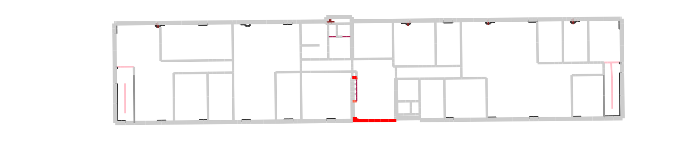

.. code:: python

    >>> !date 

.. parsed-literal::

    mardi 30 aot 2016, 11:43:21 (UTC+0200)

Description of the propagation environment
==========================================

The ``Layout`` class contains the data structure for describing a
propagation environment. It contains different graphs helping the
implementation of the ray tracing. The class is implemented in the

`layout.py <http://pylayers.github.io/pylayers/modules/pylayers.gis.layout.html>`__

.. code:: python

    >>> from pylayers.gis.layout import *
    >>> from IPython.display import Image
    >>> import os
    >>> %matplotlib inline

Getting the list of all available Layouts : the ``ls()`` method
---------------------------------------------------------------

Creating a default Layout is as simple as :

.. code:: python

    >>> L=Layout()
    >>> L

.. parsed-literal::

    
    ----------------
    newfile.ini
    ----------------
    
    Number of points  : 0
    Number of segments  : 0
    Number of sub segments  : 0
    Number of cycles  : 0
    Number of rooms  : 0
    
    xrange :(-50, 50)
    yrange :(-50, 50)
    
    Useful dictionnaries
    ----------------
    name :  {slab :seglist} 
    
    Useful arrays
    ----------------
    
    Useful tip
    ----------------
    Point p in Gs => p_coord:
    Segment s in Gs => s_ab coordinates 
    s -> u = self.tgs[s] -> v = self.tahe[:,u] -> s_ab = self.pt[:,v]

Querying the file name associated with the Layout.

.. code:: python

    >>> L._filename

.. parsed-literal::

    'newfile.ini'

The Layout is described in an ``.ini`` file.

The ``ls()`` method lists the layout files which are available in the
``struc`` directory of your current project, which is set up via the
$BASENAME environment variable which should be defined in order PyLayers
find the good directories.

.. code:: python

    >>> L.ls('ini')

.. parsed-literal::

    ['11Dbibli.ini',
     'B11.ini',
     'CORM1.ini',
     'Campus_de_Beaulieu_Rennes.ini',
     'DLR.ini',
     'DLR2.ini',
     'IETR_Avenue_Jean_Perrin_Rennes.ini',
     'Luebbers.ini',
     'MOCAP-small.ini',
     'MOCAP-small2.ini',
     'MOCAP.ini',
     'MOCAPext.ini',
     'Rennes.ini',
     'Scene.ini',
     'Servon sur Vilaine.ini',
     'Servon_sur_Vilaine.ini',
     'TA-Office.ini',
     'TA-Office3.ini',
     'TC1_METIS.ini',
     'TC2_METIS.ini',
     'TC2_METIS_new.ini',
     'W2PTIN.ini',
     'WHERE1.ini',
     'defdiff.ini',
     'defsthdiff.ini',
     'defstr.ini',
     'edge.ini',
     'klepal.ini',
     'lat_40_72847_lon_-74_00763.ini',
     'lat_40_72919_lon_-73_99695.ini',
     'scattering.ini',
     'test.ini']

.. code:: python

    >>> L=Layout('defstr.ini')

.. code:: python

    >>> L

.. parsed-literal::

    
    ----------------
    defstr.ini
    ----------------
    
    Number of points  : 12
    Number of segments  : 13
    Number of sub segments  : 3
    Number of cycles  : 0
    Number of rooms  : 0
    degree 0 : []
    degree 1 : [-8 -7]
    number of node point of degree 2 : 4
    number of node point of degree 3 : 2
    
    xrange :(757.0, 770.0)
    yrange :(1110.955, 1116.545)
    
    Useful dictionnaries
    ----------------
    sl {slab name : slab dictionary}
    name :  {slab :seglist} 
    
    Useful arrays
    ----------------
    pt : numpy array of points 
    normal : numpy array of normal 
    offset : numpy array of offset 
    tsg : get segment index in Gs from tahe
    isss :  sub-segment index above Nsmax
    tgs : get segment index in tahe from self.Gs
    upnt : get point id index from self.pt
    lsss : list of segments with sub-segment
    sla : list of all slab names (Nsmax+Nss+1)
    degree : degree of nodes 
    
    Useful tip
    ----------------
    Point p in Gs => p_coord:
    Segment s in Gs => s_ab coordinates 
    s -> u = self.tgs[s] -> v = self.tahe[:,u] -> s_ab = self.pt[:,v]

.. code:: python

    >>> f,a=L.showG('s',nodes=True,slab=True,subseg=True,figsize=(10,10),labels=True)

.. image:: Layout_files/Layout_11_0.png

L.ax provides the boundary of the layout with the following format :
(xmin,xmax,ymin,ymax)

.. code:: python

    >>> L.ax

.. parsed-literal::

    (757.0, 770.0, 1110.955, 1116.545)

.. code:: python

    >>> L.build()

.. parsed-literal::

    building Layout ...
    check len(ncycles) == 2 passed

This Layout has several convex cycles which are stored in the Gt graph.
The diffraction points are stored in the dictionnary ``L.ddiff``. The
keys of this dictionnary are the diffraction points number and the
values are a zipped list of output cycles and corresponding wedge
angles.

.. code:: python

    >>> L.Gv.node

.. parsed-literal::

    {-8: {},
     -7: {},
     -6: {},
     -4: {},
     -3: {},
     -1: {},
     1: {},
     2: {},
     3: {},
     4: {},
     5: {},
     6: {},
     7: {},
     8: {},
     9: {},
     15: {},
     19: {},
     25: {},
     28: {}}

.. code:: python

    >>> L.ddiff

.. parsed-literal::

    {-8: ([2, 5], 6.283185307179586),
     -7: ([2, 5], 6.283185307179586),
     -6: ([4, 1], 4.7123889803846897),
     -4: ([6, 4], 4.7123889803846897),
     -3: ([6, 3], 4.7123889803846897),
     -1: ([3, 1], 4.7723171355059337)}

.. code:: python

    >>> L.Gt.node

.. parsed-literal::

    {0: {'hash': '518b90eb90362b8b6593ea7426b17eda', 'indoor': False},
     1: {'indoor': False,
      'inter': [(13, 1, 0),
       (13, 0, 1),
       (19, 1, 4),
       (19, 4, 1),
       (4, 1),
       (4, 1, 2),
       (4, 2, 1),
       (15, 1, 3),
       (15, 3, 1),
       (-3,),
       (-4,)],
      'isopen': True,
      'polyg': (757.0,1110.955)
      (757.0,1116.545)
      (758.5,1115.9)
      (758.5,1111.6)
      
      vnodes : (-9 13 -12 19 -6 4 -1 15 )},
     2: {'indoor': True,
      'inter': [(1, 2),
       (1, 2, 5),
       (1, 5, 2),
       (2, 2),
       (2, 2, 5),
       (2, 5, 2),
       (9, 2),
       (9, 2, 3),
       (9, 3, 2),
       (4, 2),
       (4, 2, 1),
       (4, 1, 2),
       (5, 2),
       (5, 2, 4),
       (5, 4, 2),
       (3, 2),
       (3, 2, 5),
       (3, 5, 2),
       (-3,),
       (-4,)],
      'isopen': True,
      'polyg': (763.5,1114.432)
      (763.5,1113.432)
      (763.5,1111.9)
      (758.5,1111.6)
      (758.5,1115.9)
      (763.5,1115.9)
      
      vnodes : (-7 1 -8 2 -2 9 -1 4 -6 5 -5 3 )},
     3: {'indoor': False,
      'inter': [(8, 3),
       (8, 3, 5),
       (8, 5, 3),
       (25, 3, 6),
       (25, 6, 3),
       (10, 3, 0),
       (10, 0, 3),
       (15, 3, 1),
       (15, 1, 3),
       (9, 3),
       (9, 3, 2),
       (9, 2, 3),
       (-3,),
       (-4,)],
      'isopen': True,
      'polyg': (763.5,1111.9)
      (768.5,1111.9)
      (770.0,1110.955)
      (757.0,1110.955)
      (758.5,1111.6)
      
      vnodes : (-2 8 -3 25 -10 10 -9 15 -1 9 )},
     4: {'indoor': False,
      'inter': [(28, 4, 6),
       (28, 6, 4),
       (6, 4),
       (6, 4, 5),
       (6, 5, 4),
       (5, 4),
       (5, 4, 2),
       (5, 2, 4),
       (19, 4, 1),
       (19, 1, 4),
       (12, 4, 0),
       (12, 0, 4),
       (-3,),
       (-4,)],
      'isopen': True,
      'polyg': (770.0,1116.545)
      (768.5,1115.9)
      (763.5,1115.9)
      (758.5,1115.9)
      (757.0,1116.545)
      
      vnodes : (-11 28 -4 6 -5 5 -6 19 -12 12 )},
     5: {'indoor': True,
      'inter': [(3, 5),
       (3, 5, 2),
       (3, 2, 5),
       (6, 5),
       (6, 5, 4),
       (6, 4, 5),
       (7, 5),
       (7, 5, 6),
       (7, 6, 5),
       (8, 5),
       (8, 5, 3),
       (8, 3, 5),
       (2, 5),
       (2, 5, 2),
       (2, 2, 5),
       (1, 5),
       (1, 5, 2),
       (1, 2, 5),
       (-3,),
       (-4,)],
      'isopen': True,
      'polyg': (763.5,1114.432)
      (763.5,1115.9)
      (768.5,1115.9)
      (768.5,1111.9)
      (763.5,1111.9)
      (763.5,1113.432)
      
      vnodes : (-7 3 -5 6 -4 7 -3 8 -2 2 -8 1 )},
     6: {'indoor': False,
      'inter': [(7, 6),
       (7, 6, 5),
       (7, 5, 6),
       (28, 6, 4),
       (28, 4, 6),
       (11, 6, 0),
       (11, 0, 6),
       (25, 6, 3),
       (25, 3, 6),
       (-3,),
       (-4,)],
      'isopen': True,
      'polyg': (768.5,1111.9)
      (768.5,1115.9)
      (770.0,1116.545)
      (770.0,1110.955)
      
      vnodes : (-3 7 -4 28 -11 11 -10 25 )}}

.. code:: python

    >>> L=Layout('DLR.ini')

.. code:: python

    >>> f,a=L.showG('s',aw=False)

.. image:: Layout_files/Layout_20_0.png

To check which are the used slabs :

.. code:: python

    >>> Slabs = np.unique(L.sla)
    >>> for s in Slabs:
    >>>     if s in L.sl:
               print L.sl[s]

.. parsed-literal::

    3D_WINDOW_GLASS : GLASS | AIR | GLASS | [0.05, 0.05, 0.05]
           blue3 1
    
    AIR : AIR | [0.05]
           white 1
    
    DOOR : WOOD | [0.05]
           red1 1
    
    METAL : METAL | [0.05]
           black 4
    
    PARTITION : PLASTER | [0.05]
           grey80 4
    
    WALL : BRICK | [0.05]
           grey20 3
    

Let's load an other layout. This an indoor office where the FP7 WHERE
project UWB impulse radio measuremnts have been performed.

.. code:: python

    >>> L=Layout('WHERE1.ini')

The showG method provides many possible visualization of the layout

.. code:: python

    >>> f,a=L.showG('s',airwalls=False,figsize=(20,10))

.. image:: Layout_files/Layout_26_0.png

.. code:: python

    >>> L=Layout('W2PTIN.ini')

.. parsed-literal::

    It exists degree 1 points : [-80]

.. image:: Layout_files/Layout_27_1.png

.. code:: python

    >>> f,a = L.showG('s')

The useful numpy arrays of the Layout
-------------------------------------

The layout data structure is a mix between graph and numpy array. numpy
arrays are used when high performance is required while graph structure
is convenient when dealing with different specific tasks. The tricky
thing for the mind is to have to transcode between node index excluding
0 and numpy array index including 0. Below are listed various useful
numpy array which are mostly used internally.

-  tsg : get segment index in Gs from tahe
-  isss : sub-segment index above Nsmax
-  tgs : get segment index in tahe from Gs
-  lsss : list of segments with sub-segment
-  sla : list of all slab names (Nsmax+Nss+1)
-  degree : degree of nodes

``pt`` the array of points
~~~~~~~~~~~~~~~~~~~~~~~~~~

The point coordinates are stored in two different places

-  L.Gs.pos : in a dictionary form (key is the point negative index)
-  L.pt : in a numpy array

.. code:: python

    >>> print np.shape(L.pt)
    >>> print len(filter(lambda x: x<0,L.Gs.pos))

.. parsed-literal::

    (2, 181)
    185

This dual storage is chosen for computational efficiency reason. The
priority goes to the graph and the numpy array is calculated at the end
of the edition in the ``Layout.g2npy`` method (graph to numpy) which is
in charge of the conversion.

tahe (tail-head)
~~~~~~~~~~~~~~~~

``tahe`` is a :math:`(2\times N_{s})` where :math:`N_s` denotes the
number of segment. The first line is the tail index of the segment
:math:`k` and the second line is the head of the segment :math:`k`.
Where :math:`k` is the index of a given segment (starting in 0).

.. code:: python

    >>> L.build()

.. parsed-literal::

    building Layout ...
    check len(ncycles) == 2 passed

The figure below illustrates a Layout and a superimposition of the graph
of cycles :math:`\mathcal{G}_c`. Those cycles are automatically
extracted from a well defined layout. This concept of **cycles** is
central in the ray determination algorithm which is implemented in
PyLayers. Notice that the exterior region is the cycle indexed by 0. All
the rooms which have a common frontier with the exterior cycle are here
connected to the origin (corresponding to exterior cycle).

.. code:: python

    >>> f,a = L.showG('s')

.. image:: Layout_files/Layout_34_0.png

.. code:: python

    >>> nx.draw_networkx_nodes(L.Gi,L.Gi.pos,node_color='blue',node_size=1)
    >>> nx.draw_networkx_edges(L.Gi,L.Gi.pos,node_color='blue',node_size=1)

.. parsed-literal::

    <matplotlib.collections.LineCollection at 0x7ff8ffa2a1d0>

.. image:: Layout_files/Layout_35_1.png

``tgs`` : trancodage from graph indexing to numpy array indexing
----------------------------------------------------------------

``tgs`` is an array with length :math:`N_s`\ +1. The index 0 is not used
because none segment has 0 as an index.

.. code:: python

    >>> ns = 5
    >>> utahe = L.tgs[ns]

.. code:: python

    >>> tahe =  L.tahe[:,utahe]

.. code:: python

    >>> ptail = L.pt[:,tahe[0]]
    >>> phead = L.pt[:,tahe[1]]

.. code:: python

    >>> print ptail

.. parsed-literal::

    [ 29.785   6.822]

.. code:: python

    >>> print phead

.. parsed-literal::

    [ 27.414   6.822]

.. code:: python

    >>> L.Gs.node[5]

.. parsed-literal::

    {'connect': [-8, -139],
     'name': 'PARTITION',
     'ncycles': [70, 72],
     'norm': array([ 0., -1.,  0.]),
     'offset': 0,
     'transition': False,
     'z': (0, 3.0)}

.. code:: python

    >>> print L.Gs.pos[-8]
    >>> print L.Gs.pos[-139]

.. parsed-literal::

    (29.785, 6.822)
    (27.414, 6.822)

.. code:: python

    >>> aseg = np.array([4,7,134])

.. code:: python

    >>> print np.shape(aseg)

.. parsed-literal::

    (3,)

.. code:: python

    >>> pt  = L.tahe[:,L.tgs[aseg]][0,:]
    >>> ph = L.tahe[:,L.tgs[aseg]][1,:]
    >>> pth = np.vstack((pt,ph))
