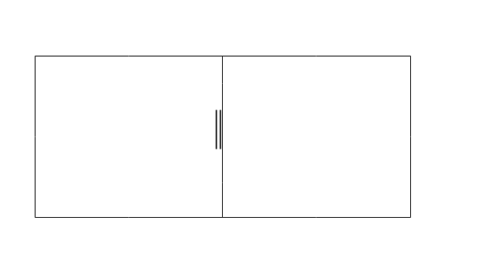
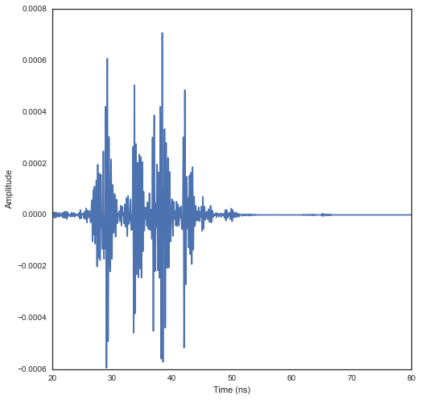

Effect of Modyfiying the Nature of Sub-Segments
===============================================

This notebook illustrates a simple ray tracing simulation with diffeent
material properties for a single segment separating 2 rooms which
contains multi-subsegments. The noteboook illustrates in details the
whole steps.

.. code:: python

    from pylayers.simul.link import *
    from pylayers.antprop.rays import *
    from pylayers.antprop.aarray import *
    from pylayers.antprop.channel import *
    from pylayers.gis.layout import *
    from pylayers.antprop.signature import *
    import pylayers.signal.bsignal as bs
    import pylayers.signal.waveform as wvf
    from pylayers.simul.simulem import *
    import matplotlib.pyplot as plt
    %matplotlib inline


.. parsed-literal::

    WARNING:traits.has_traits:DEPRECATED: traits.has_traits.wrapped_class, 'the 'implements' class advisor has been deprecated. Use the 'provides' class decorator.


Let start by loading a simple layout with 2 single rooms. The multi
subsegment appears in the middle with the red vertical lines. Each
subsegment is materialized by a segment.

.. code:: python

    L=Layout('defstr.ini')
    f,a=L.showG('s',subseg=True,figsize=(10,10))





The studied configuration is composed of a simple 2 rooms building
separated by a subsegment which has a multi subsegment attribute. The
attribute of the subsegment can be changed with the method
```chgmss`` <http://pylayers.github.io/pylayers/modules/generated/pylayers.gis.layout.Layout.chgmss.html>`__
(change multisubsegment). In the example WOOD in the lower part then
10cm of AIR then wood again until the ceiling.

.. code:: python

    L.chgmss(1,ss_name=['WOOD','AIR','WOOD'],ss_z =[(0.0,2.7),(2.7,2.8),(2.8,3)],ss_offset=[0,0,0])

As the Layout structure has been modified it is required to rebuild the
structure.

.. code:: python

    L.build()
    L.save()


.. parsed-literal::

    check len(ncycles) == 2 passed


::


    ---------------------------------------------------------------------------

    KeyError                                  Traceback (most recent call last)

    <ipython-input-4-de0401164687> in <module>()
          1 L.build()
    ----> 2 L.save()
    

    /home/uguen/Documents/rch/devel/pylayers/pylayers/gis/layout.pyc in save(self, _filename)
       5203             _fileini = racine + '.ini'
       5204             self.savestr2(_filename)
    -> 5205             self.saveini(_fileini)
       5206             print "structure saved in ", _filename
       5207             print "structure saved in ", _fileini


    /home/uguen/Documents/rch/devel/pylayers/pylayers/gis/layout.pyc in saveini(self, _fileini)
       1282             d['vnodes']=vnodes
       1283             d['ss_slab']=[]
    -> 1284             d['ss_slab'].append(self.Gt.node[c]['ss_slab'][0])
       1285             d['ss_slab'].append(self.Gt.node[c]['ss_slab'][-1])
       1286             config.set("cycles",str(c),d)


    KeyError: 'ss_slab'


The :math:`\mathcal{G}_s` graph dictionnary has the following structure

.. code:: python

    L.Gs.node


.. parsed-literal::

    {-8: {},
     -7: {},
     -6: {},
     -5: {},
     -4: {},
     -3: {},
     -2: {},
     -1: {},
     1: {'connect': [-8, -7],
      'name': 'PARTITION',
      'ncycles': [1, 2],
      'norm': array([-0.999982  , -0.00599989,  0.        ]),
      'offset': 0,
      'ss_name': ['WOOD', 'AIR', 'WOOD'],
      'ss_offset': [0, 0, 0],
      'ss_z': [(0.0, 2.7), (2.7, 2.8), (2.8, 3)],
      'transition': True,
      'z': (0.0, 3.0)},
     2: {'connect': [-8, -2],
      'name': 'WALL',
      'ncycles': [1, 2],
      'norm': array([ 0.99997778,  0.00666652,  0.        ]),
      'offset': 0,
      'transition': False,
      'z': (0.0, 3.0)},
     3: {'connect': [-7, -5],
      'name': 'WALL',
      'ncycles': [1, 2],
      'norm': array([-0.99997775, -0.00667097,  0.        ]),
      'offset': 0,
      'transition': False,
      'z': (0.0, 3.0)},
     4: {'connect': [-6, -1],
      'name': 'WALL',
      'ncycles': [1, 0],
      'norm': array([ 0.99997888,  0.00649986,  0.        ]),
      'offset': 0,
      'transition': False,
      'z': (0.0, 3.0)},
     5: {'connect': [-6, -5],
      'name': 'WALL',
      'ncycles': [1, 0],
      'norm': array([-0.00619988,  0.99998078,  0.        ]),
      'offset': 0,
      'transition': False,
      'z': (0.0, 3.0)},
     6: {'connect': [-5, -4],
      'name': 'WALL',
      'ncycles': [2, 0],
      'norm': array([-0.00639987,  0.99997952,  0.        ]),
      'offset': 0,
      'transition': False,
      'z': (0.0, 3.0)},
     7: {'connect': [-4, -3],
      'name': 'WALL',
      'ncycles': [2, 0],
      'norm': array([ 0.99997887,  0.00650149,  0.        ]),
      'offset': 0,
      'transition': False,
      'z': (0.0, 3.0)},
     8: {'connect': [-3, -2],
      'name': 'WALL',
      'ncycles': [2, 0],
      'norm': array([ 0.00639987, -0.99997952,  0.        ]),
      'offset': 0,
      'transition': False,
      'z': (0.0, 3.0)},
     9: {'connect': [-1, -2],
      'name': 'WALL',
      'ncycles': [1, 0],
      'norm': array([-0.00639987,  0.99997952,  0.        ]),
      'offset': 0,
      'transition': False,
      'z': (0.0, 3.0)}}


We define now two points which are the termination of a radio link.

.. code:: python

    #tx=np.array([759,1114,1.5])
    #rx=np.array([767,1114,1.5])
    tx=np.array([759,1114,1.5])
    rx=np.array([767,1114,1.5])

.. code:: python

    L.chgmss(1,ss_name=['WOOD','AIR','WOOD'],ss_z =[(0.0,2.7),(2.7,2.8),(2.8,3)],ss_offset=[0,0,0])
    L.save()
    fGHz=np.linspace(1,11,100)
    #Aa = Antenna('S1R1.vsh3')
    #Ab = Antenna('S1R1.vsh3')
    #Aa = Antenna('Gauss',fGHz=fGHz)
    #Ab = Antenna('Gauss',fGHz=fGHz)
    Aa = AntArray(N=[8,1,1],fGHz=fGHz)
    Ab = AntArray(N=[4,1,1],fGHz=fGHz)
    Lk = DLink(L=L,a=tx,b=rx,Aa=Aa,Ab=Ab,fGHz=np.linspace(1,11,100))


::


    ---------------------------------------------------------------------------

    KeyError                                  Traceback (most recent call last)

    <ipython-input-7-fd2986e5b29e> in <module>()
          1 L.chgmss(1,ss_name=['WOOD','AIR','WOOD'],ss_z =[(0.0,2.7),(2.7,2.8),(2.8,3)],ss_offset=[0,0,0])
    ----> 2 L.save()
          3 fGHz=np.linspace(1,11,100)
          4 #Aa = Antenna('S1R1.vsh3')
          5 #Ab = Antenna('S1R1.vsh3')


    /home/uguen/Documents/rch/devel/pylayers/pylayers/gis/layout.pyc in save(self, _filename)
       5203             _fileini = racine + '.ini'
       5204             self.savestr2(_filename)
    -> 5205             self.saveini(_fileini)
       5206             print "structure saved in ", _filename
       5207             print "structure saved in ", _fileini


    /home/uguen/Documents/rch/devel/pylayers/pylayers/gis/layout.pyc in saveini(self, _fileini)
       1282             d['vnodes']=vnodes
       1283             d['ss_slab']=[]
    -> 1284             d['ss_slab'].append(self.Gt.node[c]['ss_slab'][0])
       1285             d['ss_slab'].append(self.Gt.node[c]['ss_slab'][-1])
       1286             config.set("cycles",str(c),d)


    KeyError: 'ss_slab'


A link is the set of a layout and 2 termination points.

.. code:: python

    Aa.plotG()


::


    ---------------------------------------------------------------------------

    NameError                                 Traceback (most recent call last)

    <ipython-input-8-5cb5df1cbc48> in <module>()
    ----> 1 Aa.plotG()
    

    NameError: name 'Aa' is not defined


.. code:: python

    #f,a=Lk.show(rays=True)
    f,a=Lk.show(rays=True)


::


    ---------------------------------------------------------------------------

    NameError                                 Traceback (most recent call last)

    <ipython-input-9-7ecd8f980a4c> in <module>()
          1 #f,a=Lk.show(rays=True)
    ----> 2 f,a=Lk.show(rays=True)
    

    NameError: name 'Lk' is not defined


On the figure above, we can see the Tx and Rx each placed in a different
room appart from a wall with a subsegement placed in the middle. Then
for evaluating the radio link, simply type:


.. code:: python

    ak,tauk=Lk.eval(force=True,a=tx,b=rx,applywav=True)


::


    ---------------------------------------------------------------------------

    NameError                                 Traceback (most recent call last)

    <ipython-input-10-d9efa0c5005d> in <module>()
    ----> 1 ak,tauk=Lk.eval(force=True,a=tx,b=rx,applywav=True)
    

    NameError: name 'Lk' is not defined


.. code:: python

    Lk.C


::


    ---------------------------------------------------------------------------

    NameError                                 Traceback (most recent call last)

    <ipython-input-11-08f49e889d34> in <module>()
    ----> 1 Lk.C
    

    NameError: name 'Lk' is not defined


.. code:: python

    f = plt.figure(figsize=(10,10))
    f,a=Lk.C.show(cmap='jet',fig=f,typ='l20',vmin=-120,vmax=-10)


::


    ---------------------------------------------------------------------------

    NameError                                 Traceback (most recent call last)

    <ipython-input-12-ef1e84aff51a> in <module>()
          1 f = plt.figure(figsize=(10,10))
    ----> 2 f,a=Lk.C.show(cmap='jet',fig=f,typ='l20',vmin=-120,vmax=-10)
    

    NameError: name 'Lk' is not defined


.. parsed-literal::

    <matplotlib.figure.Figure at 0x2b6d7fef2210>


.. code:: python

    fGHz=np.arange(2,6,0.5)
    wav = wvf.Waveform(fcGHz=4,bandGHz=1.5)
    wav.show()


.. image:: Multisubsegments_files/Multisubsegments_22_0.png


.. code:: python

    wav.st.y.shape


.. parsed-literal::

    (1, 251)


.. code:: python

    len(Lk.fGHz)


::


    ---------------------------------------------------------------------------

    NameError                                 Traceback (most recent call last)

    <ipython-input-15-00ef4b2c8627> in <module>()
    ----> 1 len(Lk.fGHz)
    

    NameError: name 'Lk' is not defined


.. code:: python

    Lk = DLink(L=L,a=tx,b=rx)

.. code:: python

    Lk.a


.. parsed-literal::

    array([  759. ,  1114. ,     1.5])


.. code:: python

    Lk.b


.. parsed-literal::

    array([  767. ,  1114. ,     1.5])


.. code:: python

    cir = Lk.H.applywavB(wav.sf)


.. parsed-literal::

    WARNING : Tchannel.applywavB is going to be replaced by Tchannel.applywav


.. code:: python

    layer = ['AIR','AIR','AIR']
    Lk.L.chgmss(1,ss_name=layer)
    Lk.L.Gs.node[1]['ss_name']=layer
    Lk.L.g2npy()
    Lk.L.save()
    fGHz=np.linspace(2,11,181)
    #Aa = Antenna('Omni',fGHz=fGHz)
    #Aa = Antenna('Omni',fGHz=fGHz)
    ak,tauk=Lk.eval(force=True)
    plt.stem(Lk.H.taud,Lk.H.ak)
    plt.stem(Lk.H.taud,Lk.H.ak[:,0,50])


::


    ---------------------------------------------------------------------------

    KeyError                                  Traceback (most recent call last)

    <ipython-input-20-ae5fc4f64f59> in <module>()
          3 Lk.L.Gs.node[1]['ss_name']=layer
          4 Lk.L.g2npy()
    ----> 5 Lk.L.save()
          6 fGHz=np.linspace(2,11,181)
          7 #Aa = Antenna('Omni',fGHz=fGHz)


    /home/uguen/Documents/rch/devel/pylayers/pylayers/gis/layout.pyc in save(self, _filename)
       5203             _fileini = racine + '.ini'
       5204             self.savestr2(_filename)
    -> 5205             self.saveini(_fileini)
       5206             print "structure saved in ", _filename
       5207             print "structure saved in ", _fileini


    /home/uguen/Documents/rch/devel/pylayers/pylayers/gis/layout.pyc in saveini(self, _fileini)
       1282             d['vnodes']=vnodes
       1283             d['ss_slab']=[]
    -> 1284             d['ss_slab'].append(self.Gt.node[c]['ss_slab'][0])
       1285             d['ss_slab'].append(self.Gt.node[c]['ss_slab'][-1])
       1286             config.set("cycles",str(c),d)


    KeyError: 'ss_slab'


.. code:: python

    Lk.H.ak.shape


::


    ---------------------------------------------------------------------------

    AttributeError                            Traceback (most recent call last)

    <ipython-input-21-1ef58d341060> in <module>()
    ----> 1 Lk.H.ak.shape
    

    AttributeError: 'Tchannel' object has no attribute 'ak'


.. code:: python

    cirair = Lk.H.applywavB(wav.sf)


.. parsed-literal::

    WARNING : Tchannel.applywavB is going to be replaced by Tchannel.applywav


.. code:: python

    layer = ['METAL','METAL','METAL']
    Lk.L.chgmss(1,ss_name=layer)
    Lk.L.Gs.node[1]['ss_name']=layer
    Lk.L.g2npy()
    Lk.L.save()
    Lk.eval(force=True)
    cirmet = Lk.H.applywavB(wav.sf)
    cirmet.plot(typ=['v'],xmin=20,xmax=80)


::


    ---------------------------------------------------------------------------

    KeyError                                  Traceback (most recent call last)

    <ipython-input-23-02ef6687144f> in <module>()
          3 Lk.L.Gs.node[1]['ss_name']=layer
          4 Lk.L.g2npy()
    ----> 5 Lk.L.save()
          6 Lk.eval(force=True)
          7 cirmet = Lk.H.applywavB(wav.sf)


    /home/uguen/Documents/rch/devel/pylayers/pylayers/gis/layout.pyc in save(self, _filename)
       5203             _fileini = racine + '.ini'
       5204             self.savestr2(_filename)
    -> 5205             self.saveini(_fileini)
       5206             print "structure saved in ", _filename
       5207             print "structure saved in ", _fileini


    /home/uguen/Documents/rch/devel/pylayers/pylayers/gis/layout.pyc in saveini(self, _fileini)
       1282             d['vnodes']=vnodes
       1283             d['ss_slab']=[]
    -> 1284             d['ss_slab'].append(self.Gt.node[c]['ss_slab'][0])
       1285             d['ss_slab'].append(self.Gt.node[c]['ss_slab'][-1])
       1286             config.set("cycles",str(c),d)


    KeyError: 'ss_slab'


.. code:: python

    #fig2=plt.figure()
    f,a=cirair.plot(typ=['l20'],color='b')
    plt.axis([0,120,-120,-40])
    plt.title('A simple illustration of shadowing effect')
    plt.legend(['air'])
    f,a=cirpart.plot(typ=['l20'],color='k')
    plt.axis([0,120,-120,-40])
    plt.legend(['wood'])
    f,a=cirmet.plot(typ=['l20'],color='r')
    plt.axis([0,120,-120,-40])
    plt.legend(['metal'])


::


    ---------------------------------------------------------------------------

    NameError                                 Traceback (most recent call last)

    <ipython-input-24-e1d90729636b> in <module>()
          4 plt.title('A simple illustration of shadowing effect')
          5 plt.legend(['air'])
    ----> 6 f,a=cirpart.plot(typ=['l20'],color='k')
          7 plt.axis([0,120,-120,-40])
          8 plt.legend(['wood'])


    NameError: name 'cirpart' is not defined





We have modified successively the nature of the 3 surfaces in the sub
segment placed in the sepataion partition. The first was AIR, the second
WOOD and the third METAL. As the subsegment is placed on the LOS path
the blockage effect is clearly visible. The chosen antennas were
omnidirectional ``Antenna('Omni')``
