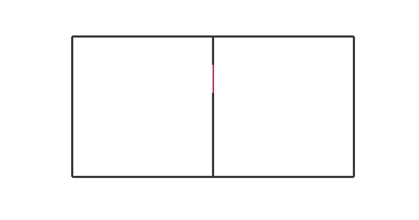

.. code:: python

    !date


.. parsed-literal::

    samedi 7 mai 2016, 10:56:03 (UTC+0200)


Effect of Modifying the Nature of Sub-Segments
==============================================

This notebook illustrates a simple ray tracing simulation with different
material properties for a single segment separating 2 rooms which
contains multi subsegments. The notebook illustrates in details the
whole steps.

.. code:: python

    from pylayers.simul.link import *
    from pylayers.antprop.rays import *
    from pylayers.antprop.aarray import *
    from pylayers.antprop.channel import *
    from pylayers.gis.layout import *
    from pylayers.antprop.signature import *
    import pylayers.signal.bsignal as bs
    import pylayers.signal.waveform as wvf
    from pylayers.simul.simulem import *
    import matplotlib.pyplot as plt
    %matplotlib inline


.. parsed-literal::

    WARNING:traits.has_traits:DEPRECATED: traits.has_traits.wrapped_class, 'the 'implements' class advisor has been deprecated. Use the 'provides' class decorator.


Let's start by loading a simple layout with 2 single rooms. The multi
subsegment appears in the middle with the red vertical lines. Each
subsegment is materialized by a segment.

.. code:: python

    L=Layout('defstr.ini')
    f,a=L.showG('s',subseg=True,figsize=(10,10))





The studied configuration is composed of a simple 2 rooms building
separated by a subsegment which has a multi subsegment attribute. The
attribute of the subsegment can be changed with the method
```chgmss`` <http://pylayers.github.io/%20pylayers/modules/generated/pylayers.gis.layout.Layout.chgmss.html>`__
(change multisubsegment). In the example WOOD in the lower part then
10cm of AIR then wood again until the ceiling.

.. code:: python

    L.chgmss(1,ss_name=['WOOD','AIR','WOOD'],ss_z =[(0.0,2.7),(2.7,2.8),(2.8,3)],ss_offset=[0,0,0])

As the Layout structure has been modified it is required to rebuild the
structure.

.. code:: python

    L.build()
    L.save()


.. parsed-literal::

    structure saved in  defstr.ini


The :math:`\mathcal{G}_s` graph dictionary has the following structure

.. code:: python

    L.Gs.node


.. parsed-literal::

    {-12: {'ncycles': [3, 4]},
     -11: {'ncycles': [4, 5]},
     -10: {'ncycles': [5, 6]},
     -9: {'ncycles': [3, 6]},
     -8: {'ncycles': [1, 2]},
     -7: {'ncycles': [1, 2]},
     -6: {'ncycles': [2, 3, 4]},
     -5: {'ncycles': [1, 2, 4]},
     -4: {'ncycles': [1, 4, 5]},
     -3: {'ncycles': [1, 5, 6]},
     -2: {'ncycles': [1, 2, 6]},
     -1: {'ncycles': [2, 3, 6]},
     1: {'connect': [-8, -7],
      'name': 'PARTITION',
      'norm': array([-1.,  0.,  0.]),
      'offset': 0,
      'ss_name': ['WOOD', 'AIR', 'WOOD'],
      'ss_offset': [0, 0, 0],
      'ss_z': [(0.0, 2.7), (2.7, 2.8), (2.8, 3)],
      'transition': True,
      'z': (0.0, 3.0)},
     2: {'connect': [-8, -2],
      'name': 'WALL',
      'norm': array([ 1.,  0.,  0.]),
      'offset': 0,
      'transition': False,
      'z': (0.0, 3.0)},
     3: {'connect': [-7, -5],
      'name': 'WALL',
      'norm': array([-1.,  0.,  0.]),
      'offset': 0,
      'transition': False,
      'z': (0.0, 3.0)},
     4: {'connect': [-6, -1],
      'name': 'WALL',
      'norm': array([ 1.,  0.,  0.]),
      'offset': 0,
      'transition': False,
      'z': (0.0, 3.0)},
     5: {'connect': [-6, -5],
      'name': 'WALL',
      'norm': array([ 0.,  1.,  0.]),
      'offset': 0,
      'transition': False,
      'z': (0.0, 3.0)},
     6: {'connect': [-5, -4],
      'name': 'WALL',
      'norm': array([ 0.,  1.,  0.]),
      'offset': 0,
      'transition': False,
      'z': (0.0, 3.0)},
     7: {'connect': [-4, -3],
      'name': 'WALL',
      'norm': array([ 1.,  0.,  0.]),
      'offset': 0,
      'transition': False,
      'z': (0.0, 3.0)},
     8: {'connect': [-3, -2],
      'name': 'WALL',
      'norm': array([ 0., -1.,  0.]),
      'offset': 0,
      'transition': False,
      'z': (0.0, 3.0)},
     9: {'connect': [-2, -1],
      'name': 'WALL',
      'norm': array([ 0., -1.,  0.]),
      'offset': 0,
      'transition': False,
      'z': (0.0, 3.0)},
     10: {'connect': [-9, -10],
      'name': 'AIR',
      'ncycles': [6, 0],
      'norm': array([ 0., -1.,  0.]),
      'offset': 0,
      'transition': True,
      'z': [0.0, 3.0]},
     11: {'connect': [-10, -11],
      'name': 'AIR',
      'ncycles': [5, 0],
      'norm': array([ 1.,  0.,  0.]),
      'offset': 0,
      'transition': True,
      'z': [0.0, 3.0]},
     12: {'connect': [-11, -12],
      'name': 'AIR',
      'ncycles': [4, 0],
      'norm': array([ 0.,  1.,  0.]),
      'offset': 0,
      'transition': True,
      'z': [0.0, 3.0]},
     13: {'connect': [-12, -9],
      'name': 'AIR',
      'ncycles': [3, 0],
      'norm': array([ 1.,  0.,  0.]),
      'offset': 0,
      'transition': True,
      'z': [0.0, 3.0]},
     16: {'connect': [-1, -9],
      'name': 'AIR',
      'ncycles': [3, 6],
      'norm': array([ 0.70710678, -0.70710678,  0.        ]),
      'offset': 0,
      'transition': True,
      'z': [0.0, 3.0]},
     17: {'connect': [-10, -3],
      'name': 'AIR',
      'ncycles': [5, 6],
      'norm': array([ 0.70710678,  0.70710678,  0.        ]),
      'offset': 0,
      'transition': True,
      'z': [0.0, 3.0]},
     20: {'connect': [-12, -6],
      'name': 'AIR',
      'ncycles': [3, 4],
      'norm': array([-0.70710678, -0.70710678,  0.        ]),
      'offset': 0,
      'transition': True,
      'z': [0.0, 3.0]},
     21: {'connect': [-4, -11],
      'name': 'AIR',
      'ncycles': [4, 5],
      'norm': array([-0.70710678,  0.70710678,  0.        ]),
      'offset': 0,
      'transition': True,
      'z': [0.0, 3.0]}}


We define now two points which are the termination of a radio link.

.. code:: python

    #tx=np.array([759,1114,1.5])
    #rx=np.array([767,1114,1.5])
    tx=np.array([759,1114,1.5])
    rx=np.array([767,1114,1.5])

.. code:: python

    L.chgmss(1,ss_name=['WOOD','AIR','WOOD'],ss_z =[(0.0,2.7),(2.7,2.8),(2.8,3)],ss_offset=[0,0,0])
    L.save()


.. parsed-literal::

    structure saved in  defstr.ini


.. code:: python

    fGHz=np.linspace(1,11,100)
    #Aa = Antenna('S1R1.vsh3')
    #Ab = Antenna('S1R1.vsh3')
    Aa = Antenna('Gauss',fGHz=fGHz)
    Ab = Antenna('Gauss',fGHz=fGHz)
    Ab.eval()
    Aa.eval()
    #Aa = AntArray(N=[8,1,1],fGHz=fGHz)
    #Ab = AntArray(N=[4,1,1],fGHz=fGHz)
    Lk = DLink(L=L,a=tx,b=rx,Aa=Aa,Ab=Ab,fGHz=fGHz,cutoff=5)
    ak,tauk=Lk.eval(force=True,verbose=False)

.. code:: python

    ak.shape


.. parsed-literal::

    (140, 1, 100)


.. code:: python

    plt.stem(tauk,ak[:,0,0])


.. parsed-literal::

    <Container object of 3 artists>


.. image:: Multisubsegments_files/Multisubsegments_16_1.png


A link is the set of a layout and 2 termination points.

.. code:: python

    Aa.eval()
    Aa.plotG()


.. image:: Multisubsegments_files/Multisubsegments_18_0.png


.. parsed-literal::

    (<matplotlib.figure.Figure at 0x2af9c3595bd0>,
     <matplotlib.projections.polar.PolarAxes at 0x2af9c359e450>)


.. code:: python

    Lk.C.Ctt


.. parsed-literal::

    FUsignal :  (100,)  (140, 100) 


.. code:: python

    #f,a=Lk.show(rays=True)
    f,a=Lk.show(rays=True,aw=0)


.. image:: Multisubsegments_files/Multisubsegments_20_0.png


On the figure above, we can see the Tx and Rx each placed in a different
room apart from a wall with a subsegment placed in the middle. Then for
evaluating the radio link, simply type:

.. code:: python

    ak,tauk=Lk.eval(force=True,a=tx,b=rx,applywav=True)

.. code:: python

    Lk.C


.. parsed-literal::

    Ctilde : Ray Propagation Channel Matrices
    ---------
    (140, 100)
    Nray : 140
    fmin(GHz) : 1.0
    fmax(GHz): 11.0
    Nfreq : 100


.. code:: python

    f = plt.figure(figsize=(10,10))
    f,a=Lk.C.show(cmap='jet',fig=f,typ='l20',vmin=-120,vmax=-10)


.. image:: Multisubsegments_files/Multisubsegments_24_0.png


.. code:: python

    fGHz=np.arange(2,6,0.1)
    wav = wvf.Waveform(fcGHz=4,bandGHz=1.5)
    wav.show()


.. image:: Multisubsegments_files/Multisubsegments_25_0.png


.. code:: python

    Lk = DLink(L=L,a=tx,b=rx,fGHz=fGHz)

.. code:: python

    Lk.a


.. parsed-literal::

    array([  759. ,  1114. ,     1.5])


.. code:: python

    Lk.b


.. parsed-literal::

    array([  767. ,  1114. ,     1.5])


.. code:: python

    cir = Lk.H.applywavB(wav.sf)


.. parsed-literal::

    WARNING : Tchannel.applywavB is going to be replaced by Tchannel.applywav


.. code:: python

    layer = ['AIR','AIR','AIR']
    Lk.L.chgmss(1,ss_name=layer)
    Lk.L.Gs.node[1]['ss_name']=layer
    Lk.L.g2npy()
    Lk.L.save()
    #Aa = Antenna('Omni',fGHz=fGHz)
    #Aa = Antenna('Omni',fGHz=fGHz)
    ak,tauk=Lk.eval(force=True,verbose=0,fGHz=fGHz)
    #plt.stem(Lk.H.taud,Lk.H.ak)
    #plt.stem(Lk.H.taud,Lk.H.ak[:,0,50])


.. parsed-literal::

    structure saved in  defstr.ini


.. code:: python

    Lk.H.ak.shape


.. parsed-literal::

    (80, 1, 40)


.. code:: python

    cirair = Lk.H.applywavB(wav.sf)


.. parsed-literal::

    WARNING : Tchannel.applywavB is going to be replaced by Tchannel.applywav


.. code:: python

    layer = ['METAL','METAL','METAL']
    Lk.L.chgmss(1,ss_name=layer)
    Lk.L.Gs.node[1]['ss_name']=layer
    Lk.L.g2npy()
    Lk.L.save()
    Lk.eval(force=True)
    cirmet = Lk.H.applywavB(wav.sf)
    cirmet.plot(typ=['v'],xmin=20,xmax=180)


.. parsed-literal::

    structure saved in  defstr.ini
    WARNING : Tchannel.applywavB is going to be replaced by Tchannel.applywav


.. parsed-literal::

    (<matplotlib.figure.Figure at 0x2af9ef5a5150>,
     array([[<matplotlib.axes._subplots.AxesSubplot object at 0x2af9eab706d0>]], dtype=object))


.. image:: Multisubsegments_files/Multisubsegments_33_2.png


.. code:: python

    #fig2=plt.figure()
    f,a=cirair.plot(typ=['l20'],color='b')
    plt.axis([0,120,-120,-40])
    plt.title('A simple illustration of shadowing effect')
    plt.legend(['air'])
    f,a=cirmet.plot(typ=['l20'],color='r')
    plt.axis([0,120,-120,-40])
    plt.legend(['metal'])


.. parsed-literal::

    <matplotlib.legend.Legend at 0x2af9ead1d6d0>


.. image:: Multisubsegments_files/Multisubsegments_34_1.png


.. image:: Multisubsegments_files/Multisubsegments_34_2.png


We have modified successively the nature of the 3 surfaces in the sub
segment placed in the separation partition. The first was AIR, the
second WOOD and the third METAL. As the subsegment is placed on the LOS
path the blockage effect is clearly visible. The chosen antennas were
omni directional ``Antenna('Omni')``

.. code:: python

    Lk.ir.plot(typ='v')


.. parsed-literal::

    (<matplotlib.figure.Figure at 0x2af9c357b6d0>,
     array([[<matplotlib.axes._subplots.AxesSubplot object at 0x2af9c36f8e10>]], dtype=object))


.. image:: Multisubsegments_files/Multisubsegments_36_1.png

