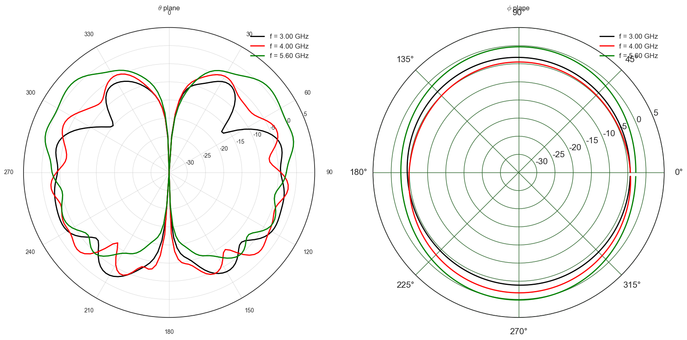

Description of antennas
=======================

PyLayers has a very rich set of tools for handling antenna radiation
pattern. Antennas can be described in different manners and read from
different specific file formats.

The description goes from a simple antenna gain formula to a full
polarization description, compressed or not, using scalar or vector
spherical harmonics decomposition.

In the following, some features of the ``Antenna`` class are
illustrated. The ``Antenna`` class is stored in the
`antenna.py <http://pylayers.github.io/pylayers/modules/pylayers.antprop.antenna.html>`__
module which is placed in the ``antprop`` module.

.. code:: python

    >>> from pylayers.antprop.antenna import *
    >>> %matplotlib inline

An antenna object can not be loaded in specifying an existing antenna
file name as argument of the constructor. Lets start by loading an
antenna from a ``vsh3`` file which correspond to a vector spherical
harmonics representation of an antenna measured in SATIMO near field
chamber.

.. code:: python

    >>> A = Antenna('S1R1.vsh3')

The object antenna can show itself just by typing it's name.

.. code:: python

    >>> A
    Antenna type : vsh3
    ------------------------
    file name : S1R1.vsh3
    fmin : 0.80GHz
    fmax : 5.95GHz
    step : 50.00MHz
    Nf : 104
    Not evaluated

::

      File "<ipython-input-3-8622ceb93fe9>", line 2
        Antenna type : vsh3
                   ^
    SyntaxError: invalid syntax

We got information about the antenna filename and the frequency band
where it has been defined.

At loading time the antenna is not evaluated. It means that there is not
internally any instanciation of the pattern for a set of angular and
frequency values.

To list all the available antenna files in the dedicated directory of
the project it is possible to invoke the ``ls()`` method.

Antenna files should be stored in the sub-directory ``ant`` of the
current project. The current project is located with the ``$BASENAME``
environment variable.

.. code:: python

    >>> !echo $BASENAME
    /home/uguen/Bureau/P1

::

      File "<ipython-input-4-a699c56867f8>", line 2
        home(/uguen/Bureau/P1)
             ^
    SyntaxError: invalid syntax

We can use the ``ls`` method to determine the number of files of
different type

.. code:: python

    >>> lvsh3 = A.ls('vsh3')
    >>> lssh3 = A.ls('sh3')
    >>> lmat = A.ls('mat')
    >>> print "Number of antenna in .vsh3 format : ",len(lvsh3)
    >>> print "Number of antenna in .sh3 format : ",len(lssh3)
    >>> print lvsh3[0:5]
    >>> print lssh3[0:5]
    >>> print lmat[0:5]
    Number of antenna in .vsh3 format :  2
    Number of antenna in .sh3 format :  4
    ['S1R1.vsh3', 'defant.vsh3']
    ['S17R1.sh3', 'S17R2m.sh3', 'S1R1.sh3', 'S2R2.sh3']
    []

::

      File "<ipython-input-5-b1e6701d70dc>", line 9
        Number of antenna in .vsh3 format :  2
                ^
    SyntaxError: invalid syntax

As already mentionned, the radiation pattern of the antenna has not yet
been evaluated. The method to evaluate the pattern is ``eval()`` with
the ``grid`` option set to true. If the ``grid`` option is set to False,
the antenna is evaluated for only the specified direction. This mode is
used in the ray tracing, while the former is used to visualize the whole
antenna pattern.

The vector spherical coefficient are strored in ``A.C``. This C refers
to the coefficients. Those coefficients are obtained thanks to the
`Spherepack
Module <http://nldr.library.ucar.edu/repository/assets/technotes/TECH-NOTE-000-000-000-380.pdf>`__.

Adams, J.C., and P.N. Swarztrauber, 1997: Spherepack 2.0: A Model
Development Facility. NCAR Technical Note NCAR/TN-436+STR, DOI:
10.5065/D6Z899CF.

We are here using the same notations. See Formula 4-10- to 4-13 of the
above reference document. Only the vector spherical analysis is done
using the ``vha`` function ``Spherepack``, the vector spherical
synthesis has been numpyfied in the
`pylayers.antprop.spharm.py <http://pylayers.github.io/pylayers/modules/pylayers.antprop.spharm.html>`__
module.

`Description of Vector Spherical Harmonics <./AntennaVSH.html>`__

The coefficients of the antenna also have a **repr**

.. code:: python

    >>> A.C
    Br
    -------------
    Nf   : 104
    fmin (GHz) : 0.8
    fmax (GHz) : 5.95
    Ncoeff s3 : 72
    
    Bi
    -------------
    Nf   : 104
    fmin (GHz) : 0.8
    fmax (GHz) : 5.95
    Ncoeff s3 : 72
    
    Cr
    -------------
    Nf   : 104
    fmin (GHz) : 0.8
    fmax (GHz) : 5.95
    Ncoeff s3 : 72
    
    Ci
    -------------
    Nf   : 104
    fmin (GHz) : 0.8
    fmax (GHz) : 5.95
    Ncoeff s3 : 72

::

      File "<ipython-input-6-1c85cece9bf9>", line 3
        -------------
                     ^
    SyntaxError: invalid syntax

Synthesis of the radiation pattern
----------------------------------

The radiation pattern is synthetized with the following call

.. code:: python

    >>> A.eval(grid=True)

.. code:: python

    >>> 20*log10(np.max(A.sqG))
    2.2267467105871743

::

    

    NameErrorTraceback (most recent call last)

    <ipython-input-8-6b5768b333ca> in <module>()
    ----> 1 20*log10(np.max(A.sqG))
          2 2.2267467105871743

    NameError: name 'log10' is not defined

The ``plotG()`` method allow to superpose different pattern for a list
of frequencies ``fGHz`` + If ``phd`` (phi in degree) is specified the
diagram is given as a function of :math:`\theta` + If ``thd`` (theta in
degree) is specified the diagram is given as a function of :math:`\phi`

.. code:: python

    >>> f = plt.figure(figsize=(20,10))
    >>> a1 = f.add_subplot(121,projection='polar')
    >>> f1,a1 = A.plotG(fGHz=[3,4,5.6],plan='theta',angdeg=0,GmaxdB=5,fig=f,ax=a1,show=False)
    >>> a2 = f1.add_subplot(122,projection='polar')
    >>> f2,a2 = A.plotG(fGHz=[3,4,5.6],plan='phi',angdeg=90,GmaxdB=5,fig=f,ax=a2)
    >>> f2.tight_layout()

.. code:: python

    >>> f = plt.figure(figsize=(20,10))
    >>> a1 = f.add_subplot(121)
    >>> f1,a1 = A.plotG(fGHz=[3,4,5.6],plan='theta',angdeg=0,fig=f,ax=a1,show=False,polar=False)
    >>> a2 = f.add_subplot(122)
    >>> f2,a2 = A.plotG(fGHz=[3,4,5.6],plan='phi',angdeg=90,GmaxdB=5,fig=f1,ax=a2,polar=False)
    >>> f2.tight_layout()

.. image:: Antenna_files/Antenna_17_0.png

.. code:: python

    >>> A.fGHz[96]
    5.6000000000000005

.. parsed-literal::

    5.6000000000000005

.. code:: python

    >>> A.plotG(fGHz=[5.6],plan='phi',angdeg=90,GmaxdB=5)
    (<matplotlib.figure.Figure at 0x7f140c466090>,
     <matplotlib.projections.polar.PolarAxes at 0x7f140c4663d0>)

::

      File "<ipython-input-12-a50e1281f288>", line 2
        (<matplotlib.figure.Figure at 0x7f140c466090>,
         ^
    SyntaxError: invalid syntax

.. code:: python

    >>> A.pol3d(R=5,St=8,Sp=8)

The vector spherical coefficients can be dispalayed as follows

.. code:: python

    >>> fig = plt.figure(figsize=(8,8))
    >>> A.C.show(typ='s3')
    >>> plt.tight_layout()
    /home/uguen/anaconda/lib/python2.7/site-packages/matplotlib/collections.py:590: FutureWarning: elementwise comparison failed; returning scalar instead, but in the future will perform elementwise comparison
      if self._edgecolors == str('face'):

::

      File "<ipython-input-14-126674ed8ed5>", line 4
        home(/uguen/anaconda/lib/python2.7/site-packages/matplotlib/collections.py:590:, FutureWarning:, elementwise, comparison, failed;, returning, scalar, instead,, but, in, the, future, will, perform, elementwise, comparison)
             ^
    SyntaxError: invalid syntax

Defining Antenna gain from analytic formulas
--------------------------------------------

An antenna can also be defined from closed-form expressions. Available
antennas are the following + Omni + Gauss + WirePlate + 3GPP

.. code:: python

    >>> Ag = Antenna(typ='Gauss')

.. code:: python

    >>> Ag.plotG()
    (<matplotlib.figure.Figure at 0x7f140978add0>,
     <matplotlib.projections.polar.PolarAxes at 0x7f13ff5b7c90>)

::

      File "<ipython-input-16-a39c3acd4a57>", line 2
        (<matplotlib.figure.Figure at 0x7f140978add0>,
         ^
    SyntaxError: invalid syntax

.. code:: python

    >>> Ao = Antenna('Omni')

.. code:: python

    >>> Ao.plotG()
    (<matplotlib.figure.Figure at 0x7f13ff4f0e90>,
     <matplotlib.projections.polar.PolarAxes at 0x7f14881dcc90>)

::

      File "<ipython-input-18-94e1e6f5f0b1>", line 2
        (<matplotlib.figure.Figure at 0x7f13ff4f0e90>,
         ^
    SyntaxError: invalid syntax

.. code:: python

    >>> A3 = Antenna('3gpp')

.. code:: python

    >>> A3.plotG()
    (<matplotlib.figure.Figure at 0x7f13ff41f710>,
     <matplotlib.projections.polar.PolarAxes at 0x7f13ff410650>)

::

      File "<ipython-input-20-dec534729d0b>", line 2
        (<matplotlib.figure.Figure at 0x7f13ff41f710>,
         ^
    SyntaxError: invalid syntax

