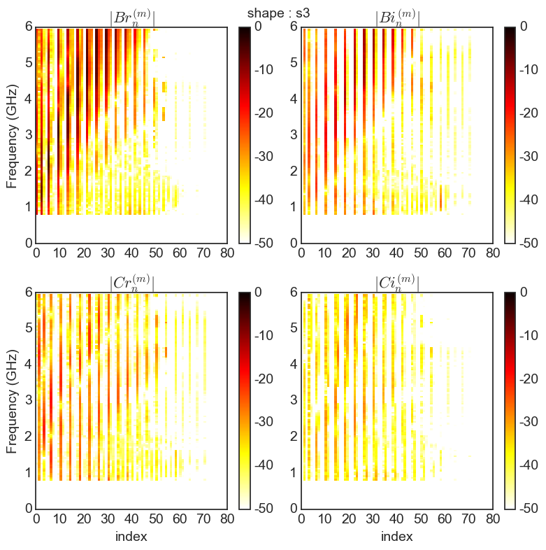

Description of antennas
=======================

PyLayers has a very rich set of tools for handling antenna radiation
pattern. Antennas can be described in different manners and read from
different specific file formats.

The description goes from a simple antenna gain formula to a full
polarization description, compressed or not, using scalar or vector
spherical harmonics decomposition.

In the following, some features of the ``Antenna`` class are
illustrated. The ``Antenna`` class is stored in the
`antenna.py <http://pylayers.github.io/pylayers/modules/pylayers.antprop.antenna.html>`__
module which is placed in the ``antprop`` module.

.. code:: python

    from pylayers.antprop.antenna import *
    %matplotlib inline

.. parsed-literal::

    WARNING:traits.has_traits:DEPRECATED: traits.has_traits.wrapped_class, 'the 'implements' class advisor has been deprecated. Use the 'provides' class decorator.

An antenna object can not be loaded in specifying an existing antenna
file name as argument of the constructor. Lets start by loading an
antenna from a ``vsh3`` file which correspond to a vector spherical
harmonics representation of an antenna measured in SATIMO near field
chamber.

.. code:: python

    A = Antenna('S1R1.vsh3')

The object antenna can show itself just by typing it's name.

.. code:: python

    A

.. parsed-literal::

    Antenna type : vsh3
    ------------------------
    file name : S1R1.vsh3
    fmin : 0.80GHz
    fmax : 5.95GHz
    step : 50.00MHz
    Nf : 104
    Not evaluated

We got information about the antenna filename and the frequency band
where it has been defined.

At loading time the antenna is not evaluated. It means that there is no
internally any pattern for a set of angular and frequency values.

To list all the available antenna files in the dedicated directory of
the project it is possible to invoke the ``ls()`` method.

Antenna files should be stored in the sub-directory ``ant`` of the
current project. The current project is located with the ``$BASENAME``
environment variable.

.. code:: python

    !echo $BASENAME

.. parsed-literal::

    /home/uguen/Bureau/P1

We can use the ``ls`` method to determine the number of files of
different type

.. code:: python

    lvsh3 = A.ls('vsh3')
    lssh3 = A.ls('sh3')
    lmat = A.ls('mat')
    print "Number of antenna in .vsh3 format : ",len(lvsh3)
    print "Number of antenna in .sh3 format : ",len(lssh3)
    print lvsh3[0:5]
    print lssh3[0:5]

.. parsed-literal::

    Number of antenna in .vsh3 format :  5
    Number of antenna in .sh3 format :  4
    ['S1R1.vsh3', 'UWB_CEA.vsh3', 'defant.vsh3', 'dipole_XZ_NEC2.vsh3', 'monocone_IETR_1_6_G.vsh3']
    ['S17R1.sh3', 'S17R2m.sh3', 'S1R1.sh3', 'S2R2.sh3']

Pattern Visualization
=====================

As already mentionned, the radiation pattern of the antenna has not yet
been evaluated. The method to evaluate the pattern is ``eval()`` with
the ``grid`` option set to true. If the ``grid`` option is set to False,
the antenna is evaluated for only the specified direction. This mode is
used in the ray tracing, while the former is used to visualize the whole
antenna pattern.

.. code:: python

    A.eval()

Now the antenna is evaluated

.. code:: python

    A

.. parsed-literal::

    Antenna type : vsh3
    ------------------------
    file name : S1R1.vsh3
    fmin : 0.80GHz
    fmax : 5.95GHz
    step : 50.00MHz
    Nf : 104
    -----------------------
          evaluated        
    -----------------------
    Ntheta : 90
    Nphi : 181
       f = 5.60 GHz 
       theta = 68.76 (degrees) 
       phi = 270.50  (degrees) 

.. code:: python

    A.fGHz

.. parsed-literal::

    array([ 0.8 ,  0.85,  0.9 ,  0.95,  1.  ,  1.05,  1.1 ,  1.15,  1.2 ,
            1.25,  1.3 ,  1.35,  1.4 ,  1.45,  1.5 ,  1.55,  1.6 ,  1.65,
            1.7 ,  1.75,  1.8 ,  1.85,  1.9 ,  1.95,  2.  ,  2.05,  2.1 ,
            2.15,  2.2 ,  2.25,  2.3 ,  2.35,  2.4 ,  2.45,  2.5 ,  2.55,
            2.6 ,  2.65,  2.7 ,  2.75,  2.8 ,  2.85,  2.9 ,  2.95,  3.  ,
            3.05,  3.1 ,  3.15,  3.2 ,  3.25,  3.3 ,  3.35,  3.4 ,  3.45,
            3.5 ,  3.55,  3.6 ,  3.65,  3.7 ,  3.75,  3.8 ,  3.85,  3.9 ,
            3.95,  4.  ,  4.05,  4.1 ,  4.15,  4.2 ,  4.25,  4.3 ,  4.35,
            4.4 ,  4.45,  4.5 ,  4.55,  4.6 ,  4.65,  4.7 ,  4.75,  4.8 ,
            4.85,  4.9 ,  4.95,  5.  ,  5.05,  5.1 ,  5.15,  5.2 ,  5.25,
            5.3 ,  5.35,  5.4 ,  5.45,  5.5 ,  5.55,  5.6 ,  5.65,  5.7 ,
            5.75,  5.8 ,  5.85,  5.9 ,  5.95])

.. code:: python

    f,a=A.plotG(fGHz=[0.8,1,2,3,4,5,6],plan='phi',GmaxdB=5)

.. code:: python

    f,a = A.plotG(fGHz=[0.8,1,2,3,4,5,6],plan='theta',GmaxdB=5)

.. image:: Antenna_files/Antenna_23_0.png

Spherial Harmonics representation
=================================

The vector spherical coefficient are strored in ``A.C``. This C refers
to the coefficients. Those coefficients are obtained thanks to the
`Spherepack
Module <http://nldr.library.ucar.edu/repository/assets/technotes/TECH-NOTE-000-000-000-380.pdf>`__.

Adams, J.C., and P.N. Swarztrauber, 1997: Spherepack 2.0: A Model
Development Facility. NCAR Technical Note NCAR/TN-436+STR, DOI:
10.5065/D6Z899CF.

We are here using the same notations. See Formula 4-10- to 4-13 of the
above reference document. Only the vector spherical analysis is done
using the ``vha`` function ``Spherepack``, the vector spherical
synthesis has been numpyfied in the
`pylayers.antprop.spharm.py <http://pylayers.github.io/pylayers/modules/pylayers.antprop.spharm.html>`__
module.

`Description of Vector Spherical Harmonics <./AntennaVSH.html>`__

The coefficients of the antenna also have a **repr**

.. code:: python

    A.C

.. parsed-literal::

    Br
    -------------
    Nf   : 104
    fmin (GHz) : 0.8
    fmax (GHz) : 5.95
    Ncoeff s3 : 72
    
    Bi
    -------------
    Nf   : 104
    fmin (GHz) : 0.8
    fmax (GHz) : 5.95
    Ncoeff s3 : 72
    
    Cr
    -------------
    Nf   : 104
    fmin (GHz) : 0.8
    fmax (GHz) : 5.95
    Ncoeff s3 : 72
    
    Ci
    -------------
    Nf   : 104
    fmin (GHz) : 0.8
    fmax (GHz) : 5.95
    Ncoeff s3 : 72

Synthesis of the radiation pattern
----------------------------------

The radiation pattern is synthetized with the following call

.. code:: python

    A.eval(grid=True)

.. code:: python

    20*np.log10(np.max(A.sqG))

.. parsed-literal::

    2.2267467105871743

The ``plotG()`` method allow to superpose different pattern for a list
of frequencies ``fGHz`` + If ``phd`` (phi in degree) is specified the
diagram is given as a function of :math:`\theta` + If ``thd`` (theta in
degree) is specified the diagram is given as a function of :math:`\phi`

.. code:: python

    f = plt.figure(figsize=(20,10))
    a1 = f.add_subplot(121,projection='polar')
    f1,a1 = A.plotG(fGHz=[3,4,5.6],plan='theta',angdeg=0,GmaxdB=5,fig=f,ax=a1,show=False)
    a2 = f1.add_subplot(122,projection='polar')
    f2,a2 = A.plotG(fGHz=[3,4,5.6],plan='phi',angdeg=90,GmaxdB=5,fig=f,ax=a2)
    f2.tight_layout()

.. image:: Antenna_files/Antenna_36_0.png

.. code:: python

    f = plt.figure(figsize=(20,10))
    a1 = f.add_subplot(121)
    f1,a1 = A.plotG(fGHz=[3,4,5.6],plan='theta',angdeg=0,fig=f,ax=a1,show=False,polar=False)
    a2 = f.add_subplot(122)
    f2,a2 = A.plotG(fGHz=[3,4,5.6],plan='phi',angdeg=90,GmaxdB=5,fig=f1,ax=a2,polar=False)
    f2.tight_layout()

.. image:: Antenna_files/Antenna_37_0.png

.. code:: python

    A.fGHz[96]

.. parsed-literal::

    5.6000000000000005

.. code:: python

    A.plotG(fGHz=[5.6],plan='phi',angdeg=90,GmaxdB=5)

.. image:: Antenna_files/Antenna_39_0.png

.. parsed-literal::

    (<matplotlib.figure.Figure at 0x2b419e470d50>,
     <matplotlib.projections.polar.PolarAxes at 0x2b419ff13ed0>)

.. code:: python

    # A.pol3d(R=5,St=8,Sp=8)

The vector spherical coefficients can be dispalayed as follows

.. code:: python

    fig = plt.figure(figsize=(8,8))
    A.C.show(typ='s3')
    plt.tight_layout()

.. image:: Antenna_files/Antenna_42_0.png

Defining Antenna gain from analytic formulas
--------------------------------------------

An antenna can also be defined from closed-form expressions. Available
antennas are the following + Omni + Gauss + WirePlate + 3GPP

.. code:: python

    Ag = Antenna(typ='Gauss')

.. code:: python

    Ag.plotG()

.. image:: Antenna_files/Antenna_46_0.png

.. parsed-literal::

    (<matplotlib.figure.Figure at 0x2b41a0783d10>,
     <matplotlib.projections.polar.PolarAxes at 0x2b41a0783150>)

.. code:: python

    Ao = Antenna('Omni')

.. code:: python

    Ao.plotG()

.. image:: Antenna_files/Antenna_48_0.png

.. parsed-literal::

    (<matplotlib.figure.Figure at 0x2b41a0653690>,
     <matplotlib.projections.polar.PolarAxes at 0x2b41a0653310>)

.. code:: python

    A3 = Antenna('3gpp')

.. code:: python

    A3.plotG()

.. image:: Antenna_files/Antenna_50_0.png

.. parsed-literal::

    (<matplotlib.figure.Figure at 0x2b41a076d050>,
     <matplotlib.projections.polar.PolarAxes at 0x2b41a05c62d0>)

