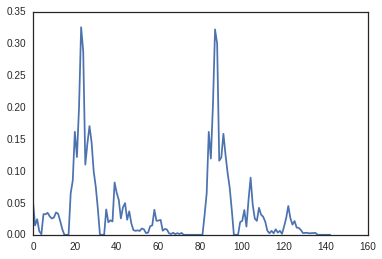

Scalar Spherical Harmonics
==========================

.. code:: python

    from pylayers.antprop.antenna import *
    from pylayers.antprop.antssh import *
    %matplotlib inline

.. parsed-literal::

    WARNING:traits.has_traits:DEPRECATED: traits.has_traits.wrapped_class, 'the 'implements' class advisor has been deprecated. Use the 'provides' class decorator.

.. code:: python

    A = Antenna('S1R1.mat',directory='ant/UWBAN/Matfile')

.. code:: python

    A

.. parsed-literal::

    Antenna type : mat
    ------------------------
    file name : S1R1.mat
    fmin : 0.80GHz
    fmax : 5.95GHz
    step : 50.00MHz
    Nf : 104
    -----------------------
          evaluated        
    -----------------------
    Ntheta : 91
    Nphi : 180
       f = 5.60 GHz 
       theta = 70.00 (degrees) 
       phi = 272.00  (degrees) 

.. code:: python

    A.nf

.. parsed-literal::

    104

To calculate scalar spherical harmonics use method ``ssh(A,L)``

.. code:: python

    L = 5
    A = ssh(A,L=5)

.. code:: python

    A

.. parsed-literal::

    Antenna type : mat
    ------------------------
    file name : S1R1.mat
    fmin : 0.80GHz
    fmax : 5.95GHz
    step : 50.00MHz
    Nf : 104
    -----------------------
          evaluated        
    -----------------------
    Ntheta : 91
    Nphi : 180
       f = 5.60 GHz 
       theta = 70.00 (degrees) 
       phi = 272.00  (degrees) 

.. code:: python

    plt.plot(abs(A.S.Cx.s2[0]))

.. parsed-literal::

    [<matplotlib.lines.Line2D at 0x2b1e3fb3d450>]

.. image:: AntennaSSH_files/AntennaSSH_8_1.png

.. code:: python

    A.savesh2()

.. parsed-literal::

    /home/uguen/Bureau/P1/ant/S1R1.sh2  already exist

.. code:: python

    A.loadsh2()

.. code:: python

    plt.plot(abs(A.S.Cx.s2[0]))

.. parsed-literal::

    [<matplotlib.lines.Line2D at 0x2b1e3fc3c750>]

.. image:: AntennaSSH_files/AntennaSSH_11_1.png

.. code:: python

    A.S.s2tos3()

.. code:: python

    plt.plot(abs(A.S.Cx.s3[0]))

.. parsed-literal::

    [<matplotlib.lines.Line2D at 0x2b1e3fcf5a50>]

.. image:: AntennaSSH_files/AntennaSSH_13_1.png

.. code:: python

    A.S.Cx.ind2.shape

.. parsed-literal::

    (36, 2)

.. code:: python

    A.savesh3()

.. parsed-literal::

    /home/uguen/Bureau/P1/ant/S1R1.sh3  already exist

.. code:: python

    plt.plot(abs(A.S.Cx.s2[0]))

.. parsed-literal::

    [<matplotlib.lines.Line2D at 0x2b1e3fdb3490>]

.. image:: AntennaSSH_files/AntennaSSH_16_1.png

.. code:: python

    A.loadsh3()

.. code:: python

    plt.plot(abs(A.S.Cx.s3[100]))

.. parsed-literal::

    [<matplotlib.lines.Line2D at 0x2b1e3fe713d0>]

.. code:: python

    plt.plot(abs(A.S.Cx.s2[100]))

.. parsed-literal::

    [<matplotlib.lines.Line2D at 0x2b1e3ff35ad0>]

.. image:: AntennaSSH_files/AntennaSSH_19_1.png

.. code:: python

    A.__dict__.keys()

.. parsed-literal::

    ['tau',
     'PhotoFile',
     'nf',
     'Fp',
     'Run',
     'source',
     '_filename',
     'param',
     'Serie',
     'Date',
     'theta',
     'fromfile',
     'fGHz',
     'phi',
     'nph',
     'Notes',
     'nth',
     'S',
     'AntennaName',
     'grid',
     'Ft',
     'typ',
     'DataFile',
     'evaluated',
     'ext',
     'StartTime',
     'sqG']

.. code:: python

    A.S.Cx.__dict__.keys()

.. parsed-literal::

    ['k2', 'ind3', 'ind2', 'fmax', 's2', 'Nf', 's3', 'lmax', 'fmin']

.. code:: python

    A.S.Cx

.. parsed-literal::

    Nf   : 104
    fmin (GHz) : 0.8
    fmax (GHz) : 5.95
    NCoeff s2  : 36
    Ncoeff s3 : 143

