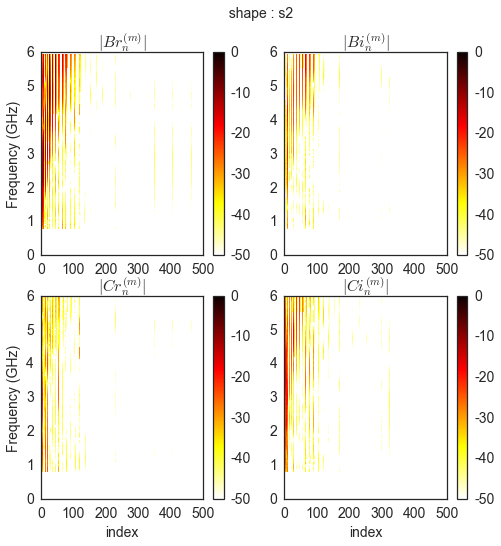

Vector Spherical Harmonics Representation of Antennas
=====================================================

.. code:: python

    from pylayers.antprop.antenna import *
    from pylayers.antprop.antvsh import *
    %matplotlib inline

.. parsed-literal::

    WARNING:traits.has_traits:DEPRECATED: traits.has_traits.wrapped_class, 'the 'implements' class advisor has been deprecated. Use the 'provides' class decorator.

Loading an Antenna from a Matlab file

.. code:: python

    A = Antenna('S2R2.mat',directory='ant/UWBAN/Matfile')

The shape of the :math:`F_{\phi}` functions indicates :

-  :math:`N_{\theta} = 91`
-  :math:`N_{\phi} = 180 `
-  :math:`N_f= 104`

.. code:: python

    np.shape(A.Fp)

.. parsed-literal::

    (91, 180, 104)

The frequency array is expressed in :math:`GHz` and delays are expressed
in :math:`ns`

.. code:: python

    fGHz = A.fGHz

.. code:: python

    fGHz.shape

.. parsed-literal::

    (104,)

Then an electrical delay of :math:`4.185ns` is applied on the
:math:`F_{\theta}`

.. code:: python

    I = A.Ft[:,:,:]

.. code:: python

    I.shape

.. parsed-literal::

    (91, 180, 104)

.. code:: python

    plt.figure(figsize=(10,8))
    plt.imshow(np.unwrap(np.angle(I[:,45,:])))
    plt.title(r'Unwrapped phase of $F_{\theta}$ w.r.t frequency and phi for $\theta=\frac{pi}{2}$')
    plt.ylabel('f index')
    plt.colorbar()
    plt.figure()
    plt.plot(fGHz,np.unwrap(np.angle(I[45,85,:])))
    plt.xlabel('f index')

.. parsed-literal::

    <matplotlib.text.Text at 0x2b9288417090>

.. image:: AntennaVSH_files/AntennaVSH_13_1.png

.. image:: AntennaVSH_files/AntennaVSH_13_2.png

.. code:: python

    tau=4.185
    I = A.Ft[:,:,:]*np.exp(-2*1j*np.pi*fGHz[None,None,:]*tau)

.. code:: python

    plt.imshow(np.unwrap(np.angle(I[:,45,:])))
    plt.title(r'Unwrapped phase of $F_{\theta}$ w.r.t frequency and phi for $\theta=\frac{pi}{2}$')
    plt.ylabel('f index')
    plt.colorbar()
    plt.figure()
    plt.plot(fGHz,np.unwrap(np.angle(I[45,85,:])))

.. parsed-literal::

    [<matplotlib.lines.Line2D at 0x2b928843b8d0>]

.. image:: AntennaVSH_files/AntennaVSH_15_1.png

.. image:: AntennaVSH_files/AntennaVSH_15_2.png

Display of the radiation pattern for all frequencies
''''''''''''''''''''''''''''''''''''''''''''''''''''

.. code:: python

    plt.figure(figsize=(10,10))
    for nf in range(104):
        plt.polar(A.phi,abs(A.Ft[45,:,nf]))

.. image:: AntennaVSH_files/AntennaVSH_17_0.png

.. code:: python

    A.info()

.. parsed-literal::

    S2R2.mat
    type :  mat
    S2R2
    Th1
    04/13/12
    09:59
    
    
    2
    2
    Nb theta (lat) : 91
    Nb phi (lon) : 180
    No vsh coefficient calculated yet

Evaluation of Vector Spherical Harmonics Coefficients
=====================================================

At that stage we compute the Vector Spherical Harmonics coefficients

.. code:: python

    A=vsh(A)

.. code:: python

    A.info()

.. parsed-literal::

    S2R2.mat
    type :  mat
    S2R2
    Th1
    04/13/12
    09:59
    
    
    2
    2
    Nb theta (lat) : 91
    Nb phi (lon) : 180
    No vsh coefficient calculated yet

.. code:: python

    A.C.s1tos2(30)

.. code:: python

    A.C

.. parsed-literal::

    Br
    -------------
    L1  : 90
    M1  : 89
    Ncoeff s1 8010
    NCoeff s2  : 495
    
    Bi
    -------------
    L1  : 90
    M1  : 89
    Ncoeff s1 8010
    NCoeff s2  : 495
    
    Cr
    -------------
    L1  : 90
    M1  : 89
    Ncoeff s1 8010
    NCoeff s2  : 495
    
    Ci
    -------------
    L1  : 90
    M1  : 89
    Ncoeff s1 8010
    NCoeff s2  : 495

.. code:: python

    fig = plt.figure(figsize=(8,8))
    A.C.show('s2',k=300)

.. code:: python

    A.C.s2tos3()

.. code:: python

    A.C

.. parsed-literal::

    Br
    -------------
    L1  : 90
    M1  : 89
    Ncoeff s1 8010
    NCoeff s2  : 495
    Ncoeff s3 : 145
    
    Bi
    -------------
    L1  : 90
    M1  : 89
    Ncoeff s1 8010
    NCoeff s2  : 495
    Ncoeff s3 : 145
    
    Cr
    -------------
    L1  : 90
    M1  : 89
    Ncoeff s1 8010
    NCoeff s2  : 495
    Ncoeff s3 : 145
    
    Ci
    -------------
    L1  : 90
    M1  : 89
    Ncoeff s1 8010
    NCoeff s2  : 495
    Ncoeff s3 : 145

.. code:: python

    fig = plt.figure(figsize=(8,8))
    A.C.show('s3')
    plt.tight_layout()

.. image:: AntennaVSH_files/AntennaVSH_28_0.png

