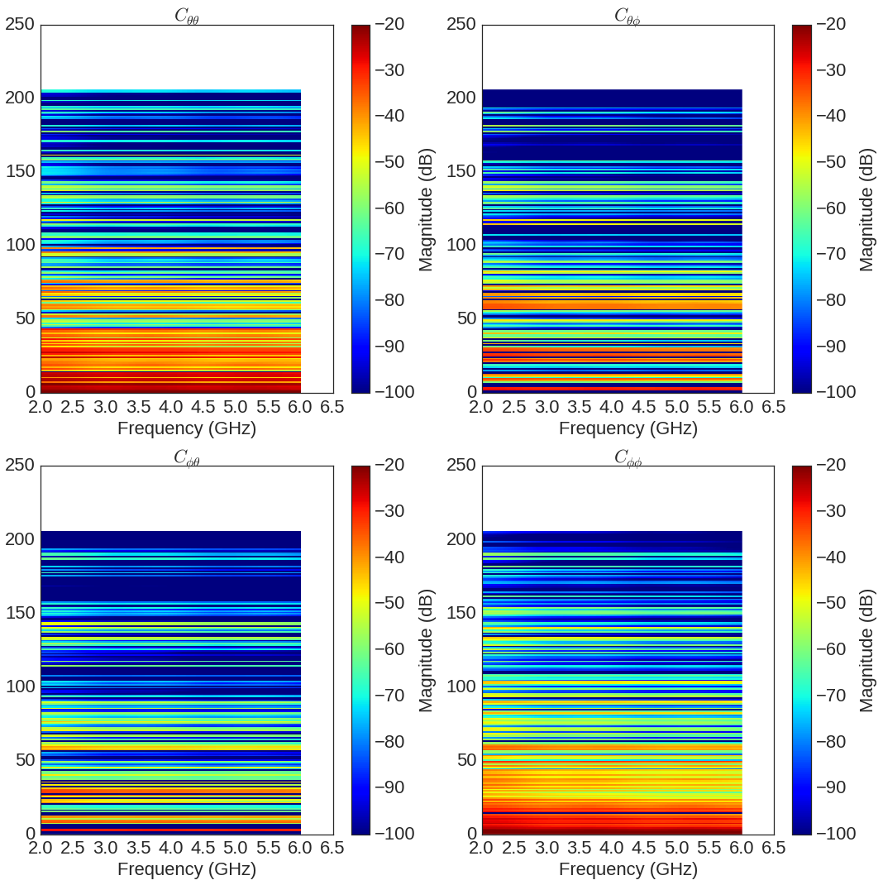
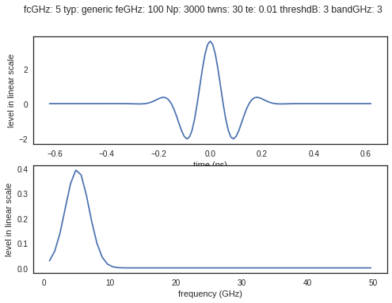
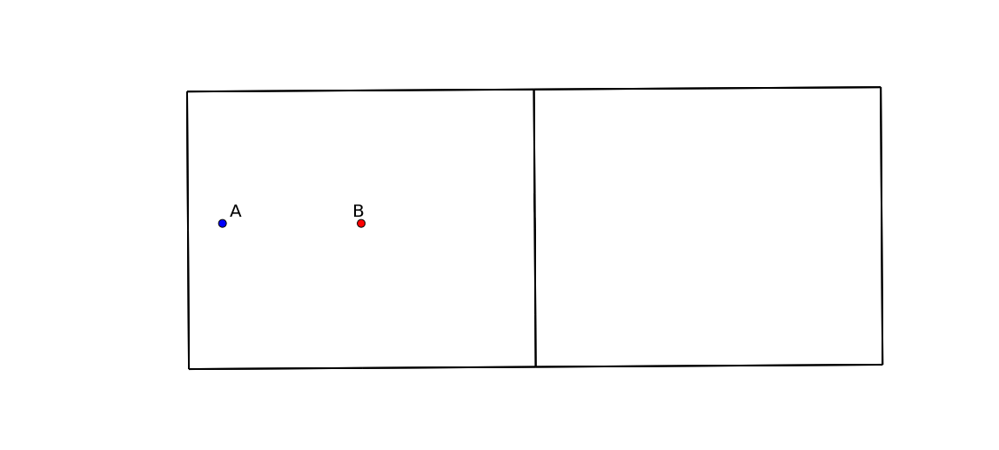
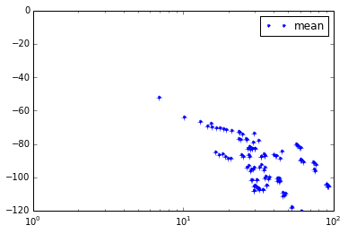

The transmission channel
========================

.. code:: python

    %matplotlib inline

.. code:: python

    from pylayers.antprop.rays import *
    import scipy.fftpack as fft
    from pylayers.gis.layout import *
    from pylayers.antprop.signature import *
    from pylayers.simul.link import *
    import pylayers.signal.bsignal as bs
    import pylayers.signal.waveform as wvf
    from pylayers.simul.simulem import *
    import matplotlib.pyplot as plt
    import time

.. parsed-literal::

    WARNING:traits.has_traits:DEPRECATED: traits.has_traits.wrapped_class, 'the 'implements' class advisor has been deprecated. Use the 'provides' class decorator.

We start by constructing a propagation channel with the dedicated class
``DLink``. We specify a Layout as well as the two extremities of the
link. Antennas are also specified.

.. code:: python

    L = Layout('defstr3.ini')
    L.Gs.node[1]['ss_name']=['WOOD','AIR','METAL']
    L.build()
    tx=array([759,1114,1.0])
    rx=array([761,1114,1.5])
    Lk = DLink(a=tx,b=rx,Aa=Antenna('Omni'),Ab=Antenna('Omni'))

.. parsed-literal::

    check len(ncycles) == 2 passed

The full evaluation and hdf5 storage of the channel is done with the
eval function. The ``force`` option is for recalculating everything
whatever what has been previously calculated.

.. code:: python

    ak,tauk=Lk.eval()

.. parsed-literal::

    checkh5
    Start Signatures
    run
    algo 2 ( ex 7)
    Signatures'> from 2_2_3 saved
    Stop signature 0.098562002182
    Start Rays
    Rays'> from 3_2_3 saved
    Stop rays 0.330257892609
    Ctilde'> from 2_3_1 saved
    Tchannel'> from 2_3_1_0_0_0_0 saved

.. code:: python

    f = plt.figure(figsize=(15,15))
    f,a=Lk.C.show(cmap='jet',typ='l20',fig=f,vmin=-100,vmax=-20,fontsize=22)

The transmission channel is stored in ``H``

.. code:: python

    Lk.H

.. parsed-literal::

    Tchannel : Ray transfer function (Nray x Nr x Nt x Nf)
    -----------------------------------------------------
    freq : 2.4 2.4 1
    shape  : (1216, 1, 1, 1)
    tau (min, max) : 6.87184270936 92.947720014
    dist (min,max) : 2.06155281281 27.8843160042
    Friis factor -j c/(4 pi f) has been applied
     calibrated : No
     windowed : No

Once the channel has been calculated, we define an IR-UWB waveform.

.. code:: python

    fGHz=np.arange(2,12,.1)
    wav = wvf.Waveform(fcGHz=5,bandGHz=3)

.. code:: python

    wav.show()

Cwood is an object which contains all the information about the
propagation channel.

.. code:: python

    Lk.show()

.. parsed-literal::

    (<matplotlib.figure.Figure at 0x2ae159523250>,
     <matplotlib.axes._subplots.AxesSubplot at 0x2ae155c45550>)

The ``Ctilde`` channel can be sorted with respect to delay

.. code:: python

    Lk.H

.. parsed-literal::

    Tchannel : Ray transfer function (Nray x Nr x Nt x Nf)
    -----------------------------------------------------
    freq : 2.4 2.4 1
    shape  : (1216, 1, 1, 1)
    tau (min, max) : 6.87184270936 92.947720014
    dist (min,max) : 2.06155281281 27.8843160042
    Friis factor -j c/(4 pi f) has been applied
     calibrated : No
     windowed : No

.. code:: python

    len(Lk.fGHz)

.. parsed-literal::

    2

.. code:: python

    f = plt.figure(figsize=(20,10))
    f,a =Lk.H.show(fig=f,cmap='jet')

::

    ---------------------------------------------------------------------------

    IndexError                                Traceback (most recent call last)

    <ipython-input-12-f5a32547e4dd> in <module>()
          1 f = plt.figure(figsize=(20,10))
    ----> 2 f,a =Lk.H.show(fig=f,cmap='jet')
    

    /home/uguen/Documents/rch/devel/pylayers/pylayers/signal/bsignal.pyc in show(self, **kwargs)
       3220 
       3221         ax1 = fig.add_subplot(121)
    -> 3222         fig,ax1 = self.imshow(typ='l20',fig=fig,ax=ax1,**kwargs)
       3223         ax2 = fig.add_subplot(122)
       3224         if 'vmin' in kwargs:

    /home/uguen/Documents/rch/devel/pylayers/pylayers/signal/bsignal.pyc in imshow(self, **kwargs)
        727 
        728         if self.y.ndim>1:
    --> 729             dt,ylabels = self.cformat(**kwargs)
        730 
        731             if 'vmin' not in kwargs:

    /home/uguen/Documents/rch/devel/pylayers/pylayers/signal/bsignal.pyc in cformat(self, **kwargs)
        603             # whole range
        604             vs = 0
    --> 605             vf = shy[ax[1]]
        606         else:
        607             # subset of values

    IndexError: tuple index out of range

.. image:: Channel_files/Channel_18_1.png

The Friis factor
----------------

The Friis factor is :

.. math:: \alpha=\frac{-jc}{4\pi f}

This factor is fundamental and should be applied only once. The energy
method has a parameter ``Friis`` which indicates if this factor has to
be used for the calculation of the energy. By default the link is
evaluated with the Friis factor. This can be checked at the end of the
**repr** of ``H``.

.. code:: python

    Lk.H

.. parsed-literal::

    Tchannel : Ray transfer function (Nray x Nr x Nt x Nf)
    -----------------------------------------------------
    freq : 2.4 2.4 1
    shape  : (1216, 1, 1, 1)
    tau (min, max) : 6.87184270936 92.947720014
    dist (min,max) : 2.06155281281 27.8843160042
    Friis factor -j c/(4 pi f) has been applied
     calibrated : No
     windowed : No

If this factor has already been applied the energy function should be
called with the option ``Friis`` set to False

.. code:: python

    Emean=Lk.H.energy(Friis=False,mode='mean')
    Eint=Lk.H.energy(Friis=False,mode='integ')
    Ecenter=Lk.H.energy(Friis=False,mode='center')
    Efirst=Lk.H.energy(Friis=False,mode='first')
    Elast=Lk.H.energy(Friis=False,mode='last')

::

    ---------------------------------------------------------------------------

    IndexError                                Traceback (most recent call last)

    <ipython-input-14-2c8aff483b42> in <module>()
          1 Emean=Lk.H.energy(Friis=False,mode='mean')
    ----> 2 Eint=Lk.H.energy(Friis=False,mode='integ')
          3 Ecenter=Lk.H.energy(Friis=False,mode='center')
          4 Efirst=Lk.H.energy(Friis=False,mode='first')
          5 Elast=Lk.H.energy(Friis=False,mode='last')

    /home/uguen/Documents/rch/devel/pylayers/pylayers/antprop/channel.pyc in energy(self, mode, Friis, sumray)
       2129         #  axis 1 : frequency
       2130         #
    -> 2131         Etot = bs.FUsignal.energy(self,axis=1,mode=mode,Friis=Friis)
       2132         if sumray:
       2133             Etot = np.sum(Etot,axis=0)

    /home/uguen/Documents/rch/devel/pylayers/pylayers/signal/bsignal.pyc in energy(self, axis, Friis, mode)
       2829 
       2830         if mode=='integ':
    -> 2831             EMH2  = MH2.sum(axis=-1)*(self.x[1]-self.x[0])
       2832 
       2833         if mode=='center':

    IndexError: index 1 is out of bounds for axis 0 with size 1

.. code:: python

    print Efirst[0],Elast[0]

::

    ---------------------------------------------------------------------------

    NameError                                 Traceback (most recent call last)

    <ipython-input-15-4b40c4a26243> in <module>()
    ----> 1 print Efirst[0],Elast[0]
    

    NameError: name 'Efirst' is not defined

On the figure below we have selected a LOS situation and we compare the
energy for each path with the LOS values (the straight line). The 3
straight lines coresponds to the Free space path loss formula for 3
frequencies (f = 2GHz,f=6GHz,f=10GHz). For those 3 frequencies the first
path is perfectly on the curve, which is a validation the observed
level.

.. code:: python

    Lk.H.y.shape

.. parsed-literal::

    (1216, 1, 1, 1)

.. code:: python

    f1 = 2
    f2 = 10
    f3 = 6
    fig = plt.figure(figsize=(10,5))
    a = plt.semilogx(Lk.H.taud,10*np.log10(Efirst),'.r',label='f=2GHz')
    a = plt.semilogx(Lk.H.taud,10*np.log10(Emean),'.b',label='mean')
    a = plt.semilogx(Lk.H.taud,10*np.log10(Elast),'.g',label='f=10GHz')
    a = plt.semilogx(Lk.H.taud,10*np.log10(Eint),'.k',label='integral')
    a = plt.semilogx(Lk.H.taud,10*np.log10(Ecenter),'.c',label='6GHz')
    plt.xlabel(r'$\tau$ (ns)')
    plt.ylabel('Path Loss (dB)')
    LOS1 = -32.4-20*np.log10(Lk.H.taud*0.3)-20*np.log10(f1)
    LOS2 = -32.4-20*np.log10(Lk.H.taud*0.3)-20*np.log10(f2)
    LOS3 = -32.4-20*np.log10(Lk.H.taud*0.3)-20*np.log10(f3)
    plt.semilogx(Lk.H.taud,LOS1,'r')
    plt.semilogx(Lk.H.taud,LOS2,'g')
    plt.semilogx(Lk.H.taud,LOS3,'c')
    plt.semilogx(tauk,20*np.log10(ak),'+')
    plt.ylim([-120,0])
    plt.legend()

::

    ---------------------------------------------------------------------------

    NameError                                 Traceback (most recent call last)

    <ipython-input-17-75aafd70e74e> in <module>()
          3 f3 = 6
          4 fig = plt.figure(figsize=(10,5))
    ----> 5 a = plt.semilogx(Lk.H.taud,10*np.log10(Efirst),'.r',label='f=2GHz')
          6 a = plt.semilogx(Lk.H.taud,10*np.log10(Emean),'.b',label='mean')
          7 a = plt.semilogx(Lk.H.taud,10*np.log10(Elast),'.g',label='f=10GHz')

    NameError: name 'Efirst' is not defined

.. parsed-literal::

    <matplotlib.figure.Figure at 0x2ae15626f150>

.. code:: python

    a = plt.semilogx(Lk.H.taud,10*np.log10(Emean),'.b',label='mean')
    plt.semilogx(tauk,20*np.log10(ak),'+')
    plt.ylim([-120,0])
    plt.legend()

::

    ---------------------------------------------------------------------------

    ValueError                                Traceback (most recent call last)

    <ipython-input-18-79fa43f184e0> in <module>()
    ----> 1 a = plt.semilogx(Lk.H.taud,10*np.log10(Emean),'.b',label='mean')
          2 plt.semilogx(tauk,20*np.log10(ak),'+')
          3 plt.ylim([-120,0])
          4 plt.legend()

    /home/uguen/anaconda/lib/python2.7/site-packages/matplotlib/pyplot.pyc in semilogx(*args, **kwargs)
       3266         ax.hold(hold)
       3267     try:
    -> 3268         ret = ax.semilogx(*args, **kwargs)
       3269     finally:
       3270         ax.hold(washold)

    /home/uguen/anaconda/lib/python2.7/site-packages/matplotlib/axes/_axes.pyc in semilogx(self, *args, **kwargs)
       1614         b = self._hold
       1615         self._hold = True  # we've already processed the hold
    -> 1616         l = self.plot(*args, **kwargs)
       1617         self._hold = b  # restore the hold
       1618         return l

    /home/uguen/anaconda/lib/python2.7/site-packages/matplotlib/__init__.pyc in inner(ax, *args, **kwargs)
       1810                     warnings.warn(msg % (label_namer, func.__name__),
       1811                                   RuntimeWarning, stacklevel=2)
    -> 1812             return func(ax, *args, **kwargs)
       1813         pre_doc = inner.__doc__
       1814         if pre_doc is None:

    /home/uguen/anaconda/lib/python2.7/site-packages/matplotlib/axes/_axes.pyc in plot(self, *args, **kwargs)
       1422             kwargs['color'] = c
       1423 
    -> 1424         for line in self._get_lines(*args, **kwargs):
       1425             self.add_line(line)
       1426             lines.append(line)

    /home/uguen/anaconda/lib/python2.7/site-packages/matplotlib/axes/_base.pyc in _grab_next_args(self, *args, **kwargs)
        384                 return
        385             if len(remaining) <= 3:
    --> 386                 for seg in self._plot_args(remaining, kwargs):
        387                     yield seg
        388                 return

    /home/uguen/anaconda/lib/python2.7/site-packages/matplotlib/axes/_base.pyc in _plot_args(self, tup, kwargs)
        362             x, y = index_of(tup[-1])
        363 
    --> 364         x, y = self._xy_from_xy(x, y)
        365 
        366         if self.command == 'plot':

    /home/uguen/anaconda/lib/python2.7/site-packages/matplotlib/axes/_base.pyc in _xy_from_xy(self, x, y)
        223             raise ValueError("x and y must have same first dimension")
        224         if x.ndim > 2 or y.ndim > 2:
    --> 225             raise ValueError("x and y can be no greater than 2-D")
        226 
        227         if x.ndim == 1:

    ValueError: x and y can be no greater than 2-D

.. code:: python

    CIR=bs.TUsignal(tauk,np.zeros(len(tauk)))
    CIR.aggcir(ak,tauk)
    CIR.stem()
    plt.title('Infinite bandwidth CIR')

::

    ---------------------------------------------------------------------------

    AttributeError                            Traceback (most recent call last)

    <ipython-input-19-e688100b13ed> in <module>()
          1 CIR=bs.TUsignal(tauk,np.zeros(len(tauk)))
    ----> 2 CIR.aggcir(ak,tauk)
          3 CIR.stem()
          4 plt.title('Infinite bandwidth CIR')

    AttributeError: 'TUsignal' object has no attribute 'aggcir'

.. code:: python

    MeanDelay = CIR.tau_moy()
    DelaySpread = CIR.tau_rms()
    print MeanDelay,DelaySpread

::

    ---------------------------------------------------------------------------

    AttributeError                            Traceback (most recent call last)

    <ipython-input-20-6f04a248436b> in <module>()
    ----> 1 MeanDelay = CIR.tau_moy()
          2 DelaySpread = CIR.tau_rms()
          3 print MeanDelay,DelaySpread

    AttributeError: 'TUsignal' object has no attribute 'tau_moy'

.. code:: python

    f = plt.figure(figsize=(20,10))
    f=Lk.H.show(cmap='jet',fig=f)

::

    ---------------------------------------------------------------------------

    IndexError                                Traceback (most recent call last)

    <ipython-input-21-61834b1cbc3e> in <module>()
          1 f = plt.figure(figsize=(20,10))
    ----> 2 f=Lk.H.show(cmap='jet',fig=f)
    

    /home/uguen/Documents/rch/devel/pylayers/pylayers/signal/bsignal.pyc in show(self, **kwargs)
       3220 
       3221         ax1 = fig.add_subplot(121)
    -> 3222         fig,ax1 = self.imshow(typ='l20',fig=fig,ax=ax1,**kwargs)
       3223         ax2 = fig.add_subplot(122)
       3224         if 'vmin' in kwargs:

    /home/uguen/Documents/rch/devel/pylayers/pylayers/signal/bsignal.pyc in imshow(self, **kwargs)
        727 
        728         if self.y.ndim>1:
    --> 729             dt,ylabels = self.cformat(**kwargs)
        730 
        731             if 'vmin' not in kwargs:

    /home/uguen/Documents/rch/devel/pylayers/pylayers/signal/bsignal.pyc in cformat(self, **kwargs)
        603             # whole range
        604             vs = 0
    --> 605             vf = shy[ax[1]]
        606         else:
        607             # subset of values

    IndexError: tuple index out of range

.. image:: Channel_files/Channel_32_1.png

The cut method applies an energy thresholding on the transmission
channel.

.. code:: python

    Lk.H.cut()

.. code:: python

    f = plt.figure(figsize=(20,10))
    f=Lk.H.show(cmap='jet',fig=f)

::

    ---------------------------------------------------------------------------

    IndexError                                Traceback (most recent call last)

    <ipython-input-23-61834b1cbc3e> in <module>()
          1 f = plt.figure(figsize=(20,10))
    ----> 2 f=Lk.H.show(cmap='jet',fig=f)
    

    /home/uguen/Documents/rch/devel/pylayers/pylayers/signal/bsignal.pyc in show(self, **kwargs)
       3220 
       3221         ax1 = fig.add_subplot(121)
    -> 3222         fig,ax1 = self.imshow(typ='l20',fig=fig,ax=ax1,**kwargs)
       3223         ax2 = fig.add_subplot(122)
       3224         if 'vmin' in kwargs:

    /home/uguen/Documents/rch/devel/pylayers/pylayers/signal/bsignal.pyc in imshow(self, **kwargs)
        727 
        728         if self.y.ndim>1:
    --> 729             dt,ylabels = self.cformat(**kwargs)
        730 
        731             if 'vmin' not in kwargs:

    /home/uguen/Documents/rch/devel/pylayers/pylayers/signal/bsignal.pyc in cformat(self, **kwargs)
        603             # whole range
        604             vs = 0
    --> 605             vf = shy[ax[1]]
        606         else:
        607             # subset of values

    IndexError: tuple index out of range

.. image:: Channel_files/Channel_35_1.png

The tap method
--------------

The tap methods takes as parameters : + The system bandwidth :math:`W`
expressed in MHz + The two extremities velocities :math:`V_a` and
:math:`V_b` + The number of taps to be evaluted :math:`N_{tap}` + The
number of time samples :math:`N_m` + The number of spatial realizations
:math:`N_s`

This method returns a Multi Dimensional Array :math:`htap(f,s,m,tap)`

htap has 4 axes.

-  axis 0 is frequency,
-  axis 1 is spatial realization
-  axis 2 is discrete time
-  axis 3 is tap index

.. code:: python

    Va = 10
    Vb = 10
    fcGHz = 4.5
    Nm = 50
    Ns = 10
    WMHz = 20
    Ntap = 10

.. code:: python

    htap,b,c,d = Lk.H.tap(WMHz=WMHz,Ns=Ns,Nm=Nm,Va=Va,Vb=Vb,Ntap=Ntap)

::

    ---------------------------------------------------------------------------

    ValueError                                Traceback (most recent call last)

    <ipython-input-25-1e46705dbeb0> in <module>()
    ----> 1 htap,b,c,d = Lk.H.tap(WMHz=WMHz,Ns=Ns,Nm=Nm,Va=Va,Vb=Vb,Ntap=Ntap)
    

    /home/uguen/Documents/rch/devel/pylayers/pylayers/antprop/channel.pyc in tap(self, **kwargs)
       2464 
       2465         # f x s  x m x tap
    -> 2466         htap  = htap.reshape(Nf,Ns,Nm,Ntap)
       2467         Et_htap = np.sqrt(np.sum(htap*np.conj(htap),axis=2))/Nm
       2468         Er_htap = np.sum(htap,axis=1)/Ns

    ValueError: total size of new array must be unchanged

.. code:: python

    np.shape(htap)

::

    ---------------------------------------------------------------------------

    NameError                                 Traceback (most recent call last)

    <ipython-input-26-ac45a4e5a814> in <module>()
    ----> 1 np.shape(htap)
    

    NameError: name 'htap' is not defined

The second parameter is the time integration of htap

-  axis 0 i frequency
-  axis 2 is spatial (realization)
-  axis 2 is tap

.. code:: python

    b.shape

::

    ---------------------------------------------------------------------------

    NameError                                 Traceback (most recent call last)

    <ipython-input-27-82ed078d10e8> in <module>()
    ----> 1 b.shape
    

    NameError: name 'b' is not defined

.. code:: python

    np.shape(c)

::

    ---------------------------------------------------------------------------

    NameError                                 Traceback (most recent call last)

    <ipython-input-28-cc55a9cc958f> in <module>()
    ----> 1 np.shape(c)
    

    NameError: name 'c' is not defined

.. code:: python

    d.shape

::

    ---------------------------------------------------------------------------

    NameError                                 Traceback (most recent call last)

    <ipython-input-29-68023ae9b3bd> in <module>()
    ----> 1 d.shape
    

    NameError: name 'd' is not defined

The figure below illustrates the joint frequency and spatial fluctuation
for the first channel tap. :exit

.. code:: python

    img = plt.imshow(abs(b[:,:,0]),interpolation='nearest',extent=(0,1000,fGHz[-1],fGHz[0]))
    plt.axis('tight')
    plt.colorbar()
    plt.xlabel('spatial realizations')
    plt.ylabel('Frequency GHz')

::

    ---------------------------------------------------------------------------

    NameError                                 Traceback (most recent call last)

    <ipython-input-30-0b5eab508be1> in <module>()
    ----> 1 img = plt.imshow(abs(b[:,:,0]),interpolation='nearest',extent=(0,1000,fGHz[-1],fGHz[0]))
          2 plt.axis('tight')
          3 plt.colorbar()
          4 plt.xlabel('spatial realizations')
          5 plt.ylabel('Frequency GHz')

    NameError: name 'b' is not defined

.. code:: python

    f = plt.figure(figsize=(10,4))
    h = plt.hist(np.real(b[0,:,0])*1e5,40,normed=True)

::

    ---------------------------------------------------------------------------

    NameError                                 Traceback (most recent call last)

    <ipython-input-31-67e5429df22c> in <module>()
          1 f = plt.figure(figsize=(10,4))
    ----> 2 h = plt.hist(np.real(b[0,:,0])*1e5,40,normed=True)
    

    NameError: name 'b' is not defined

.. parsed-literal::

    <matplotlib.figure.Figure at 0x2ae158e6a550>

.. code:: python

    mmax = 0.3*WMHz*1e6/(2*fcGHz*(Va+Vb))
    tmaxms = 1000*mmax/(WMHz*1e6)
    plt.imshow(abs(c[:,:,1]),interpolation='nearest',extent=(0,tmaxms,fGHz[-1],fGHz[0]))
    plt.axis('tight')
    plt.colorbar()
    plt.xlabel('Discrete Time (ms)')
    plt.ylabel('frequency (GHz)')

::

    ---------------------------------------------------------------------------

    NameError                                 Traceback (most recent call last)

    <ipython-input-32-b96e2c6d4018> in <module>()
          1 mmax = 0.3*WMHz*1e6/(2*fcGHz*(Va+Vb))
          2 tmaxms = 1000*mmax/(WMHz*1e6)
    ----> 3 plt.imshow(abs(c[:,:,1]),interpolation='nearest',extent=(0,tmaxms,fGHz[-1],fGHz[0]))
          4 plt.axis('tight')
          5 plt.colorbar()

    NameError: name 'c' is not defined

.. code:: python

    plt.plot(abs(c[0,:,0]))

::

    ---------------------------------------------------------------------------

    NameError                                 Traceback (most recent call last)

    <ipython-input-33-0f4c005a4ee8> in <module>()
    ----> 1 plt.plot(abs(c[0,:,0]))
    

    NameError: name 'c' is not defined

.. code:: python

    h = c[:,:,2]

::

    ---------------------------------------------------------------------------

    NameError                                 Traceback (most recent call last)

    <ipython-input-34-45f737fc79d6> in <module>()
    ----> 1 h = c[:,:,2]
    

    NameError: name 'c' is not defined

.. code:: python

    import scipy.fftpack as fft

.. code:: python

    H = fft.fft(h,axis=1)

::

    ---------------------------------------------------------------------------

    NameError                                 Traceback (most recent call last)

    <ipython-input-36-7416bec9fa83> in <module>()
    ----> 1 H = fft.fft(h,axis=1)
    

    NameError: name 'h' is not defined

.. code:: python

    plt.imshow(fft.fftshift(abs(H)))
    plt.axis('tight')

::

    ---------------------------------------------------------------------------

    NameError                                 Traceback (most recent call last)

    <ipython-input-37-dfddc57fe5a3> in <module>()
    ----> 1 plt.imshow(fft.fftshift(abs(H)))
          2 plt.axis('tight')

    NameError: name 'H' is not defined

.. code:: python

    #from pylayers.util.mayautil import *
    #m=VolumeSlicer(data=abs(htap[:,0,:,:]))
    #m.configure_traits()
