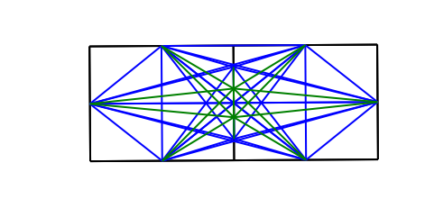
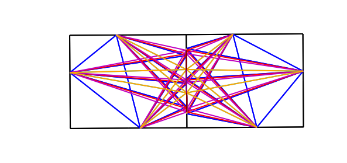

Ray Signatures
==============

Signature are calculated from a cycle to an other cycle of the Layout.
They are used for the determination of rays once the transmitter and
receiver are known. The best algorithmic manner to get a signature is
not stabilized yet, a lot of approaches have been implemented so far,
with very different performances. It is expected that the signature is
delivering all its utility when dealing with mobile trajectories.

The evaluation of a signature from one cycle to another is implemented
in the ``pylayers.simul.Link.DLink`` class.

.. code:: python

    import time
    from pylayers.gis.layout import *
    from pylayers.antprop.signature import *
    from pylayers.antprop.rays import *
    %matplotlib inline

.. parsed-literal::

    Layout:Mayavi is not installed
    Layout:Mayavi is not installed

.. code:: python

    L = Layout('defstr3.ini')
    L.build()
    L.dumpw()

.. parsed-literal::

    check len(ncycles) == 2 passed

Showing the graph of rooms with 2 rooms separated by a DOOR segment

.. code:: python

    L.showG('sv',figsize=(8,8))
    a=plt.axis('off')

The graph of interactions is shown below.

.. code:: python

    L.showG('si',figsize=(10,5))
    a=plt.axis('off')

All the interactions of a given cycle are stored as meta information in
nodes of ``Gt``

.. code:: python

    L.Gi.node

.. parsed-literal::

    {(-8,): {},
     (-7,): {},
     (1, 1): {},
     (1, 1, 2): {},
     (1, 2): {},
     (1, 2, 1): {},
     (2, 1): {},
     (2, 1, 2): {},
     (2, 2): {},
     (2, 2, 1): {},
     (3, 1): {},
     (3, 1, 2): {},
     (3, 2): {},
     (3, 2, 1): {},
     (4, 0): {},
     (4, 0, 1): {},
     (4, 1): {},
     (4, 1, 0): {},
     (5, 0): {},
     (5, 0, 1): {},
     (5, 1): {},
     (5, 1, 0): {},
     (6, 0): {},
     (6, 0, 2): {},
     (6, 2): {},
     (6, 2, 0): {},
     (7, 0): {},
     (7, 0, 2): {},
     (7, 2): {},
     (7, 2, 0): {},
     (8, 0): {},
     (8, 0, 2): {},
     (8, 2): {},
     (8, 2, 0): {},
     (9, 0): {},
     (9, 0, 1): {},
     (9, 1): {},
     (9, 1, 0): {}}

.. code:: python

    L.Gt.node[0]['inter']

.. parsed-literal::

    [(9, 0),
     (9, 0, 1),
     (9, 1, 0),
     (4, 0),
     (4, 0, 1),
     (4, 1, 0),
     (5, 0),
     (5, 0, 1),
     (5, 1, 0),
     (6, 0),
     (6, 0, 2),
     (6, 2, 0),
     (7, 0),
     (7, 0, 2),
     (7, 2, 0),
     (8, 0),
     (8, 0, 2),
     (8, 2, 0),
     (-1,),
     (-6,),
     (-4,),
     (-3,)]

The signature is calculated with as parameters the Layout object and two
cycle numbers. In example below it is 0 and 1.

.. code:: python

    Si = Signatures(L,0,1)

The cold start determination of the signature is done with a ``run``
function. The code is not in its final shape here and there is room for
significant acceleration in incorporating propagation based heuristics.
The mitigation of graph exploration depth is done in setting a
``cutoff`` value which limits the exploration in the interaction graph.

.. code:: python

    Si.run5(cutoff=5,diffraction=False,algo='old')

::

    ---------------------------------------------------------------------------

    AttributeError                            Traceback (most recent call last)

    <ipython-input-8-d547d93e7556> in <module>()
    ----> 1 Si.run5(cutoff=5,diffraction=False,algo='old')
    

    AttributeError: 'Signatures' object has no attribute 'run5'

The representation method of a signature gives informations about the
different signatures. Signatures are grouped by number of interactions.

.. code:: python

    L.Gt.pos

.. parsed-literal::

    {0: (758.49, 1111.9),
     1: array([  761.00289669,  1113.91576981]),
     2: array([  766.00300113,  1113.94747911])}

.. code:: python

    ptx = np.array(L.Gt.pos[0])+np.random.rand(2)
    prx = np.array(L.Gt.pos[1])+np.random.rand(2)
    print ptx
    print prx

.. parsed-literal::

    [  759.12113251  1112.5940909 ]
    [  761.6061431   1113.92961102]

