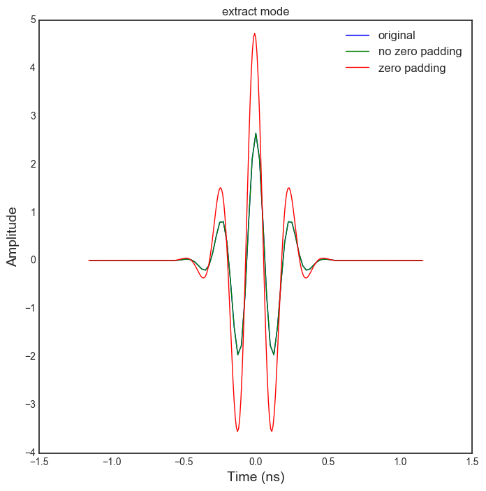

Handling time and frequency domain signals : ``Bsignal`` Class
==============================================================

This section presents some features of the classes implemented in the
```pylayers.signal.bsignal.py`` <http://pylayers.github.io/pylayers/modules/pylayers.signal.bsignal.html>`__
module.

.. code:: python

    %matplotlib inline

The ``Bsignal`` class is a container for a signal with a base which can
be either in time domain or frequency domain.

.. code:: python

    from pylayers.signal.bsignal import *
    from matplotlib.pyplot import *

As a first example, let construct an impulse signal normalized in
energy. To do so there exist a specialized function :
```EnImpulse`` <http://pylayers.github.io/pylayers/modules/generated/pylayers.signal.bsignal.EnImpulse.demo.html#pylayers.signal.bsignal.EnImpulse.demo>`__

.. code:: python

    E=TUsignal()
    E.EnImpulse(feGHz=40)

.. code:: python

    E.plot(typ='v')


.. parsed-literal::

    (<matplotlib.figure.Figure at 0x2b9d0558e790>,
     array([[<matplotlib.axes._subplots.AxesSubplot object at 0x2b9d055a12d0>]], dtype=object))


.. image:: Bsignal_files/Bsignal_7_1.png


.. code:: python

    E.energy()


.. parsed-literal::

    array([ 1.00000008])


The Fourier transform of this signal exhibits the Hermitian Symmetry.

.. code:: python

    F = E.fft()
    F.plot(typ='m')


.. parsed-literal::

    (<matplotlib.figure.Figure at 0x2b9d07c0f410>,
     array([[<matplotlib.axes._subplots.AxesSubplot object at 0x2b9d07c87f10>]], dtype=object))


.. image:: Bsignal_files/Bsignal_10_1.png


We then extract the non redundant part of the signal with the ``ft``
method

.. code:: python

    G=E.ft()

.. code:: python

    GH=G.symHz(100,scale='extract')

.. code:: python

    print GH.y[0,1]
    print GH.y[0,-1]


.. parsed-literal::

    (-0.0014441784194-4.88037298122e-05j)
    (-0.0014441784194+4.88037298122e-05j)


.. code:: python

    ip = F.ifft()
    ip2= GH.ifft()

.. code:: python

    f,a=E.plot(typ='v',labels=['original'])
    f,a=ip.plot(typ='v',fig=f,ax=a[0][0],labels=['no zero padding'])
    f,a=ip2.plot(typ='v',fig=f,ax=a[0][0],labels=['zero padding'])
    title('extract mode')


.. parsed-literal::

    <matplotlib.text.Text at 0x2b9d07de6710>





.. code:: python

    ip.energy()


.. parsed-literal::

    array([ 1.00000008])


.. code:: python

    ip2.energy()


.. parsed-literal::

    array([ 3.18478273])


.. code:: python

    Y=E.esd()

FHsignal in CIR mode
--------------------

We create a Fusignal which corresponds to the signal

.. math:: X_u(f) = \alpha e^{-2j\pi f \tau}

.. math:: f\in [f_{min},f_{max}]

.. code:: python

    fGHz = np.arange(2,10,0.01)
    tau = 20
    y = 2*np.ones(len(fGHz))*np.exp(-2*1j*np.pi*fGHz*tau)
    Hu = FUsignal(fGHz,y)

.. code:: python

    Hu.plot(typ='m')
    Hu.plot(typ='r')


.. parsed-literal::

    (<matplotlib.figure.Figure at 0x2b9d07d09d10>,
     array([[<matplotlib.axes._subplots.AxesSubplot object at 0x2b9d083a92d0>]], dtype=object))


.. image:: Bsignal_files/Bsignal_25_1.png


.. image:: Bsignal_files/Bsignal_25_2.png


.. code:: python

    hu = Hu.ifft()

The inverse Fourier transform allows to recover perfectly the amplitude
:math:`\alpha` and the delay :math:`\tau` of the channel

.. code:: python

    hu.plot(typ='m')


.. parsed-literal::

    (<matplotlib.figure.Figure at 0x2b9d07d6a590>,
     array([[<matplotlib.axes._subplots.AxesSubplot object at 0x2b9d07cfed50>]], dtype=object))


.. image:: Bsignal_files/Bsignal_28_1.png


.. code:: python

    real=np.imag(hu.y)
    u = np.where(hu.y==max(hu.y))[0]
    tau = hu.x[u]
    alpha = abs(hu.y[u])

.. code:: python

    H = Hu.symHz(100,scale='cir')

.. code:: python

    H.plot(typ='m')


.. parsed-literal::

    (<matplotlib.figure.Figure at 0x2b9d084c7810>,
     array([[<matplotlib.axes._subplots.AxesSubplot object at 0x2b9d08477390>]], dtype=object))


.. image:: Bsignal_files/Bsignal_31_1.png


.. code:: python

    h = H.ifft()

.. code:: python

    h.plot(typ='v')


.. parsed-literal::

    (<matplotlib.figure.Figure at 0x2b9d085f3cd0>,
     array([[<matplotlib.axes._subplots.AxesSubplot object at 0x2b9d08535590>]], dtype=object))


.. code:: python

    real=np.imag(h.y)
    u = np.where(h.y==max(h.y))[0]
    tau = h.x[u]
    alpha = abs(h.y[u])

.. code:: python

    fft.ifft(H.y)


.. parsed-literal::

    array([[ -1.50593859e-15 -6.41964563e-20j,
              1.22745263e-04 -1.36427337e-19j,
              8.94216494e-05 -1.03247967e-19j, ...,
              1.05839739e-05 +7.80645228e-20j,
             -1.37135712e-04 -1.94405223e-19j,
              8.17123442e-05 +3.02799103e-19j]])


.. code:: python

    print H.y[...,203]
    print H.y[...,-203]
    len(H.y)


.. parsed-literal::

    [-0.10108118-0.07343977j]
    [-0.10108118+0.07343977j]


.. parsed-literal::

    1


.. code:: python

    Y=h.fft()

.. code:: python

    Y.plot(typ='m')


.. parsed-literal::

    (<matplotlib.figure.Figure at 0x2b9d086b7050>,
     array([[<matplotlib.axes._subplots.AxesSubplot object at 0x2b9d086919d0>]], dtype=object))


.. image:: Bsignal_files/Bsignal_38_1.png

