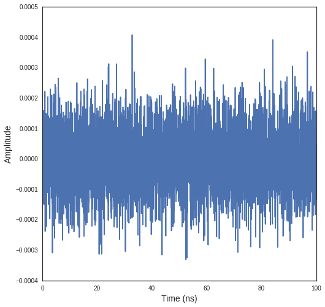

Modelisation of the Thermal Noise
=================================

.. code:: python

    >>> from pylayers.signal.bsignal import *
    >>> %matplotlib inline

The bsignal module has a dedicated class for handling noise signal. To
create a white noise just type :

.. code:: python

    >>> w = Noise()

The representation of the noise object provides information about
default values. In digital representation of noise the sampling
frequency is important. The noise signal is generated from a time
:math:`t_i` to a time :math:`t_f = t_i+T`. The default power spectral
density is :math:`-174dBm/Hz` and can be modified with the argument
``PSDdBmpHz``.

.. code:: python

    >>> w
    Sampling frequency : 50 GHz
    ti  : 0ns 
    tf  : 100ns 
    ts  : 0.02ns 
    N   : 5000
    -------------
    DSP : -174 dBm/Hz
        : 3.98107170553e-21 Joules
    -------------
    Noise Figure : 0 dB
    Vrms : 9.97631157484e-05 Volts
    Variance : 9.81692234355e-09 V^2
    Power (dBm) /50 Ohms : -157.010299957 dBm
    Power realized /50 Ohms : -157.069946488 dBm

::

      File "<ipython-input-3-95c19c884cbc>", line 2
        Sampling frequency : 50 GHz
                         ^
    SyntaxError: invalid syntax

.. code:: python

    >>> f,a=w.plot(typ='v')

.. code:: python

    >>> w.psd()
    FUsignal :  (2500,)  (2500,) 
    Frequency (GHz) : 2500

::

      File "<ipython-input-5-ad9f7f7e43b5>", line 2
        FUsignal :  (2500,)  (2500,)
                 ^
    SyntaxError: invalid syntax

.. code:: python

    >>> w2 = w.fgating(fcGHz=4,BGHz=3)

::

    

    TypeErrorTraceback (most recent call last)

    <ipython-input-6-0901d96562a6> in <module>()
    ----> 1 w2 = w.fgating(fcGHz=4,BGHz=3)
    

    TypeError: fgating() got an unexpected keyword argument 'BGHz'

.. code:: python

    >>> W2=w2.psd()
    >>> W2.plotdB(mask=True)

::

    

    NameErrorTraceback (most recent call last)

    <ipython-input-7-00fd8114e3d7> in <module>()
    ----> 1 W2=w2.psd()
          2 W2.plotdB(mask=True)

    NameError: name 'w2' is not defined

.. code:: python

    >>> w.plot(typ='v')
    (<matplotlib.figure.Figure at 0x7ff520fd5c90>,
     array([[<matplotlib.axes.AxesSubplot object at 0x7ff520fcd750>]], dtype=object))

::

      File "<ipython-input-8-cc6c01699cec>", line 2
        (<matplotlib.figure.Figure at 0x7ff520fd5c90>,
         ^
    SyntaxError: invalid syntax

.. code:: python

    >>> ip=EnImpulse(fc=4.4928,band=0.4992,fe=100)

::

    

    NameErrorTraceback (most recent call last)

    <ipython-input-9-307076f57f86> in <module>()
    ----> 1 ip=EnImpulse(fc=4.4928,band=0.4992,fe=100)
    

    NameError: name 'EnImpulse' is not defined

.. code:: python

    >>> fig = plt.figure(figsize=(10,10))
    >>> for k,snr in enumerate(range(30,-30,-10)):
    ...     a = fig.add_subplot(3,2,k+1)
    ...     ipn,n=ip.awgn(snr=snr,typ='snr')
    ...     ipn.plot(typ='v',fig=fig,ax=a)
    ...     a.set_title('SNR :'+str(snr)+' dB')
    >>> plt.tight_layout()

::

    

    NameErrorTraceback (most recent call last)

    <ipython-input-10-897bc488bfef> in <module>()
          2 for k,snr in enumerate(range(30,-30,-10)):
          3     a = fig.add_subplot(3,2,k+1)
    ----> 4     ipn,n=ip.awgn(snr=snr,typ='snr')
          5     ipn.plot(typ='v',fig=fig,ax=a)
          6     a.set_title('SNR :'+str(snr)+' dB')

    NameError: name 'ip' is not defined

.. image:: Noise_files/Noise_12_1.png

