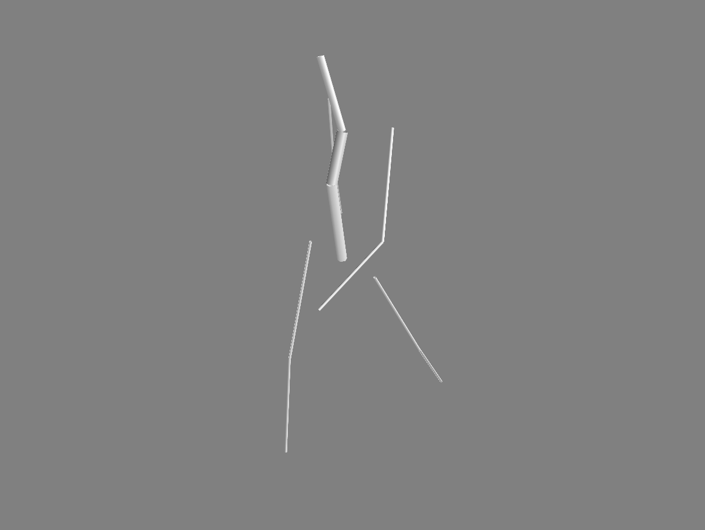
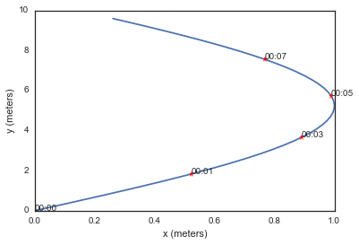
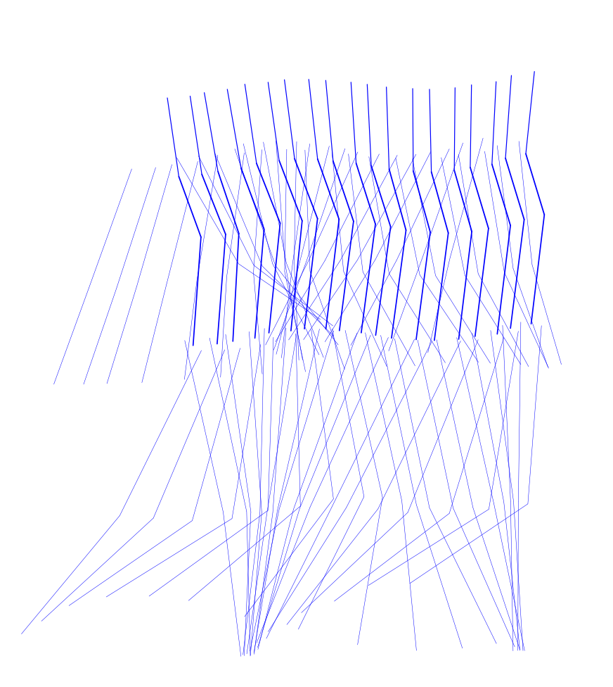
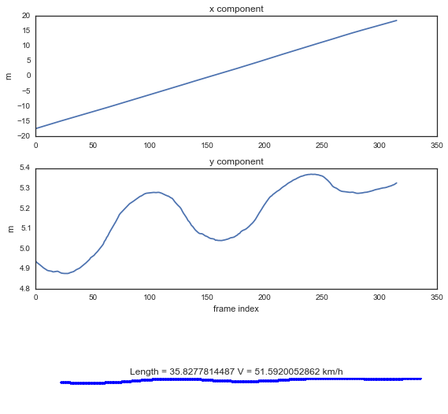
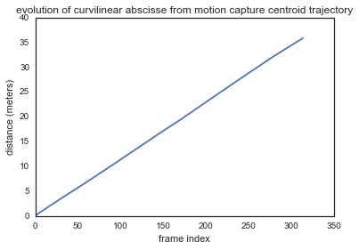
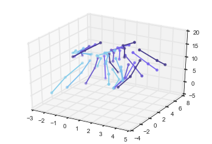

Handling Body Description and Mobility
======================================

.. code:: python

    from pylayers.mobility.ban.body import *
    from pylayers.mobility.trajectory import Trajectory
    from IPython.display import Image
    from matplotlib.pyplot import *
    import pylayers.util.mayautil as mau
    %matplotlib inline

.. parsed-literal::

    WARNING:traits.has_traits:DEPRECATED: traits.has_traits.wrapped_class, 'the 'implements' class advisor has been deprecated. Use the 'provides' class decorator.

The body mobility is imported from motion capture files. This is the
chosen manner to achieve a high degree of realism for the modeling of
the human motion. Two kind of files exist :

-  ``c3d`` files are a set of point which are evolving in time
-  ``bvh`` files are a stuctured version of the motion capture.

Both type of file will be exploited in the following.

``BodyCylinder`` data structure
-------------------------------

To ease electromagnetic simulation a simplification of the motion
capture data structure is necessary. Generally there is a large number
of captured points, not all of them being useful for our modeling.

The body model is a restriction of key body segments which are
transformed into :math:`K` cylinders of radius :math:`r_k`.

The chosen body model is made of 11 cylinders. 4 cylinders decribing the
two arms, 4 cylinders decribing the two legs, 2 cylinders describing the
trunk and 1 cylinder for the head.

The body cylinder model is handled by the dedicated Python class call
``Body``

To create a void body, simply instantiate a Body object from the class

.. code:: python

    John = Body()

.. parsed-literal::

    **** Processor coding : Intel-PC

which is equivalent to :

.. code:: python

    John = Body(_filebody='John.ini',_filemocap='07_01.c3d',unit='cm')

.. parsed-literal::

    **** Processor coding : Intel-PC

The default body filename is John.ini and the default motion capture
filename is '07\_01.c3d'. The creation of a Body consists in reading a
``_filebody`` and a ``_filemocap``

.. code:: python

    John._show3()
    mau.inotshow('John',doc=True)

Description of a body file
--------------------------

An example of a body file is given below. It is a file in ``ini`` format
with 4 sections.

-  [nodes]

This section associates a node number to a c3d fils conventional node
number

::

    NodeId = C3DNODE

-  [cylinder]

This section associates a cylinder Id to a dictionnary wich contains
cylinder tail head and radius information

::

      CylId = {'t',NodeId1,'h',NodeId2,'r',float (m),'name',}

-  [device]

This section associates a device name to a dictionnary wich contains
cylinder device related information

::

       DevId = {'typ' : {static|mobile}
                 'cyl': CylId
                 'l'  : length coordinate in ccs,
                 'h'  : height coordinate in ccs,
                 'a'  : angle coordinate in ccs,
                 'file' : antenna file ,
                 'T' : Rotation matrix }

Example of a Body file
----------------------

::

    [nodes]
    0 = [STRN,T10]
    1 = [CLAV,C7]
    2 = [RFHD,LFHD,LBHD,RBHD]
    3 = RSHO
    4 = LSHO
    5 = [RRAD,RHUM]
    6 = [LRAD,LHUM]
    7 = [RWRA,RWRB]
    8 = [LWRA,LWRB]
    9 = [RFWT,RBWT]
    10 = [LFWT,LBWT]
    11 = [RKNE,RKNI]
    12 = [LKNE,LKNI]
    13 = RANI
    14 = LANI
    15 = [RFWT, LFWT,LBWT,RBWT]
    [cylinder]
    ; sternum (STRN) - clavicle (CLAV)
    trunku = {'t':0,'h':1,'r':0.18,'i':0}
    ; bottom  (BOTT) sternum (STRN)
    trunkb = {'t':15,'h':0,'r':0.17,'i':10}
    ; clavicle (CLAV)  - head (RFHD)
    headu = {'t':1,'h':2,'r':0.12,'i':1}
    ; right elbow (RELB)  right shoulder (RSHO)
    armr = {'t':5,'h':3,'r':0.05,'i':2}
    ; left elbow (LELB)  left shoulder (LSHO)
    arml  = {'t':6,'h':4,'r':0.05,'i':3}
    ; right wrist (RWRB) right elbow (RELB)
    forearmr = {'t':7,'h':5,'r':0.05,'i':4}
    ; left wrist (LWRB)  left elbow (LELB)
    forearml = {'t':8,'h':6,'r':0.05,'i':5}
    ; right knee (RKNE) right hip (RFWT)
    thighr = {'t':11,'h':9,'r':0.05,'i':6}
    ; left knee (LKNE)  left hip (LFWT)
    thighl = {'t':12,'h':10,'r':0.05,'i':7}
    ; right ankle (RANK) right knee (RKNE)
    calfr = {'t':13,'h':11,'r':0.05,'i':8}
    ; left ankle (LANK) left knee (LKNE)
    calfl = {'t':14,'h':12,'r':0.05,'i':9}
    [wearable]
    file = real_suit1.ini
    [mocap]
    file = serie_017_noDEC_Real.c3d
    ; unit of c3d file
    unit = mm
    ; number of frame to consider. if -1 : all frames
    nframes = -1

.. code:: python

    Bernard = Body(_filebody='Bernard.ini',_filemocap='serie_017.c3d')

.. parsed-literal::

    **** Processor coding : DEC-VAX

Loading a Motion Capture File
-----------------------------

A ``.c3d`` motion capture file is loaded with the method **``loadC3D``**
with as arguments the motion capture file and the number of frames to
load.

The motion is represented as a sequence of frames stored in the
**``d``** variable member.

It is possible to get the information from the C3D header by using the
verbose option of the ``read_c3d`` function

.. code:: python

    # Video Frame Rate
    Vrate = 120
    # Inter Frame
    Tframe = 1./120
    # select a number of frame
    nframes = 300
    # Time duration of the whole selected frame sequence
    Tfseq = Tframe*nframes
    #
    # load a .c3dmotion capture file
    # this update the g.pos
    #
    #bc.loadC3D(filename='07_01.c3d',nframes=nframes,centered=True)

The duration of the capture is

.. code:: python

    print "Duration of the motion capture sequence", Tfseq," seconds"

.. parsed-literal::

    Duration of the motion capture sequence 2.5  seconds

``d`` is a MDA of shape ``(3,npoint,nframe)``. It contains all the
possible configurations of the body. In general it is supposed to be a
cyclic motion as an integer number of walking steps. This allows to
instantiate the body configuration anywhere else in space in a given
trajectory.

A specific space-time configuration of the body is called a
**``topos``**.

.. code:: python

    np.shape(Bernard.d)

.. parsed-literal::

    (3, 16, 11213)

Defining a trajectory
---------------------

A Trajectory is a class which :

-  derives from a pandas ``DataFrame``
-  is a container for time,position,velocity and acceleration.

.. code:: python

    traj = Trajectory()

To define a default trajectory :

.. code:: python

    t = traj.generate()

.. code:: python

    print traj.columns

.. parsed-literal::

    Index([u'x', u'y', u'z', u'vx', u'vy', u'vz', u'ax', u'ay', u'az', u's'], dtype='object')

.. code:: python

    traj.head()

.. raw:: html

    

    <table border="1" class="dataframe">
      <thead>
        <tr style="text-align: right;">
          <th></th>
          <th>x</th>
          <th>y</th>
          <th>z</th>
          <th>vx</th>
          <th>vy</th>
          <th>vz</th>
          <th>ax</th>
          <th>ay</th>
          <th>az</th>
          <th>s</th>
        </tr>
      </thead>
      <tbody>
        <tr>
          <th>1970-01-01 00:00:00.000000</th>
          <td>0.000000</td>
          <td>0.000000</td>
          <td>-0.119779</td>
          <td>0.299813</td>
          <td>1</td>
          <td>2.694500</td>
          <td>-0.005505</td>
          <td>0</td>
          <td>4.195088</td>
          <td>0.000000</td>
        </tr>
        <tr>
          <th>1970-01-01 00:00:00.204082</th>
          <td>0.061186</td>
          <td>0.204082</td>
          <td>0.430119</td>
          <td>0.298689</td>
          <td>1</td>
          <td>3.550640</td>
          <td>-0.010989</td>
          <td>0</td>
          <td>-26.724612</td>
          <td>0.213056</td>
        </tr>
        <tr>
          <th>1970-01-01 00:00:00.408163</th>
          <td>0.122143</td>
          <td>0.408163</td>
          <td>1.154739</td>
          <td>0.296446</td>
          <td>1</td>
          <td>-1.903363</td>
          <td>-0.016433</td>
          <td>0</td>
          <td>-4.287227</td>
          <td>0.426047</td>
        </tr>
        <tr>
          <th>1970-01-01 00:00:00.612245</th>
          <td>0.182642</td>
          <td>0.612245</td>
          <td>0.766298</td>
          <td>0.293093</td>
          <td>1</td>
          <td>-2.778307</td>
          <td>-0.021814</td>
          <td>0</td>
          <td>5.471191</td>
          <td>0.638907</td>
        </tr>
        <tr>
          <th>1970-01-01 00:00:00.816327</th>
          <td>0.242457</td>
          <td>0.816327</td>
          <td>0.199296</td>
          <td>0.288641</td>
          <td>1</td>
          <td>-1.661737</td>
          <td>-0.027114</td>
          <td>0</td>
          <td>11.980007</td>
          <td>0.851574</td>
        </tr>
      </tbody>
    </table>
    

.. code:: python

    f,a = traj.plot()

settopos () method
~~~~~~~~~~~~~~~~~~

Once the trajectory has been defined it is possible to send the body at
the position corresponding to any time of the trajectory with the
**``settopos``** method.

settopos takes as argument

-  A trajectory
-  A time index

.. code:: python

    traj.__repr__()

.. parsed-literal::

    'Trajectory of agent MyNameIsNoBody with ID 1\n--------------------------------------------\nt (s) : 0.00 : 0.20 : 9.59\ndtot (m) : 9.79\nVmoy (m/s) : 1.02\n                                   x         y         z        vx  vy  \\\n1970-01-01 00:00:00.000000  0.000000  0.000000 -0.119779  0.299813   1   \n1970-01-01 00:00:00.204082  0.061186  0.204082  0.430119  0.298689   1   \n\n                                 vz        ax  ay         az         s  \n1970-01-01 00:00:00.000000  2.69450 -0.005505   0   4.195088  0.000000  \n1970-01-01 00:00:00.204082  3.55064 -0.010989   0 -26.724612  0.213056  \n'

.. code:: python

    John.settopos(traj,t=5)

.. code:: python

    plt.figure(figsize=(15,20))
    for t in np.arange(traj.tmin+0.4,traj.tmax,0.5):
        John.settopos(traj,t=t)
        f,a=John.show(color='b',plane='yz',topos=True)
        axis('off')

.. code:: python

    John

.. parsed-literal::

    My name is : John
    
    I have a Galaxy Gear device with id #1 on the left forearm witn antenna defant.vsh3
    I have a cardio device with id #0 on the upper part of trunk witn antenna defant.vsh3
    
    @ t=0.708333333333 (frameID=85),
    My centroid position is [-7.87435024  5.23416696]
    
    filewear : suit2.ini
    filename : 07_01.c3d
    nframes : 316
    Centered : True
    Mocap Speed : 13.649 m/s 

.. code:: python

    Francois = Body(_filebody='Francois.ini')
    Francois

.. parsed-literal::

    **** Processor coding : Intel-PC

.. parsed-literal::

    My name is : Francois
    
    I have a Galaxy Gear device with id #1 on the left forearm witn antenna defant.vsh3
    I have a cardio device with id #0 on the upper part of trunk witn antenna defant.vsh3
    
    I am nowhere yet
    
    filewear : suit2.ini
    filename : 07_01.c3d
    nframes : 300
    Centered : True
    Mocap Speed : 13.702 m/s 

.. code:: python

    Francois.settopos(traj,t=6)
    Francois

.. parsed-literal::

    My name is : Francois
    
    I have a Galaxy Gear device with id #1 on the left forearm witn antenna defant.vsh3
    I have a cardio device with id #0 on the upper part of trunk witn antenna defant.vsh3
    
    @ t=0.441666666667 (frameID=53),
    My centroid position is [-11.4689352    4.97981336]
    
    filewear : suit2.ini
    filename : 07_01.c3d
    nframes : 300
    Centered : True
    Mocap Speed : 13.702 m/s 

-  3 : dimension of space
-  16 : number of nodes
-  300 : number of frames

The figure below shows the projection in a vertival plane of the body
nodes.

Centering the motion
--------------------

.. code:: python

    John.centered

.. parsed-literal::

    True

In order to translate the motion in any point in space-time, a
distinction is made between the real motion or topos and the centered
motion capture which acts as a virtual motion.

Let :math:`\mathbf{p}^k` denotes the center of gravity of the body in
the (O,x,y) plane

.. code:: python

    John.center()

.. code:: python

    a = np.hstack((John.vg,John.vg[:,-1][:,np.newaxis]))

:math:`\mathbf{v}_g` is the velocity vector of the gravity center of the
body.

.. code:: python

    print np.shape(John.pg)
    print np.shape(John.vg)

.. parsed-literal::

    (3, 316)
    (3, 316)

.. code:: python

    print John.vg[:,145]
    print John.vg[:,298]

.. parsed-literal::

    [ 0.11498696 -0.00263353  0.        ]
    [ 0.10812351  0.00072441  0.        ]

At that point the body structure is centered.

The frame is centered in the xy plane by substracting from the
configuration of points the projection of the body in the xy plane.

.. code:: python

    np.shape(John.d)

.. parsed-literal::

    (3, 16, 316)

.. code:: python

    John.npoints

.. parsed-literal::

    16

Each frame is centered above the origin. For example for a walk motion
the effect of the centering is just like if the body was still walking
but not moving forward exactly in the same manner as a walk on a
conveyor belt.

.. code:: python

    pgc = np.sum(John.d[:,:,0],axis=1)/16
    pg0 = John.pg[:,0]
    print "True center of gravity", pg0
    print "Center of gravity of the centered frame",pgc

.. parsed-literal::

    True center of gravity [-17.42515686   4.93730766   0.        ]
    Center of gravity of the centered frame [  4.44089210e-16  -1.05471187e-15   8.94887349e+00]

.. code:: python

    np.shape(John.pg)

.. parsed-literal::

    (3, 316)

The current file contains 300 frames

.. code:: python

    tframe = np.arange(John.nframes)

.. code:: python

    np.shape(John.pg[0:-1,:])

.. parsed-literal::

    (2, 316)

.. code:: python

    xg = John.pg[0,:]
    yg = John.pg[1,:]
    zg = John.pg[2,:]
    figure(figsize=(8,8))
    subplot(311)
    plot(tframe,xg)
    title('x component')
    ylabel('m')
    subplot(312)
    xlabel('frame index')
    title('y component')
    ylabel('m')
    plot(tframe,yg)
    subplot(313)
    xlabel('frame index')
    title('Motion capture centroid trajectory')
    ylabel('m')
    plot(xg,yg,'.b')
    
    d = John.pg[0:-1,1:]-John.pg[0:-1,0:-1]
    smocap = np.cumsum(np.sqrt(np.sum(d*d,axis=0)))
    
    Vmocap = smocap[-1]/Tfseq
    title('Length = '+str(smocap[-1])+' V = '+str(Vmocap*3.6)+' km/h')
    axis('scaled')
    axis('off')
    plt.tight_layout()

.. code:: python

    plot(smocap)
    title('evolution of curvilinear abscisse from motion capture centroid trajectory')
    xlabel('frame index')
    ylabel('distance (meters)')

.. parsed-literal::

    <matplotlib.text.Text at 0x2b8487d5d090>

Defining a large scale trajectory
---------------------------------

A large scale trajectory is defined in the :math:`(O,x,y)` plane.

``traj`` is a data structure (Npt,2)

.. code:: python

    v = Vmocap
    print v*3.6,"Kmph"

.. parsed-literal::

    51.5920052862 Kmph

.. code:: python

    # time in seconds
    time = np.arange(0,10,0.01)
    x = v*time
    y = np.zeros(len(time))
    z = np.zeros(len(time))
    traj = Trajectory()
    traj.generate()
    traj.tmax

.. parsed-literal::

    9.591837

.. code:: python

    fig ,ax = traj.plot()
    traj.head()

.. raw:: html

    

    <table border="1" class="dataframe">
      <thead>
        <tr style="text-align: right;">
          <th></th>
          <th>x</th>
          <th>y</th>
          <th>z</th>
          <th>vx</th>
          <th>vy</th>
          <th>vz</th>
          <th>ax</th>
          <th>ay</th>
          <th>az</th>
          <th>s</th>
        </tr>
      </thead>
      <tbody>
        <tr>
          <th>1970-01-01 00:00:00.000000</th>
          <td>0.000000</td>
          <td>0.000000</td>
          <td>0.253679</td>
          <td>0.299813</td>
          <td>1</td>
          <td>0.145261</td>
          <td>-0.005505</td>
          <td>0</td>
          <td>-8.730777</td>
          <td>0.000000</td>
        </tr>
        <tr>
          <th>1970-01-01 00:00:00.204082</th>
          <td>0.061186</td>
          <td>0.204082</td>
          <td>0.283324</td>
          <td>0.298689</td>
          <td>1</td>
          <td>-1.636531</td>
          <td>-0.010989</td>
          <td>0</td>
          <td>17.513389</td>
          <td>0.213056</td>
        </tr>
        <tr>
          <th>1970-01-01 00:00:00.408163</th>
          <td>0.122143</td>
          <td>0.408163</td>
          <td>-0.050662</td>
          <td>0.296446</td>
          <td>1</td>
          <td>1.937630</td>
          <td>-0.016433</td>
          <td>0</td>
          <td>-30.359379</td>
          <td>0.426047</td>
        </tr>
        <tr>
          <th>1970-01-01 00:00:00.612245</th>
          <td>0.182642</td>
          <td>0.612245</td>
          <td>0.344773</td>
          <td>0.293093</td>
          <td>1</td>
          <td>-4.258161</td>
          <td>-0.021814</td>
          <td>0</td>
          <td>15.393231</td>
          <td>0.638907</td>
        </tr>
        <tr>
          <th>1970-01-01 00:00:00.816327</th>
          <td>0.242457</td>
          <td>0.816327</td>
          <td>-0.524239</td>
          <td>0.288641</td>
          <td>1</td>
          <td>-1.116685</td>
          <td>-0.027114</td>
          <td>0</td>
          <td>11.431038</td>
          <td>0.851574</td>
        </tr>
      </tbody>
    </table>
    

.. image:: Body_files/Body_87_1.png

Trajectory
----------

``posvel()``
------------

The ``posvel()`` method (position and velocity) takes as arguments the
following parameters

-  ``traj`` a plane trajectory object.
-  :math:`t_k` time for evaluation of topos
-  :math:`T_{fs}` duration of the periodic motion frame sequence

and returns

-  the frame index
   :math:`k_f = \lfloor \frac{t_k \pmod{T_{fs}}}{t_f} \rfloor`
-  the trajectory index :math:`k_t = \lfloor t_k \rfloor`
-  velocity unitary vector along motion capture frame
   :math:`\hat{\mathbf{v}}_s = \frac{\mathbf{p}^g[k_f]-\mathbf{p}^g[k_f-1]}{|\mathbf{p}^g[k_f]-\mathbf{p}^g[k_f-1]|}`
-  :math:`\hat{\mathbf{w}}_s = \mathbf{\hat{z}} \times  \hat{\mathbf{v}}_s `
-  velocity unitary vector along trajectory
   :math:`\hat{\mathbf{v}}_t = \frac{\mathbf{p}^t[k_t]-\mathbf{p}^g[k_t-1]}{|\mathbf{p}^g[k_t]-\mathbf{p}^t[k_t-1]|}`
-  :math:`\hat{\mathbf{w}}_t = \mathbf{\hat{z}} \times  \hat{\mathbf{v}}_t `

:math:`t_f = \frac{T_{fs}}{Nf}` is the interframe time or frame sampling
period, it is equal to the whole duration of the motion sequence
:math:`T_{fs}` divided by the number of frames

``settopos`` is a method which takes as argument :

-  ``traj`` a plane trajectory (Npt,2)
-  :math:`t_k` time for evaluation of topos

In further version of the class, this function will be modified to avoid
passing the whole trajectory.

.. code:: python

    John.settopos(traj=traj,t=3)

There is now a new data structure in the Body objet. This data structure
is called a ``topos``.

.. code:: python

    print np.shape(John.topos)

.. parsed-literal::

    (3, 16)

.. code:: python

    John.topos

.. parsed-literal::

    array([[  0.74198686,   0.76931593,   1.80846633,   2.26719915,
             -0.91675363,   3.25586636,  -1.86053098,   3.82194596,
             -2.06245933,   2.15021298,  -0.55180885,   2.02586803,
             -0.94510502,   1.36586716,  -0.57366714,   0.79920206],
           [  3.75720113,   3.13644711,   2.8414143 ,   2.20063108,
              2.6901425 ,   1.78826275,   3.20212316,   1.7696506 ,
              4.042258  ,   3.29688912,   3.60268634,   2.76571804,
              3.90430304,   2.24259271,   1.0241781 ,   3.44978773],
           [ 12.24457275,  13.88075684,  16.00988037,  14.0978418 ,
             14.3736377 ,  10.74208496,  11.07206543,   7.98268372,
              8.47460388,   9.31935974,   9.1988916 ,   4.30262299,
              4.54000305,   0.44698982,   1.7794635 ,   9.25912567]])

.. code:: python

    John.settopos(traj=traj,t=1)
    fig,ax=John.plot3d(topos=True,col='#87CEEB')
    John.settopos(traj=traj,t=2)
    John.plot3d(topos=True,fig=fig,ax=ax,col='#7EC0EE')
    John.settopos(traj=traj,t=3)
    John.plot3d(topos=True,fig=fig,ax=ax,col='#6A5ACD')
    John.settopos(traj=traj,t=4)
    John.plot3d(topos=True,fig=fig,ax=ax,col='#7A67EE')
    John.settopos(traj=traj,t=5)
    John.plot3d(topos=True,fig=fig,ax=ax,col='#473C8B')

.. parsed-literal::

    (<matplotlib.figure.Figure at 0x2b84a0e12390>,
     <matplotlib.axes._subplots.Axes3DSubplot at 0x2b84a0eef490>)

Definition of Several Coordinates systems
-----------------------------------------

Each cylinder of the ``Body`` model bears one specific coordinate
system.

One or several cylinder coordinate systems can be chosen to define the
Body Local Coordinates System (BLCS) which is required for motion
capture (BLCS) applications.

In general, the origin will be chosen on a position which is the most
time invariant as on the chest or the back.

Those frames of references are all defined in the Global Coordinate
System (GCS) of the scene.

Construction of the Cylinder Coordinate System (CCS)
~~~~~~~~~~~~~~~~~~~~~~~~~~~~~~~~~~~~~~~~~~~~~~~~~~~~

The method ``setccs()`` is used to associate a Cylinder Coordinate
System (CCS) to each cylinder of the bodyCylinder model. Notice that
those cylinders coordinates systems are not known by the localization
application. The localization application will define the BLCS from the
position of radiating devices placed on the body surface.

Each basis is constructed with the function from
``geomutil.onbfromaxe()`` : orthonormal bases from axes. This function
takes 2 sets of :math:`n` points :math:`\mathbf{p}_{A,n}` and
:math:`\mathbf{p}_{B,n}` as input and provides an orthonormal basis as
output.

3 unitary vectors are constructed :

.. math:: \hat{\mathbf{w}}_n = \frac{\mathbf{p}_B-\mathbf{p}_A}{| \mathbf{p}_B-\mathbf{p}_A |} 

.. math:: \hat{\mathbf{u}}_n = \frac{\hat{\mathbf{v}}_g - (\hat{\mathbf{v}}_g.{\hat{\mathbf{w}}_n}) \mathbf{\hat{w}}_n}{|\hat{\mathbf{v}_g} - (\hat{\mathbf{v}_g}.{\hat{\mathbf{w}}_n}) \mathbf{\hat{w}}_n|} 

.. math:: \hat{\mathbf{v}}_n = \mathbf{\hat{w}}_n \times \mathbf{\hat{u}}_n  

Where :math:`\hat{\mathbf{v}}_g` is the unit velocity vector along
actual trajectory.

The outpout of ``geomutil.onbframe`` is an MDA
:math:`(3\times n \times 3)` of :math:`n` unitary matrices aggregated
along axis 1

.. math:: \mathbf{T}_n=[\hat{\mathbf{u}}_n, \hat{\mathbf{v}}_n, \hat{\mathbf{w}}_n]

To create the CCS :

.. code:: python

    John.setccs()

.. code:: python

    import scipy.linalg as la
    print "ccs dimensions : ",np.shape(John.ccs)
    print John.ccs[0,:,:]
    print "Check determinant : ", la.det(John.ccs[0,:,:])

.. parsed-literal::

    ccs dimensions :  (11, 3, 3)
    [[ 0.94678656  0.05306765 -0.31745715]
     [-0.06834689  0.99696857 -0.03718026]
     [ 0.31452173  0.05689898  0.94754345]]
    Check determinant :  1.0

Create a Wireframe body representation from the body graph model

Placing a dcs (Device Coordinate System ) on the cylinder
---------------------------------------------------------

A DCS is refered by 4 numbers :math:`(Id,l,h,\alpha)`

-  Id : Cylinder Id
-  l : length along cylinder
-  h : height above cylinder generatrix
-  alpha : angle from front direction (degrees)

.. code:: python

    Id = 4 # 4 Left Arm
    l  = 0.1 # Longitudinal coordinates
    h  = 0.03 # height
    alpha = 45 # angle degrees

.. code:: python

    John.dcyl

.. parsed-literal::

    {'arml': 3,
     'armr': 2,
     'calfl': 9,
     'calfr': 8,
     'forearml': 5,
     'forearmr': 4,
     'headu': 1,
     'thighl': 7,
     'thighr': 6,
     'trunkb': 10,
     'trunku': 0}

Rotate Matrix around z

.. code:: python

    John.settopos(traj=traj,t=6,cs=True)

.. code:: python

    John.dcyl

.. parsed-literal::

    {'arml': 3,
     'armr': 2,
     'calfl': 9,
     'calfr': 8,
     'forearml': 5,
     'forearmr': 4,
     'headu': 1,
     'thighl': 7,
     'thighr': 6,
     'trunkb': 10,
     'trunku': 0}

.. code:: python

    John.show3(topos=True,dcs=True)

.. code:: python

    John.show3(topos=True,pattern=True)
