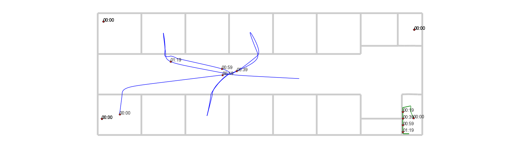
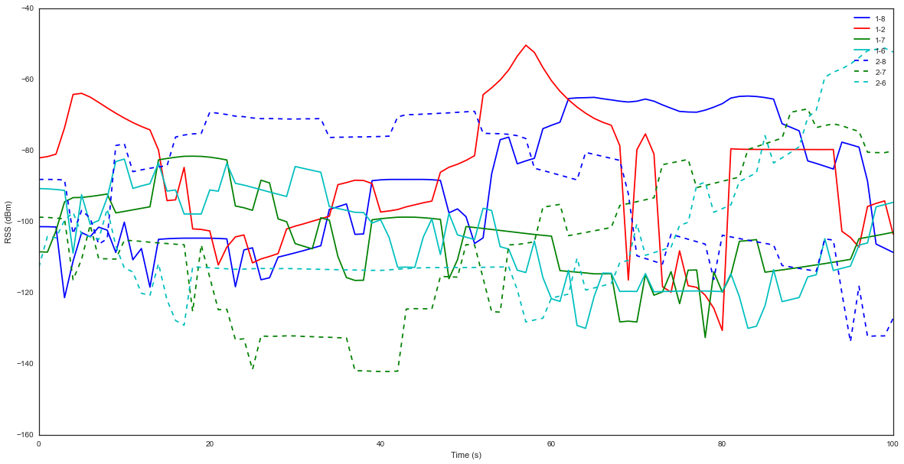

Trajectory and Network simulation
---------------------------------

.. code:: python

    from IPython.display import Image, HTML, Latex, YouTubeVideo
    import numpy as np
    import pylayers.mobility.trajectory as traj
    from pylayers.mobility.ban.body import *
    from pylayers.gis.layout import *
    %matplotlib inline

.. parsed-literal::

    WARNING:traits.has_traits:DEPRECATED: traits.has_traits.wrapped_class, 'the 'implements' class advisor has been deprecated. Use the 'provides' class decorator.

.. code:: python

    YouTubeVideo('1Qa6xLpU5-M')

.. raw:: html

    
            <iframe
                width="400"
                height="300"
                src="https://www.youtube.com/embed/1Qa6xLpU5-M"
                frameborder="0"
                allowfullscreen
            ></iframe>
            

Trajectories can be generated using simulnet.

.. code:: python

    from pylayers.simul.simulnet import *
    S=Simul()

.. parsed-literal::

    Layout graphs are loaded from /home/uguen/Bureau/P1/struc/ini

.. code:: python

    # set simulation duration
    
    S.sim_opt['duration']='100'
    
    S.meca_opt['mecanic_update_time']=0.1
    
    # turn on network simulation
    S.net_opt['network']=True

.. code:: python

    # run mechanical simulation
    S.runsimul()

trajectories can be imported from a simulnet simulation with the
``importh5`` method

.. code:: python

    from pylayers.mobility.trajectory import *

.. code:: python

    str1 = eval(S.sim_opt['filename'])
    str2 = S.L.filename.split('.')[0]
    # the save filename is composed of simulation filename and layout filename
    save_filename = str1 + '_' + str2 +'.h5'
    
    list_traj = S.traj

.. code:: python

    list_traj

.. parsed-literal::

    Trajectories performed in Layout : TA-Office.ini
    
    Trajectory of agent John with ID 1
    ----------------------------------
    t (s) : 0.00 : 0.20 : 99.80
    dtot (m) : 352.33
    Vmoy (m/s) : 3.53
                                     x         y        vx        vy        ax  \
    t                                                                            
    1970-01-01 00:00:00.000  18.907750  2.528547  0.038749  0.155237  0.193744   
    1970-01-01 00:00:00.200  18.921699  2.584433  0.069748  0.279427  0.154995   
    
                                   ay      s  
    t                                         
    1970-01-01 00:00:00.000  0.776185  0.160  
    1970-01-01 00:00:00.200  0.620948  0.448  
    
    Trajectory of agent Alex with ID 2
    ----------------------------------
    t (s) : 0.00 : 0.20 : 99.80
    dtot (m) : 301.79
    Vmoy (m/s) : 3.02
                                     x          y        vx        vy        ax  \
    t                                                                             
    1970-01-01 00:00:00.000  24.306132  12.467593  0.030661 -0.157035  0.153303   
    1970-01-01 00:00:00.200  24.317170  12.411061  0.055189 -0.282663  0.122642   
    
                                   ay      s  
    t                                         
    1970-01-01 00:00:00.000 -0.785174  0.160  
    1970-01-01 00:00:00.200 -0.628139  0.448  
    
    Access point Router with ID 6
    -----------------------------
    t (s) : 0.00
    Vmoy (m/s) : 0.0
                  x  y    z  vx  vy  ax  ay  s
    t                                         
    1970-01-01  0.5  2  2.5   0   0   0   0  0
    
    Access point Router with ID 7
    -----------------------------
    t (s) : 0.00
    Vmoy (m/s) : 0.0
                  x   y    z  vx  vy  ax  ay  s
    t                                          
    1970-01-01  0.7  14  2.5   0   0   0   0  0
    
    Access point Router with ID 8
    -----------------------------
    t (s) : 0.00
    Vmoy (m/s) : 0.0
                 x   y    z  vx  vy  ax  ay  s
    t                                         
    1970-01-01  39  13  2.5   0   0   0   0  0
    

The 2 following trajectories have been calculated with
``pylayers.simul.simulnet``

.. code:: python

    t=S.traj.resample(10)

.. code:: python

    t[5]

::

    ---------------------------------------------------------------------------

    IndexError                                Traceback (most recent call last)

    <ipython-input-10-670e16babe19> in <module>()
    ----> 1 t[5]
    

    IndexError: list index out of range

.. code:: python

    f=plt.figure(figsize=(20,20))
    f,a = S.L.showG('s',fig=f)
    for k,nodes in enumerate(t):
        f,a = nodes.plot(fig=f,ax=a)

.. code:: python

    len(t.t)

.. parsed-literal::

    4989

.. code:: python

    S

.. parsed-literal::

    Simulation information
    ----------------------
    Layout: TA-Office.ini
    Simulation duration: 100
    Random seed: 1
    Save simulation: True
    
    Update times
    -------------
    Mechanical update: 0.1
    Network update: 0.1
    Localization update: 'autonomous'
    
    Agents => self.lAg[i]
    ------
    Number of agents :5
    Agents IDs: ['1', '2', '6', '7', '8']
    Agents names: ['John', 'Alex', 'Router', 'Router', 'Router']
    Destination of chosen agents: 'random'
    
    Network
    -------
    Nodes per wstd: {'rat1': ['1', '8', '2', '7', '6']}
    
    Localization
    ------------
    Localization enable: False
    Postion estimation methods: ['geo']

.. code:: python

    S.traj.t

.. code:: python

    plt.figure(figsize=(20,10))
    Rss18 = S.save.save['1']['8']['rat1']['Pr'][:,0]
    Rss12 = S.save.save['1']['2']['rat1']['Pr'][:,0]
    Rss17 = S.save.save['1']['7']['rat1']['Pr'][:,0]
    Rss16 = S.save.save['1']['6']['rat1']['Pr'][:,0]
    Rss28 = S.save.save['2']['8']['rat1']['Pr'][:,0]
    Rss27 = S.save.save['2']['7']['rat1']['Pr'][:,0]
    Rss26 = S.save.save['2']['6']['rat1']['Pr'][:,0]
    plt.plot(Rss18,'b',label='1-8')
    plt.plot(Rss12,'r',label='1-2')
    plt.plot(Rss17,'g',label='1-7')
    plt.plot(Rss16,'c',label='1-6')
    plt.plot(Rss28,'b--',label='2-8')
    plt.plot(Rss27,'g--',label='2-7')
    plt.plot(Rss26,'c--',label='2-6')
    plt.xlabel('Time (s)')
    plt.ylabel('RSS (dBm)')
    plt.legend()

.. parsed-literal::

    <matplotlib.legend.Legend at 0x2b5d58032b50>

