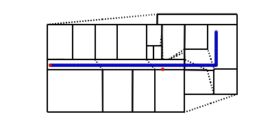
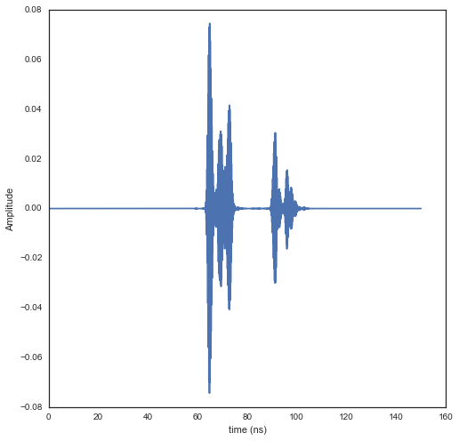

Example of a trajectory synthesis in the DLR WHERE2 environment
---------------------------------------------------------------

The document describing the measurement performed in the DLR environment
is `WHERE2 Deliverable D4.4 Test and Evaluation of the Integrated System
under Laboratory
Conditions <http://www.kn-s.dlr.de/where2/documents/Deliverables/Deliverable-D4.4.pdf>`__

.. code:: python

    from pylayers.simul.simulem import *
    from pylayers.antprop.rays import *
    from pylayers.antprop.channel import *
    from pylayers.antprop.signature import *
    import pylayers.util.pyutil as pyu
    from pylayers.gis.layout import *
    from pylayers.util.project import *
    import pylayers.signal.bsignal as bs
    from datetime import datetime
    import time
    import pdb
    import pickle
    import numpy as np
    import matplotlib.pyplot as plt
    %matplotlib inline

.. parsed-literal::

    WARNING:traits.has_traits:DEPRECATED: traits.has_traits.wrapped_class, 'the 'implements' class advisor has been deprecated. Use the 'provides' class decorator.

This function has to be moved in simulem module. It is a temporary
implementation. Signatures can be handled much more efficiently here. It
run a full simulation and returns a list of channel impulse response.

.. code:: python

    def evalcir(S,wav,cutoff=4):
        """
        Parameters
        ----------
    
        S
        tx
        rx
        wav
        cutoff
    p.rays import *
    from pylayers.antpr
        """
    
        crxp =-1
        ctxp =-1
        tcir = {}
        tx = S.tx.position
        Ntx = len(tx[0])
        rx = S.rx.position
        Nrx = len(rx[0])
    
        #for kt in range(1,Ntx-1):
        #print kt+1
        kt=0
        tcir[kt+1] = {}
        t = np.array([S.tx.position[0,kt+1],S.tx.position[1,kt+1],S.tx.position[2,kt+1]])
        for kr in range(Nrx-1):
            if (mod(kr,10)==0):
                print kr+1
            r = np.array([S.rx.position[0,kr+1],S.rx.position[1,kr+1],S.rx.position[2,kr+1]])
            ctx = S.L.pt2cy(t)
            crx = S.L.pt2cy(r)
            if (ctx<>ctxp)|(crx<>crxp):
                Si  = Signatures(S.L,ctx,crx)
                ctxp = ctx
                crxp = crx
                Si.run5(cutoff=cutoff,algo
    ='old')
            r2d = Si.rays(t,r)
            #r2d.show(S.L)
    
            r3d = r2d.to3D(S.L)
            r3d.locbas(S.L)
            r3d.fillinter(S.L)
            Ct  = r3d.eval(S.fGHz)
            sca = Ct.prop2tran(S.tx.A,S.rx.A)
            cir = sca.applywavB(wav.sfg)
            tcir[kt+1][kr+1]=cir
        return(tcir)
Loading the Layout
^^^^^^^^^^^^^^^^^^

.. code:: python

    S = Simul()
    filestr = 'DLR2'
    S.layout(filestr+'.ini','matDB.ini','slabDB.ini')
    try:
        S.L.dumpr()
    except:
        S.L.build()
        S.L.dumpw()

.. parsed-literal::

    new file WHERE1.str

.. code:: python

    S.L.display['ednodes']=False
    S.L.display['nodes']=False
    S.L.display['title']='DLR WP4 WHERE2 measurement site'
    S.L.display['overlay']=False
    fig,ax = S.L.showGs()

.. code:: python

    S.show3()
We have a list of static Anchor Nodes. Those values correspond to the
actual anchor nodes coordinates of the WHERE2 project DLR measurement
campaign.

.. code:: python

    AnchorNodes = {390:{'name':'MT_ACO_05','coord':[6,0.81,1.64]},
                   386:{'name':'MT_ACO_08','coord':[30.574,2.8,1.291]},
                   391:{'name':'MT_ACO_07','coord':[11.78,-5.553,1.5]},
                   385:{'name': 'MT_ACO_01','coord':[19.52,-0.69,1.446]},
                   387:{'name':'MT_ACO_03','coord':[28.606,-0.74,1.467]},
                   400:{'name':'MT_ACO_02','coord':[30.574,2.8,1.291]},
                   1:{'name':'MT_DLR_RTDSlave','coord':[0.85,0,1.18]}
                  }
.. code:: python

    S.tx.clear()
    S.rx.clear()
    S.tx.filant='def.vsh3'
    S.rx.filant='def.vsh3'
    da ={}
    dm ={}
Vizualization of the simulated scenario

.. code:: python

    fig,ax=S.L.showG('s',nodes=False)
    plt.axis('off')
    #
    # add new points in tx and rx
    #
    #for c,k in enumerate(AnchorNodes):
    c = 0 # first anchor nodes
    k = AnchorNodes.keys()[c]
    pta = array([AnchorNodes[k]['coord'][0],AnchorNodes[k]['coord'][1],AnchorNodes[k]['coord'][2]]).reshape(3,1)
    #
    # To add a point
    #
    S.tx.point(pta,mode="add")
    da[c]=k
    plt.plot(pta[0,:],pta[1,:],'or')

.. parsed-literal::

    [<matplotlib.lines.Line2D at 0x2b378de56a10>]

.. image:: DLR-WHERE2_files/DLR-WHERE2_13_1.png

In the following a trajectory for the receiver is defined.

``linevect`` function allows to define a linear trajectory from ``ptt``
along direction ``vec``.

.. code:: python

    S.rx.linevect(npt=290, step=0.1, ptt=[0, 0, 1.275], vec=[1, 0, 0], mode='subst')
    ps = S.rx.position[:,-1]
    S.rx.linevect(npt=60, step=0.1, ptt=ps,vec=[0,1,0],mode='append')
Looking what is does

.. code:: python

    S.L.display['ednodes']=False
    S.L.display['edges']=True
    S.L.display['nodes']=False
    S.L.display['title']='Trajectory to be simulated'
    S.show(s=20)

.. parsed-literal::

    Warning : no furniture file loaded

.. parsed-literal::

    (<matplotlib.figure.Figure at 0x2b378dad5350>,
     <matplotlib.axes.AxesSubplot at 0x2b378de86550>)

Choosing a UWB waveform for the simulation

.. code:: python

    wav = wvf.Waveform(type='W1compensate')
    wav.show()

running the simulation

.. code:: python

    #tcir = evalcir(S,wav,cutoff=4)
Saving the data in pickle format

.. code:: python

    #file = open("tcir5.pickle","w")
    #pickle.dump(tcir,file)
    #file.close()
Reading the data from the above file

.. code:: python

    #del tcir
    file=open("tcir5.pickle","r")
    tcir=pickle.load(file)
    file.close()
    #del ttcir
    #
    for i in tcir[1].keys():
        cir = tcir[1][i]
        cir.zlr(0,150)
        try:
            ttcir=np.vstack((ttcir,cir.y))
        except:
            ttcir=cir.y
.. code:: python

    tcir[1][1].x
    tcir[1][102].x

.. parsed-literal::

    array([  1.01214575e-02,   3.03643725e-02,   5.06072874e-02, ...,
             1.49949393e+02,   1.49969636e+02,   1.49989879e+02])

Aggregated CIR along a synthetic trajectory (line in the corridor)
^^^^^^^^^^^^^^^^^^^^^^^^^^^^^^^^^^^^^^^^^^^^^^^^^^^^^^^^^^^^^^^^^^

.. code:: python

    plt.figure(figsize=(20,20))
    dmax=150
    plt.imshow(20*np.log10(ttcir+1e-20),vmax=-40,vmin=-120,origin='lower',extent=[0,dmax,1,69],interpolation='nearest')
    plt.xlabel(r'delay $\times$ c (meters)',fontsize=20)
    #plt.ylabel(r'distance along trajectory (meters)',fontsize=20)
    plt.ylabel(r'trajectory index number',fontsize=20)
    clb=plt.colorbar()
    clb.set_label('level (dB)',fontsize=20)
    
    plt.axis('tight')

.. parsed-literal::

    (0.0, 150.0, 1.0, 69.0)

.. code:: python

    tcir[1][10].plot(typ=['v'])

.. parsed-literal::

    (<matplotlib.figure.Figure at 0x2b378e71ac90>,
     array([[<matplotlib.axes.AxesSubplot object at 0x2b378de92790>]], dtype=object))

.. image:: DLR-WHERE2_files/DLR-WHERE2_30_1.png

.. code:: python

    plt.figure(figsize=(10,5))
    tcir[1][1].plot(typ=['v'])
    xlabel('Delay (ns)')
    ylabel('Level (V)')
    title('Received Waveform')

::

    ---------------------------------------------------------------------------

    NameError                                 Traceback (most recent call last)

    <ipython-input-18-029939bf9a94> in <module>()
          1 plt.figure(figsize=(10,5))
          2 tcir[1][1].plot(typ=['v'])
    ----> 3 xlabel('Delay (ns)')
          4 ylabel('Level (V)')
          5 title('Received Waveform')

    NameError: name 'xlabel' is not defined

.. parsed-literal::

    <matplotlib.figure.Figure at 0x2b378df08510>

.. code:: python

    tcir[1][11].plot(typ=['v'])
    xlabel('Delay (ns)')
    ylabel('Level (V)')
    title('Received Waveform')

::

    ---------------------------------------------------------------------------

    NameError                                 Traceback (most recent call last)

    <ipython-input-19-c4ff825d50c0> in <module>()
          1 tcir[1][11].plot(typ=['v'])
    ----> 2 xlabel('Delay (ns)')
          3 ylabel('Level (V)')
          4 title('Received Waveform')

    NameError: name 'xlabel' is not defined

.. image:: DLR-WHERE2_files/DLR-WHERE2_32_1.png

