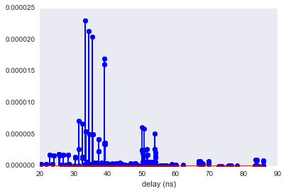

.. code:: python

    from pylayers.simul.link import *
    %matplotlib inline
    import seaborn as sns
    sns.set_style("dark")


.. parsed-literal::

    WARNING:traits.has_traits:DEPRECATED: traits.has_traits.wrapped_class, 'the 'implements' class advisor has been deprecated. Use the 'provides' class decorator.


How to do Ray Tracing simulation using DLink
============================================

This section illustrates the
```link`` <http://pylayers.github.io/pylayers/modules/pylayers.simul.link.html>`__
module.

A ``Dlink`` object is a deterministic (Single Input Single Output) SISO
link. The frequency range of the simulation can be set as argument of
the DLink object.

.. code:: python

    L=DLink(fGHz=np.arange(2,6,0.01))


.. parsed-literal::

    check len(ncycles) == 2 ... passed !
    check x,y = Gs.node[seg]['ncycles'] ; seg in Gt[x][y]['segment'] ... passed !


.. code:: python

    L


.. parsed-literal::

    filename: Links_0_defstr.ini.h5
    Link Parameters :
    ------- --------
    Layout : defstr.ini
    
    Node a   
    ------  
    position : [  766.00300113  1113.94747911     1.2       ]
    Antenna : Omni
    Rotation matrice : 
     [[ 1.  0.  0.]
     [ 0.  1.  0.]
     [ 0.  0.  1.]]
    
    Node b   
    ------  
    position : [  761.00289669  1113.91576981     1.2       ]
    Antenna : Omni
    Rotation matrice : 
     [[ 1.  0.  0.]
     [ 0.  1.  0.]
     [ 0.  0.  1.]]
    
    Link evaluation information : 
    ----------------------------- 
    distance :  5.000 m 
    delay : 16.667 ns
    fmin (fGHz) : 2.0
    fmax (fGHz) : 5.99
    fstep (fGHz) : 0.01
    Nf : 400
     


.. code:: python

    f,a=L.show()


.. image:: LinkSimulation_files/LinkSimulation_5_0.png


.. code:: python

    L


.. parsed-literal::

    filename: Links_0_defstr.ini.h5
    Link Parameters :
    ------- --------
    Layout : defstr.ini
    
    Node a   
    ------  
    position : [  766.00300113  1113.94747911     1.2       ]
    Antenna : Omni
    Rotation matrice : 
     [[ 1.  0.  0.]
     [ 0.  1.  0.]
     [ 0.  0.  1.]]
    
    Node b   
    ------  
    position : [  761.00289669  1113.91576981     1.2       ]
    Antenna : Omni
    Rotation matrice : 
     [[ 1.  0.  0.]
     [ 0.  1.  0.]
     [ 0.  0.  1.]]
    
    Link evaluation information : 
    ----------------------------- 
    distance :  5.000 m 
    delay : 16.667 ns
    fmin (fGHz) : 2.0
    fmax (fGHz) : 5.99
    fstep (fGHz) : 0.01
    Nf : 400
     


.. code:: python

    a=L.eval(force=True,verbose=False)


.. parsed-literal::

    run


To evaluate a link there is the ``eval`` method. This method takes as
argument + a list of the desired outputs, + the type of algorithm being
used, + the ceil heigh + the number of multi reflection between ceil and
floor.

.. code:: python

    L.R.show(L=L.L,figsize=(10,10))


.. parsed-literal::

    (<matplotlib.figure.Figure at 0x2b2ecce81f10>,
     <matplotlib.axes._subplots.AxesSubplot at 0x2b2ecced0750>)


.. image:: LinkSimulation_files/LinkSimulation_9_1.png


.. code:: python

    L.H.taud


.. parsed-literal::

    array([ 20.32969003,  20.33192391,  22.83268209,  22.83279466,
            22.83456106,  22.83555103,  25.65382718,  25.65488947,
            25.65757892,  25.65778221,  33.33365909,  33.3343511 ,
            33.55367646,  33.55470393,  33.55473285,  33.55501565,
            21.84711186,  21.8491906 ,  23.60712385,  23.60904762,
            24.19362254,  24.19372878,  24.19539582,  24.19633011,
            25.79401814,  25.79411778,  25.7956814 ,  25.79655773,
            26.16831798,  26.87226914,  26.87328327,  26.8758508 ,
            26.87604487,  28.32170279,  28.32266502,  28.32510117,
            28.32528531,  28.99180193,  31.44237962,  31.44261404,
            31.49245513,  31.49267269,  34.28021045,  34.28088335,
            34.49419087,  34.49519033,  34.49521846,  34.49549355,
            34.8449953 ,  34.84833857,  35.42785385,  35.42850495,
            35.63494358,  35.63591104,  35.63593827,  35.63620456,
            35.89997276,  35.90181477,  36.08733916,  36.88680149,
            36.88973367,  37.65401094,  38.02659171,  38.02931445,
            39.3895944 ,  42.21058056,  50.00066031,  50.00134261,
            50.00136179,  50.11148622,  50.11181539,  50.19854795,
            50.19886835,  50.20056794,  50.20085159,  27.36386058,
            28.51835017,  28.51835017,  28.51994267,  28.51994267,
            28.78855442,  30.07531512,  30.35344085,  30.35344085,
            30.35352553,  30.35352553,  30.35485429,  30.35485429,
            30.355599  ,  30.355599  ,  31.37713466,  32.44415566,
            32.44438283,  32.49268733,  32.49289819,  32.52873882,
            32.52873882,  32.5295766 ,  32.5295766 ,  32.53169772,
            32.53169772,  32.53185805,  32.53185805,  33.6544683 ,
            33.6546873 ,  33.7012571 ,  33.7014604 ,  35.75155517,
            35.75481368,  36.78053893,  36.78233685,  36.85340822,
            36.85656931,  36.96344204,  37.74435221,  37.74721778,
            37.85245096,  37.85419797,  38.03019915,  38.18110551,
            38.49447415,  38.78963939,  38.79242774,  38.85899737,
            38.86166179,  38.87329197,  38.87329197,  38.87388536,
            38.87388536,  39.06211981,  39.06211981,  39.06300239,
            39.06300239,  39.06302723,  39.06302723,  39.06327015,
            39.06327015,  39.51992586,  39.87507588,  39.87767242,
            40.19378245,  41.17693708,  41.36333417,  42.72451158,
            42.72542944,  42.96199612,  43.48748901,  43.50524266,
            43.84997203,  43.86420492,  43.88317571,  44.7426129 ,
            45.54476788,  45.5496117 ,  46.28102018,  50.63660762,
            50.63728135,  50.6373003 ,  50.74604469,  50.74636974,
            50.8320196 ,  50.832336  ,  50.83401442,  50.83429453,
            51.42048261,  51.42114607,  51.42116472,  51.52825488,
            51.528575  ,  51.61292683,  51.61323845,  51.61489147,
            51.61516735,  51.76624383,  51.7709086 ,  51.77149995,
            52.78285607,  52.78381165,  52.784656  ,  53.44355487,
            53.44653341,  56.03545842,  56.03848957,  58.85577244,
            58.85822269,  66.66765177,  66.66836297,  66.75667811,
            66.75767941,  66.85534195,  66.85764593,  32.93601168,
            32.93601168,  35.22108146,  35.22108146,  37.26423535,
            37.26423535,  37.26443314,  37.26443314,  37.30649715,
            37.30649715,  37.30668081,  37.30668081,  39.01021428,
            40.02245393,  40.17678058,  40.17678058,  40.1796802 ,
            40.1796802 ,  41.09510973,  41.09510973,  41.0967189 ,
            41.0967189 ,  41.25889053,  41.25889053,  41.95993475,
            41.95993475,  41.96251244,  41.96251244,  42.12986368,
            42.6359536 ,  42.6359536 ,  42.96535438,  42.96535438,
            42.96776417,  42.96776417,  43.06884505,  43.46704372,
            43.4679459 ,  44.17623962,  44.17623962,  44.21721046,
            44.23467124,  44.37774092,  44.37862459,  44.57375962,
            44.58776148,  45.11276649,  45.12988078,  45.45218816,
            45.46229258,  45.47602086,  46.24203587,  46.24680665,
            46.32387515,  46.70902601,  46.70902601,  46.96735919,
            47.09910701,  47.10379099,  47.8114299 ,  52.38075983,
            52.38536987,  52.38595429,  53.1389123 ,  53.14345658,
            53.14403266,  53.38567125,  53.38661604,  53.38745086,
            53.85226115,  53.85226115,  53.85289465,  53.85289465,
            53.85291247,  53.85291247,  53.95517632,  53.95517632,
            53.95548204,  53.95548204,  54.03604553,  54.03604553,
            54.03634317,  54.03634317,  54.03792207,  54.03792207,
            54.03818558,  54.03818558,  54.03900033,  54.04194606,
            54.12975056,  54.13068235,  54.1315057 ,  54.77420521,
            54.7771114 ,  56.60364476,  56.60664549,  56.66785273,
            57.30595606,  57.30892002,  59.39698603,  59.39941395,
            60.0666459 ,  60.06904675,  67.14592908,  67.14663522,
            67.23432213,  67.23531631,  67.33228607,  67.33457373,
            67.7390271 ,  67.73972705,  67.82664721,  67.82763271,
            67.92375687,  67.92602461,  72.69528391,  75.51501669,
            83.3353552 ,  83.51794125,  83.51839518,  83.51942837,
            83.51987503,  43.10216721,  43.10216721,  45.94480834,
            45.94480834,  47.17397471,  47.17397471,  47.17480599,
            47.17480599,  47.8660809 ,  47.8660809 ,  47.88221109,
            47.88221109,  48.19564344,  48.19564344,  48.20859336,
            48.20859336,  49.00919719,  49.00919719,  49.74259624,
            49.74259624,  49.74703133,  49.74703133,  50.41758452,
            50.41758452,  55.49544125,  55.49544125,  55.49979258,
            55.49979258,  55.50034421,  55.50034421,  56.44492798,
            56.44492798,  56.44582156,  56.44582156,  56.44661114,
            56.44661114,  57.06324173,  57.06324173,  57.06603135,
            57.06603135,  57.2297609 ,  57.92448129,  59.49766886,
            59.49766886,  59.50052364,  59.50052364,  62.16109676,
            62.16109676,  62.16341672,  62.16341672,  69.60298695,
            69.60298695,  69.60366816,  69.60366816,  69.68826352,
            69.68826352,  69.68922269,  69.68922269,  69.7827826 ,
            69.7827826 ,  69.78498992,  69.78498992,  73.13415278,
            73.67906285,  75.93759112,  76.4625251 ,  83.71846526,
            83.90021758,  83.90066944,  83.90169793,  83.90214255,
            84.19490142,  84.37562747,  84.37607678,  84.37709947,
            84.37754159,  60.0936397 ,  60.0936397 ,  75.39631491,
            75.39631491,  78.11861331,  78.11861331,  85.70170025,
            85.70170025,  85.87925541,  85.87925541,  85.87969686,
            85.87969686,  85.88070164,  85.88070164,  85.88113603,  85.88113603])


.. code:: python

    aktk=L.eval(force=[], output=['sig','ray','Ct','H'],ra_ceil_height_meter=3,ra_number_mirror_cf=1)


.. parsed-literal::

    check len(ncycles) == 2 ... passed !
    check x,y = Gs.node[seg]['ncycles'] ; seg in Gt[x][y]['segment'] ... passed !
    check len(ncycles) == 2 ... passed !
    check x,y = Gs.node[seg]['ncycles'] ; seg in Gt[x][y]['segment'] ... passed !


.. code:: python

    aktk[0][:,0,0]


.. parsed-literal::

    array([  3.52545448e-07,   3.52449958e-07,   1.81293013e-06,
             1.81355427e-06,   1.81246801e-06,   1.81225544e-06,
             1.84623831e-06,   1.84625365e-06,   1.84597291e-06,
             1.84569139e-06,   2.30890427e-05,   2.30885634e-05,
             5.45151057e-06,   5.44466583e-06,   5.44699309e-06,
             5.44389253e-06,   3.38507556e-07,   3.38414439e-07,
             3.50243290e-07,   3.50142862e-07,   1.68388567e-06,
             1.68447274e-06,   1.68347369e-06,   1.68329118e-06,
             1.66910401e-06,   1.66969267e-06,   1.66870614e-06,
             1.66853650e-06,   2.32660870e-07,   1.74143809e-06,
             1.74145795e-06,   1.74120477e-06,   1.74093534e-06,
             1.73462991e-06,   1.73465175e-06,   1.73440258e-06,
             1.73412901e-06,   8.12271092e-08,   7.18819107e-06,
             7.18825798e-06,   2.67750890e-06,   2.68115960e-06,
             2.13746779e-05,   2.13742700e-05,   5.05274408e-06,
             5.04824408e-06,   5.04856446e-06,   5.04569062e-06,
             2.74245157e-07,   2.74429569e-07,   2.05135845e-05,
             2.05132121e-05,   5.02169381e-06,   5.01041234e-06,
             5.01753768e-06,   5.01467756e-06,   3.64956529e-07,
             3.64699612e-07,   5.31748442e-07,   8.03749202e-08,
             8.03476743e-08,   2.76877733e-07,   4.83472018e-07,
             4.83341959e-07,   3.47444132e-07,   4.79387678e-07,
             6.10444256e-06,   2.56396565e-06,   2.56396467e-06,
             2.46200426e-06,   2.45842061e-06,   1.96158346e-06,
             6.60925842e-07,   6.58971389e-07,   1.96782228e-06,
             2.16028745e-07,   3.22899344e-07,   3.22899344e-07,
             3.22802086e-07,   3.22802086e-07,   2.23767980e-07,
             7.97458932e-08,   1.34722128e-06,   1.38250148e-06,
             1.34771678e-06,   1.38300403e-06,   1.38220875e-06,
             1.34693680e-06,   1.38209971e-06,   1.34683412e-06,
             8.26094605e-08,   6.65402704e-06,   6.65456075e-06,
             1.17553549e-06,   1.17335771e-06,   1.44978016e-06,
             1.47282705e-06,   1.47285769e-06,   1.44981159e-06,
             1.47267163e-06,   1.44962871e-06,   1.47242899e-06,
             1.44938927e-06,   0.00000000e+00,   0.00000000e+00,
             6.17035398e-07,   6.16148719e-07,   2.67018767e-07,
             2.67199063e-07,   3.46200134e-07,   3.48016974e-07,
             2.70911643e-07,   2.71100411e-07,   4.90693673e-07,
             7.87249148e-08,   7.86981139e-08,   3.44484588e-07,
             3.56731247e-07,   4.80194079e-07,   1.32571165e-07,
             2.47028556e-07,   8.04512541e-08,   8.04234562e-08,
             4.70804269e-07,   4.70677328e-07,   1.69494679e-05,
             1.60958494e-05,   1.69492159e-05,   1.60956300e-05,
             3.43886540e-06,   3.69338523e-06,   3.44143334e-06,
             3.68513887e-06,   3.44656203e-06,   3.69035320e-06,
             3.68825409e-06,   3.44407283e-06,   2.25911089e-07,
             4.76293375e-07,   4.76163271e-07,   2.67099688e-07,
             2.01953358e-07,   2.45569033e-08,   5.89688051e-08,
             5.89465518e-08,   3.45928569e-07,   9.92165684e-08,
             4.89054380e-07,   8.05193275e-08,   4.62240974e-07,
             2.35277626e-07,   7.96026265e-08,   2.13914711e-08,
             2.13842695e-08,   6.91501853e-08,   5.86946001e-06,
             2.56867094e-06,   2.56867018e-06,   4.64361262e-08,
             3.73755475e-08,   1.66278307e-06,   5.94269657e-07,
             5.91027003e-07,   1.66801503e-06,   0.00000000e+00,
             2.65733783e-06,   2.65733703e-06,   5.63787921e-08,
             4.53384922e-08,   1.76022164e-06,   6.69159286e-07,
             6.65607007e-07,   1.76741418e-06,   6.14270322e-07,
             7.71713605e-08,   6.16293466e-07,   1.04920034e-07,
             2.30366543e-08,   1.05121861e-07,   2.29468295e-08,
             2.29392501e-08,   3.94420965e-08,   3.86087756e-08,
             5.84282139e-08,   2.72273824e-07,   7.62625906e-07,
             7.62617769e-07,   3.50929011e-07,   3.49953237e-07,
             6.01612412e-07,   6.03620747e-07,   2.22961833e-07,
             2.25471830e-07,   7.46439152e-08,   7.91492404e-08,
             4.22362679e-06,   4.22261275e-06,   4.21919116e-06,
             4.21919116e-06,   2.32654984e-06,   2.29185962e-06,
             2.28701869e-06,   2.33030154e-06,   1.31309402e-07,
             1.35575332e-07,   2.46479711e-07,   2.57297029e-07,
             2.46648988e-07,   2.57505064e-07,   3.52100604e-07,
             1.35154394e-07,   1.35210776e-07,   3.52924012e-07,
             4.30882056e-07,   3.08175735e-07,   7.59687054e-08,
             7.62096337e-08,   7.61828449e-08,   7.59514429e-08,
             2.43459166e-08,   2.23353946e-07,   2.91909556e-07,
             2.11722286e-07,   4.36238696e-07,   2.11641285e-07,
             4.36118482e-07,   2.50849946e-08,   4.76703655e-08,
             4.76563037e-08,   3.07898538e-07,   3.06576128e-07,
             7.30250901e-08,   1.96859820e-07,   3.79133238e-08,
             3.78889080e-08,   7.40493659e-08,   1.68667025e-07,
             6.09886402e-08,   2.13561471e-07,   5.91943916e-08,
             6.80862694e-08,   1.11831204e-07,   1.63748435e-08,
             1.63694066e-08,   4.65444565e-08,   4.32521838e-07,
             4.32821404e-07,   6.41745547e-08,   1.21077641e-08,
             1.21036468e-08,   5.98030739e-08,   6.07404202e-07,
             7.51685167e-08,   6.09370367e-07,   6.17080132e-07,
             7.55347179e-08,   6.21605037e-07,   1.04161863e-07,
             2.25963659e-08,   1.04361125e-07,   5.10205727e-06,
             5.10205727e-06,   2.64977893e-06,   2.64977893e-06,
             2.64977769e-06,   2.64977769e-06,   2.06842970e-06,
             2.06842970e-06,   2.06541860e-06,   2.06541860e-06,
             1.32354413e-06,   1.54943583e-06,   5.52270980e-07,
             6.82652092e-07,   5.51505950e-07,   6.80792503e-07,
             1.55352365e-06,   1.32547640e-06,   1.01589938e-08,
             1.01820452e-08,   1.06607075e-07,   2.29629228e-08,
             1.06822982e-07,   1.56106515e-08,   1.56256694e-08,
             2.85132595e-08,   3.99063652e-08,   7.44359451e-08,
             3.16070165e-08,   4.24427891e-08,   4.42631225e-08,
             1.92528044e-07,   3.96120234e-08,   1.78134668e-07,
             7.61682982e-07,   7.61674694e-07,   1.78718152e-07,
             1.77638146e-07,   5.21369413e-07,   5.27337149e-07,
             4.80548106e-07,   4.80542639e-07,   2.29774391e-07,
             2.28461809e-07,   3.41573689e-07,   3.43968200e-07,
             1.14684615e-08,   8.46056810e-08,   1.01625415e-07,
             8.15735323e-08,   9.52250934e-07,   9.49653529e-07,
             8.19200201e-08,   1.31774427e-07,   8.59380228e-08,
             1.04373063e-08,   2.35219067e-08,   5.77798799e-08,
             5.52824589e-08,   5.52733156e-08,   5.77700791e-08,
             6.19410884e-08,   1.32097399e-07,   4.14116342e-07,
             4.56671420e-07,   3.02707169e-08,   1.55324871e-07,
             3.72892590e-07,   4.36637184e-07,   7.21731243e-08,
             1.11814236e-07,   2.09791893e-08,   2.09823380e-08,
             2.09750186e-08,   2.09719612e-08,   3.30505982e-08,
             7.12000888e-08,   9.67418049e-08,   1.39086828e-07,
             8.09731930e-09,   1.27658935e-08,   9.68899546e-08,
             1.40201809e-07,   6.91248231e-08,   7.16511233e-08,
             7.65747297e-09,   7.80282437e-09,   7.17097116e-08,
             6.91996962e-08,   2.22377320e-08,   2.22377320e-08,
             2.22302292e-08,   2.22302292e-08,   5.12678664e-08,
             0.00000000e+00,   2.57293308e-08,   4.39689882e-08,
             3.21459572e-08,   3.16454176e-08,   1.82691362e-08,
             6.46609970e-08,   2.42391244e-07,   9.03877339e-08,
             4.71343575e-07,   7.80620959e-07,   4.71337912e-07,
             7.80611077e-07,   3.04018024e-07,   3.56205537e-07,
             3.02330158e-07,   3.55324676e-07,   3.05940828e-07,
             5.33890427e-07,   3.06764928e-07,   5.35602419e-07,
             9.59022657e-09,   4.48182791e-09,   6.54751594e-08,
             6.26187619e-08,   1.02938050e-07,   8.14113178e-08,
             9.30437727e-07,   9.29245970e-07,   8.17637927e-08,
             0.00000000e+00,   0.00000000e+00,   0.00000000e+00,
             0.00000000e+00,   0.00000000e+00,   6.35080595e-08,
             6.35599890e-08,   9.35102078e-10,   6.85993662e-09,
             0.00000000e+00,   4.36194610e-08,   1.12684623e-07,
             1.12683820e-07,   7.90967540e-08,   8.15426627e-08,
             8.11604305e-07,   8.46013511e-07,   8.11095461e-07,
             8.43615854e-07,   7.94532465e-08,   8.17836464e-08])


.. code:: python

    L.CL.fGHz


::


    ---------------------------------------------------------------------------

    AttributeError                            Traceback (most recent call last)

    <ipython-input-11-f9ebf13840b1> in <module>()
    ----> 1 L.CL.fGHz
    

    AttributeError: 'DLink' object has no attribute 'CL'


.. code:: python

    plt.stem(aktk[1],aktk[0][:,0,0])
    plt.xlabel('delay (ns)')


.. parsed-literal::

    <matplotlib.text.Text at 0x2b2ece0fe910>





The propagation channel (without antenna) can be vizualized on a ray by
ray mode.

.. code:: python

    type(L.C)


.. parsed-literal::

    pylayers.antprop.channel.Ctilde


.. code:: python

    #L._show3()sns.set_style("dark")

.. code:: python

    fig = plt.figure(figsize=(8,8))
    C = L.C
    f,a = C.show(cmap='hot',fig=fig,typ='l10',vmin=-100,vmax=-10)


.. image:: LinkSimulation_files/LinkSimulation_18_0.png


It is possible to look at individual ray transfer function, as
illustrated below.

.. code:: python

    C.Ctt.y.shape


.. parsed-literal::

    (405, 400)


.. code:: python

    ir = 3
    plt.figure()
    plt.plot(C.Ctt.x,abs(C.Ctt.y[ir,:]))
    plt.xlabel('Frequency (GHz)')
    plt.ylabel('Level (linear)')
    plt.title('Modulus of the ray '+str(ir)+' transfer function')


.. parsed-literal::

    <matplotlib.text.Text at 0x2b2ecced0310>


.. image:: LinkSimulation_files/LinkSimulation_21_1.png


.. code:: python

    ir = 30
    plt.plot(C.Ctt.x,abs(C.Ctt.y[ir,:]))
    plt.xlabel('Frequency (GHz)')
    plt.ylabel('Level (linear)')
    plt.title('Modulus of the ray '+str(ir)+' transfer function')


.. parsed-literal::

    <matplotlib.text.Text at 0x2b2ecf05c750>


.. image:: LinkSimulation_files/LinkSimulation_22_1.png


In the link we also have the transmission channel accounting for the
effect of antennas and Friis factor. If the ray transfer function is
scaled with :math:`\frac{4\pi f}{c}`

.. code:: python

    L.H.x.shape


.. parsed-literal::

    (400,)


.. code:: python

    L.H.y.shape


.. parsed-literal::

    (405, 1, 1, 400)


.. code:: python

    plt.plot(L.H.x,L.H.y[0,0,0,:]*4*np.pi*L.H.x/0.3)


.. parsed-literal::

    /home/uguen/anaconda/lib/python2.7/site-packages/numpy/core/numeric.py:474: ComplexWarning: Casting complex values to real discards the imaginary part
      return array(a, dtype, copy=False, order=order)


.. parsed-literal::

    [<matplotlib.lines.Line2D at 0x2b2ecf0ff8d0>]


.. image:: LinkSimulation_files/LinkSimulation_26_2.png


Notice that in this case the frequency

The infinite bandwidth channel impulse response is plotted below from
the extrated set :math:`\{\alpha_k,\tau_k\}`.

.. code:: python

    aktk[1].shape


.. parsed-literal::

    (405,)


.. code:: python

    aktk[0][:,0,0]


.. parsed-literal::

    array([  3.52545448e-07,   3.52449958e-07,   1.81293013e-06,
             1.81355427e-06,   1.81246801e-06,   1.81225544e-06,
             1.84623831e-06,   1.84625365e-06,   1.84597291e-06,
             1.84569139e-06,   2.30890427e-05,   2.30885634e-05,
             5.45151057e-06,   5.44466583e-06,   5.44699309e-06,
             5.44389253e-06,   3.38507556e-07,   3.38414439e-07,
             3.50243290e-07,   3.50142862e-07,   1.68388567e-06,
             1.68447274e-06,   1.68347369e-06,   1.68329118e-06,
             1.66910401e-06,   1.66969267e-06,   1.66870614e-06,
             1.66853650e-06,   2.32660870e-07,   1.74143809e-06,
             1.74145795e-06,   1.74120477e-06,   1.74093534e-06,
             1.73462991e-06,   1.73465175e-06,   1.73440258e-06,
             1.73412901e-06,   8.12271092e-08,   7.18819107e-06,
             7.18825798e-06,   2.67750890e-06,   2.68115960e-06,
             2.13746779e-05,   2.13742700e-05,   5.05274408e-06,
             5.04824408e-06,   5.04856446e-06,   5.04569062e-06,
             2.74245157e-07,   2.74429569e-07,   2.05135845e-05,
             2.05132121e-05,   5.02169381e-06,   5.01041234e-06,
             5.01753768e-06,   5.01467756e-06,   3.64956529e-07,
             3.64699612e-07,   5.31748442e-07,   8.03749202e-08,
             8.03476743e-08,   2.76877733e-07,   4.83472018e-07,
             4.83341959e-07,   3.47444132e-07,   4.79387678e-07,
             6.10444256e-06,   2.56396565e-06,   2.56396467e-06,
             2.46200426e-06,   2.45842061e-06,   1.96158346e-06,
             6.60925842e-07,   6.58971389e-07,   1.96782228e-06,
             2.16028745e-07,   3.22899344e-07,   3.22899344e-07,
             3.22802086e-07,   3.22802086e-07,   2.23767980e-07,
             7.97458932e-08,   1.34722128e-06,   1.38250148e-06,
             1.34771678e-06,   1.38300403e-06,   1.38220875e-06,
             1.34693680e-06,   1.38209971e-06,   1.34683412e-06,
             8.26094605e-08,   6.65402704e-06,   6.65456075e-06,
             1.17553549e-06,   1.17335771e-06,   1.44978016e-06,
             1.47282705e-06,   1.47285769e-06,   1.44981159e-06,
             1.47267163e-06,   1.44962871e-06,   1.47242899e-06,
             1.44938927e-06,   0.00000000e+00,   0.00000000e+00,
             6.17035398e-07,   6.16148719e-07,   2.67018767e-07,
             2.67199063e-07,   3.46200134e-07,   3.48016974e-07,
             2.70911643e-07,   2.71100411e-07,   4.90693673e-07,
             7.87249148e-08,   7.86981139e-08,   3.44484588e-07,
             3.56731247e-07,   4.80194079e-07,   1.32571165e-07,
             2.47028556e-07,   8.04512541e-08,   8.04234562e-08,
             4.70804269e-07,   4.70677328e-07,   1.69494679e-05,
             1.60958494e-05,   1.69492159e-05,   1.60956300e-05,
             3.43886540e-06,   3.69338523e-06,   3.44143334e-06,
             3.68513887e-06,   3.44656203e-06,   3.69035320e-06,
             3.68825409e-06,   3.44407283e-06,   2.25911089e-07,
             4.76293375e-07,   4.76163271e-07,   2.67099688e-07,
             2.01953358e-07,   2.45569033e-08,   5.89688051e-08,
             5.89465518e-08,   3.45928569e-07,   9.92165684e-08,
             4.89054380e-07,   8.05193275e-08,   4.62240974e-07,
             2.35277626e-07,   7.96026265e-08,   2.13914711e-08,
             2.13842695e-08,   6.91501853e-08,   5.86946001e-06,
             2.56867094e-06,   2.56867018e-06,   4.64361262e-08,
             3.73755475e-08,   1.66278307e-06,   5.94269657e-07,
             5.91027003e-07,   1.66801503e-06,   0.00000000e+00,
             2.65733783e-06,   2.65733703e-06,   5.63787921e-08,
             4.53384922e-08,   1.76022164e-06,   6.69159286e-07,
             6.65607007e-07,   1.76741418e-06,   6.14270322e-07,
             7.71713605e-08,   6.16293466e-07,   1.04920034e-07,
             2.30366543e-08,   1.05121861e-07,   2.29468295e-08,
             2.29392501e-08,   3.94420965e-08,   3.86087756e-08,
             5.84282139e-08,   2.72273824e-07,   7.62625906e-07,
             7.62617769e-07,   3.50929011e-07,   3.49953237e-07,
             6.01612412e-07,   6.03620747e-07,   2.22961833e-07,
             2.25471830e-07,   7.46439152e-08,   7.91492404e-08,
             4.22362679e-06,   4.22261275e-06,   4.21919116e-06,
             4.21919116e-06,   2.32654984e-06,   2.29185962e-06,
             2.28701869e-06,   2.33030154e-06,   1.31309402e-07,
             1.35575332e-07,   2.46479711e-07,   2.57297029e-07,
             2.46648988e-07,   2.57505064e-07,   3.52100604e-07,
             1.35154394e-07,   1.35210776e-07,   3.52924012e-07,
             4.30882056e-07,   3.08175735e-07,   7.59687054e-08,
             7.62096337e-08,   7.61828449e-08,   7.59514429e-08,
             2.43459166e-08,   2.23353946e-07,   2.91909556e-07,
             2.11722286e-07,   4.36238696e-07,   2.11641285e-07,
             4.36118482e-07,   2.50849946e-08,   4.76703655e-08,
             4.76563037e-08,   3.07898538e-07,   3.06576128e-07,
             7.30250901e-08,   1.96859820e-07,   3.79133238e-08,
             3.78889080e-08,   7.40493659e-08,   1.68667025e-07,
             6.09886402e-08,   2.13561471e-07,   5.91943916e-08,
             6.80862694e-08,   1.11831204e-07,   1.63748435e-08,
             1.63694066e-08,   4.65444565e-08,   4.32521838e-07,
             4.32821404e-07,   6.41745547e-08,   1.21077641e-08,
             1.21036468e-08,   5.98030739e-08,   6.07404202e-07,
             7.51685167e-08,   6.09370367e-07,   6.17080132e-07,
             7.55347179e-08,   6.21605037e-07,   1.04161863e-07,
             2.25963659e-08,   1.04361125e-07,   5.10205727e-06,
             5.10205727e-06,   2.64977893e-06,   2.64977893e-06,
             2.64977769e-06,   2.64977769e-06,   2.06842970e-06,
             2.06842970e-06,   2.06541860e-06,   2.06541860e-06,
             1.32354413e-06,   1.54943583e-06,   5.52270980e-07,
             6.82652092e-07,   5.51505950e-07,   6.80792503e-07,
             1.55352365e-06,   1.32547640e-06,   1.01589938e-08,
             1.01820452e-08,   1.06607075e-07,   2.29629228e-08,
             1.06822982e-07,   1.56106515e-08,   1.56256694e-08,
             2.85132595e-08,   3.99063652e-08,   7.44359451e-08,
             3.16070165e-08,   4.24427891e-08,   4.42631225e-08,
             1.92528044e-07,   3.96120234e-08,   1.78134668e-07,
             7.61682982e-07,   7.61674694e-07,   1.78718152e-07,
             1.77638146e-07,   5.21369413e-07,   5.27337149e-07,
             4.80548106e-07,   4.80542639e-07,   2.29774391e-07,
             2.28461809e-07,   3.41573689e-07,   3.43968200e-07,
             1.14684615e-08,   8.46056810e-08,   1.01625415e-07,
             8.15735323e-08,   9.52250934e-07,   9.49653529e-07,
             8.19200201e-08,   1.31774427e-07,   8.59380228e-08,
             1.04373063e-08,   2.35219067e-08,   5.77798799e-08,
             5.52824589e-08,   5.52733156e-08,   5.77700791e-08,
             6.19410884e-08,   1.32097399e-07,   4.14116342e-07,
             4.56671420e-07,   3.02707169e-08,   1.55324871e-07,
             3.72892590e-07,   4.36637184e-07,   7.21731243e-08,
             1.11814236e-07,   2.09791893e-08,   2.09823380e-08,
             2.09750186e-08,   2.09719612e-08,   3.30505982e-08,
             7.12000888e-08,   9.67418049e-08,   1.39086828e-07,
             8.09731930e-09,   1.27658935e-08,   9.68899546e-08,
             1.40201809e-07,   6.91248231e-08,   7.16511233e-08,
             7.65747297e-09,   7.80282437e-09,   7.17097116e-08,
             6.91996962e-08,   2.22377320e-08,   2.22377320e-08,
             2.22302292e-08,   2.22302292e-08,   5.12678664e-08,
             0.00000000e+00,   2.57293308e-08,   4.39689882e-08,
             3.21459572e-08,   3.16454176e-08,   1.82691362e-08,
             6.46609970e-08,   2.42391244e-07,   9.03877339e-08,
             4.71343575e-07,   7.80620959e-07,   4.71337912e-07,
             7.80611077e-07,   3.04018024e-07,   3.56205537e-07,
             3.02330158e-07,   3.55324676e-07,   3.05940828e-07,
             5.33890427e-07,   3.06764928e-07,   5.35602419e-07,
             9.59022657e-09,   4.48182791e-09,   6.54751594e-08,
             6.26187619e-08,   1.02938050e-07,   8.14113178e-08,
             9.30437727e-07,   9.29245970e-07,   8.17637927e-08,
             0.00000000e+00,   0.00000000e+00,   0.00000000e+00,
             0.00000000e+00,   0.00000000e+00,   6.35080595e-08,
             6.35599890e-08,   9.35102078e-10,   6.85993662e-09,
             0.00000000e+00,   4.36194610e-08,   1.12684623e-07,
             1.12683820e-07,   7.90967540e-08,   8.15426627e-08,
             8.11604305e-07,   8.46013511e-07,   8.11095461e-07,
             8.43615854e-07,   7.94532465e-08,   8.17836464e-08])


.. code:: python

    plt.stem(aktk[1],aktk[0][:,0,0])
    plt.title('Infinite bandwith Channel Impulse response')
    plt.xlabel('delay (ns)')
    plt.ylabel('amplitude (linear scale')


.. parsed-literal::

    <matplotlib.text.Text at 0x2b2ecf17e390>


.. image:: LinkSimulation_files/LinkSimulation_31_1.png

