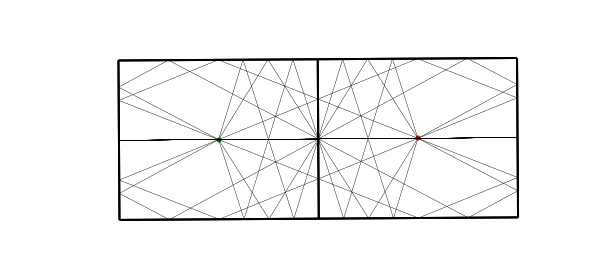
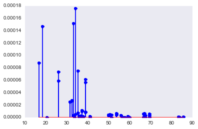
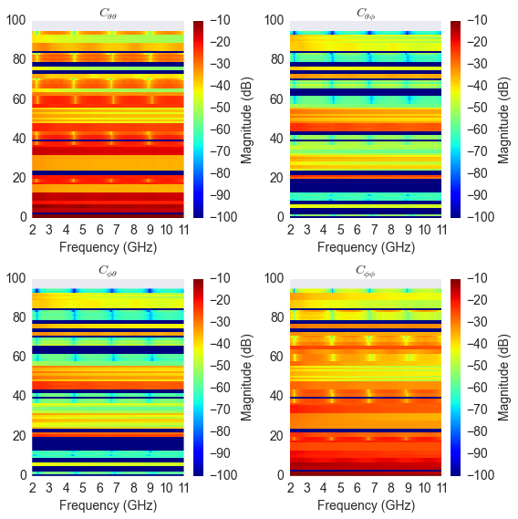
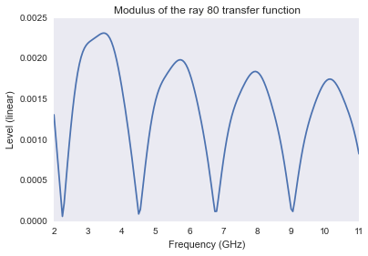
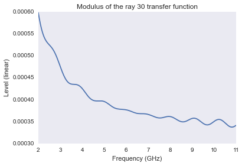
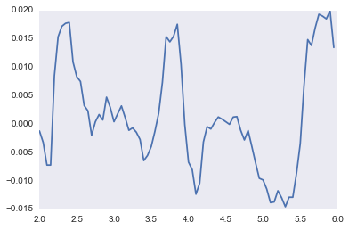
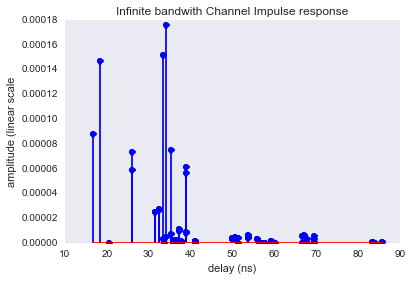

.. code:: python

    from pylayers.simul.link import *
    %matplotlib inline
    import seaborn as sns
    sns.set_style("dark")


.. parsed-literal::

    WARNING:traits.has_traits:DEPRECATED: traits.has_traits.wrapped_class, 'the 'implements' class advisor has been deprecated. Use the 'provides' class decorator.


How to do Ray Tracing simulation using DLink
============================================

This section illustrates the
```link`` <http://pylayers.github.io/pylayers/modules/pylayers.simul.link.html>`__
module. A ``Dlink`` object is a deterministic (Single Input Single
Output) SISO link.

.. code:: python

    L=DLink()

.. code:: python

    L.show()


.. parsed-literal::

    (<matplotlib.figure.Figure at 0x2b2136c1b5d0>,
     <matplotlib.axes._subplots.AxesSubplot at 0x2b20c91d1f90>)


.. image:: LinkSimulation_files/LinkSimulation_4_1.png


.. code:: python

    L


.. parsed-literal::

    filename: Links_0_defstr.ini.h5
    Link Parameters :
    ------- --------
    Layout : defstr.ini
    
    Node a   
    ------  
    position : [  766.00300113  1113.94747911     1.2       ]
    Antenna : sh3
    Rotation matrice : 
     [[ 1.  0.  0.]
     [ 0.  1.  0.]
     [ 0.  0.  1.]]
    
    Node b   
    ------  
    position : [  761.0028967   1113.91576981     1.2       ]
    Antenna : sh3
    Rotation matrice : 
     [[ 1.  0.  0.]
     [ 0.  1.  0.]
     [ 0.  0.  1.]]
    
    Link evaluation information : 
    ----------------------------- 
    distance :  5.000 m 
    delay : 16.667 ns
    fmin (fGHz) : 2.0
    fmax (fGHz) : 11.0
    fstep (fGHz) : 0.05
    Nf : 181
     


.. code:: python

    L.eval()


.. parsed-literal::

    checkh5
    Start Signatures
    Signatures'> from 1_2_3 loaded
    load signature
    Stop signature 0.121777057648
    Start Rays
    Rays'> from 3_0_2 loaded
    Stop rays 0.152944087982
    Ctilde'> from 0_2_0 loaded
    Tchannel'> from 0_2_0_0_0_2_2 loaded


.. parsed-literal::

    (array([  8.74446418e-05,   1.46698690e-04,   0.00000000e+00,
              3.14995445e-06,   1.51702810e-04,   7.29356204e-05,
              5.90710148e-05,   2.46454264e-05,   2.44450202e-05,
              4.87319705e-06,   1.75686332e-04,   7.13675689e-06,
              7.47211694e-05,   6.74741489e-08,   1.95936070e-06,
              2.23741852e-07,   2.26646476e-06,   4.14435099e-06,
              3.00650318e-06,   3.00698950e-06,   2.61297158e-05,
              2.70506446e-05,   0.00000000e+00,   0.00000000e+00,
              7.97779088e-08,   2.38562292e-06,   4.04156289e-08,
              2.64709912e-06,   9.07630898e-08,   1.12916970e-06,
              1.22492177e-07,   1.33692589e-06,   8.04381204e-06,
              8.49458480e-06,   6.14904213e-05,   5.66523749e-05,
              4.67849894e-06,   3.68188625e-06,   3.68423370e-06,
              0.00000000e+00,   3.88676042e-06,   3.88632416e-06,
              2.23404583e-07,   5.46676503e-06,   1.02274728e-05,
              1.00586800e-05,   1.07393894e-05,   9.71108468e-06,
              9.25607532e-08,   1.62695253e-07,   4.71935354e-07,
              1.21853846e-06,   1.61900680e-07,   1.01020395e-07,
              1.47301403e-06,   6.52210803e-07,   4.42388951e-06,
              6.41935326e-06,   5.64142360e-06,   3.84647619e-06,
              3.84739961e-06,   5.64145807e-06,   3.27350264e-06,
              3.34549293e-06,   9.67273293e-08,   1.64206449e-07,
              2.35671508e-07,   6.21878652e-06,   1.36855910e-07,
              3.45202976e-06,   2.66614869e-07,   9.25499264e-07,
              9.77377034e-07,   0.00000000e+00,   0.00000000e+00,
              1.01308828e-07,   1.36303838e-07,   0.00000000e+00,
              0.00000000e+00,   1.91570108e-07,   2.77178941e-07,
              3.40906186e-06,   5.08162922e-06,   2.75700486e-07,
              0.00000000e+00,   1.71902246e-06,   1.71676236e-06,
              1.68408980e-06,   1.76350549e-06,   1.12834353e-07,
              3.06875167e-08,   1.41120249e-07,   3.95694440e-08,
              3.54499281e-07,   4.25309327e-07]),
     array([ 16.66734994,  18.48784882,  20.53778357,  33.33365909,
             33.3343511 ,  26.03460301,  26.03460301,  31.44237961,
             31.44261404,  34.28021045,  34.28088335,  35.42785385,
             35.42850495,  35.89995802,  35.89997275,  35.90181477,
             35.90184832,  50.00066032,  50.0013426 ,  50.00136179,
             32.44415565,  32.44438284,  33.65446829,  33.65468731,
             36.78052454,  36.78053892,  36.78233685,  36.78236959,
             37.85243698,  37.85245096,  37.85419797,  37.85422979,
             38.87329197,  38.87329197,  38.87388536,  38.87388536,
             50.63660763,  50.63728134,  50.63730029,  51.42048261,
             51.42114606,  51.42116471,  66.66765177,  66.66836297,
             37.26423534,  37.26423534,  37.26443315,  37.26443315,
             41.09509686,  41.09509686,  41.09510973,  41.09510973,
             41.0967189 ,  41.0967189 ,  41.0967482 ,  41.0967482 ,
             53.85226116,  53.85226116,  53.85289465,  53.85289465,
             53.85291246,  53.85291246,  55.86686011,  55.8671227 ,
             56.66325336,  56.66785273,  67.14592909,  67.14663522,
             67.7390271 ,  67.73972705,  83.33535519,  56.43674387,
             56.43700381,  57.14110656,  57.14136329,  57.2252067 ,
             57.2297609 ,  57.91998171,  57.92448129,  69.60298696,
             69.60298696,  69.60366816,  69.60366816,  83.71846526,
             84.19490142,  59.33890847,  59.33890847,  59.3391557 ,
             59.3391557 ,  60.08930256,  60.08930256,  60.09363971,
             60.09363971,  85.70170024,  85.70170024]))


To evaluate a link there is the ``eval`` method. This method takes as
argument + a list of the desired outputs, + the type of algorithm being
used, + the ceil heigh + the number of multi reflection between ceil and
floor.

.. code:: python

    L.R.show(L=L.L,figsize=(10,10))


.. parsed-literal::

    (<matplotlib.figure.Figure at 0x2b2136dfc190>,
     <matplotlib.axes._subplots.AxesSubplot at 0x2b2136dfc710>)





.. code:: python

    L.H.taud


.. parsed-literal::

    array([ 16.66734994,  18.48784882,  20.53778357,  33.33365909,
            33.3343511 ,  26.03460301,  26.03460301,  31.44237961,
            31.44261404,  34.28021045,  34.28088335,  35.42785385,
            35.42850495,  35.89995802,  35.89997275,  35.90181477,
            35.90184832,  50.00066032,  50.0013426 ,  50.00136179,
            32.44415565,  32.44438284,  33.65446829,  33.65468731,
            36.78052454,  36.78053892,  36.78233685,  36.78236959,
            37.85243698,  37.85245096,  37.85419797,  37.85422979,
            38.87329197,  38.87329197,  38.87388536,  38.87388536,
            50.63660763,  50.63728134,  50.63730029,  51.42048261,
            51.42114606,  51.42116471,  66.66765177,  66.66836297,
            37.26423534,  37.26423534,  37.26443315,  37.26443315,
            41.09509686,  41.09509686,  41.09510973,  41.09510973,
            41.0967189 ,  41.0967189 ,  41.0967482 ,  41.0967482 ,
            53.85226116,  53.85226116,  53.85289465,  53.85289465,
            53.85291246,  53.85291246,  55.86686011,  55.8671227 ,
            56.66325336,  56.66785273,  67.14592909,  67.14663522,
            67.7390271 ,  67.73972705,  83.33535519,  56.43674387,
            56.43700381,  57.14110656,  57.14136329,  57.2252067 ,
            57.2297609 ,  57.91998171,  57.92448129,  69.60298696,
            69.60298696,  69.60366816,  69.60366816,  83.71846526,
            84.19490142,  59.33890847,  59.33890847,  59.3391557 ,
            59.3391557 ,  60.08930256,  60.08930256,  60.09363971,
            60.09363971,  85.70170024,  85.70170024])


.. code:: python

    aktk=L.eval(force=[], output=['sig','ray','Ct','H'],
                si_algo='old',ra_ceil_height_meter=3,ra_number_mirror_cf=1)


.. parsed-literal::

    checkh5
    Start Signatures
    Signatures'> from 1_2_3 loaded
    load signature
    Stop signature 0.12762093544
    Start Rays
    Rays'> from 3_0_2 loaded
    Stop rays 0.0357868671417
    Ctilde'> from 0_2_0 loaded
    Tchannel'> from 0_2_0_0_0_2_2 loaded


.. code:: python

    plt.stem(aktk[1],aktk[0])


.. parsed-literal::

    <Container object of 3 artists>





The propagation channel (without antenna) can be vizualized on a ray by
ray mode.

.. code:: python

    type(L.C)


.. parsed-literal::

    pylayers.antprop.channel.Ctilde


.. code:: python

    #L._show3()sns.set_style("dark")

.. code:: python

    fig = plt.figure(figsize=(8,8))
    C = L.C
    f,a = C.show(cmap='jet',fig=fig,typ='l10',vmin=-100,vmax=-10)





It is possible to look at individual ray transfer function, as
illustrated below.

.. code:: python

    C.Ctt.y.shape


.. parsed-literal::

    (95, 181)


.. code:: python

    ir = 80
    plt.plot(C.Ctt.x,abs(C.Ctt.y[ir,:]))
    plt.xlabel('Frequency (GHz)')
    plt.ylabel('Level (linear)')
    plt.title('Modulus of the ray '+str(ir)+' transfer function')


.. parsed-literal::

    <matplotlib.text.Text at 0x2b2137988c90>





.. code:: python

    ir = 30
    plt.plot(C.Ctt.x,abs(C.Ctt.y[ir,:]))
    plt.xlabel('Frequency (GHz)')
    plt.ylabel('Level (linear)')
    plt.title('Modulus of the ray '+str(ir)+' transfer function')


.. parsed-literal::

    <matplotlib.text.Text at 0x2b21380bc790>





In the link we also have the transmission channel accounting for the
effect of antennas and Friis factor. If the ray transfer function is
scaled with :math:`\frac{4\pi f}{c}`

.. code:: python

    plt.plot(L.H.x,L.H.y[0,:]*4*np.pi*L.H.x/0.3)


.. parsed-literal::

    /home/uguen/anaconda/lib/python2.7/site-packages/numpy/core/numeric.py:462: ComplexWarning: Casting complex values to real discards the imaginary part
      return array(a, dtype, copy=False, order=order)


.. parsed-literal::

    [<matplotlib.lines.Line2D at 0x2b2138189fd0>]





Notice that in this case the frequency

The infinite bandwidth channel impulse response is plotted below from
the extrated set :math:`\{\alpha_k,\tau_k\}`.

.. code:: python

    plt.stem(aktk[1],aktk[0])
    plt.title('Infinite bandwith Channel Impulse response')
    plt.xlabel('delay (ns)')
    plt.ylabel('amplitude (linear scale')


.. parsed-literal::

    <matplotlib.text.Text at 0x2b2137946cd0>





.. code:: python

    import pylayers.simul.simulnet as sn
    import pylayers.simul.simultraj as st

.. code:: python

    S=sn.Simul()


.. parsed-literal::

    Layout graphs are loaded from /home/uguen/Bureau/P1/struc/ini


.. code:: python

    S.L


.. parsed-literal::

    
    ----------------
    TA-Office.ini
    Image('/home/uguen/Bureau/P1/struc/images/DLR4991.png')
    ----------------
    
    Number of points  : 71
    Number of segments  : 87
    Number of sub segments  : 16
    Number of cycles  : 18
    Number of rooms  : 17
    degree 0 : []
    degree 1 : []
    number of node point of degree 2 : 39
    number of node point of degree 3 : 32
    
    xrange :(0.0, 40.0)
    yrange :(0.0, 15.0)
    
    Useful dictionnaries
    ----------------
    dca {cycle : []} cycle with an airwall
    sl {slab name : slab dictionary}
    name :  {slab :seglist} 
    
    Useful arrays
    ----------------
    pt : numpy array of points 
    normal : numpy array of normal 
    offset : numpy array of offset 
    tsg : get segment index in Gs from tahe
    isss :  sub-segment index above Nsmax
    tgs : get segment index in tahe from Gs
    lsss : list of segments with sub-segment
    sla : list of all slab names (Nsmax+Nss+1)
    degree : degree of nodes 


.. code:: python

    S.runsimul()

.. code:: python

    dB=True
    from pylayers.mobility.trajectory import *

A trajectories object is a list of trajectories. The loadh5 methods by
default loads the file '.h5' generated by
```Simulnet`` <http://pylayers.github.io/pylayers/modules/pylayers.simul.simulnet.html>`__.

.. code:: python

    T=Trajectories()
    T.loadh5()

.. code:: python

    T


.. parsed-literal::

    Trajectories performed in Layout : TA-Office.ini
    
    Trajectory of agent John with ID 1
    ----------------------------------
    t (s) : 0.00 : 0.20 : 119.80
    dtot (m) : 406.09
    Vmoy (m/s) : 3.39
                                     x         y        vx        vy        ax  \
    t                                                                            
    1970-01-01 00:00:00.000  18.907750  2.528547  0.038749  0.155237  0.193744   
    1970-01-01 00:00:00.200  18.921699  2.584433  0.069748  0.279427  0.154995   
    
                                   ay      s  
    t                                         
    1970-01-01 00:00:00.000  0.776185  0.160  
    1970-01-01 00:00:00.200  0.620948  0.448  
    
    Trajectory of agent Alex with ID 2
    ----------------------------------
    t (s) : 0.00 : 0.20 : 119.80
    dtot (m) : 361.43
    Vmoy (m/s) : 3.02
                                     x          y        vx        vy        ax  \
    t                                                                             
    1970-01-01 00:00:00.000  24.306132  12.467593  0.030661 -0.157035  0.153303   
    1970-01-01 00:00:00.200  24.317170  12.411061  0.055189 -0.282663  0.122642   
    
                                   ay      s  
    t                                         
    1970-01-01 00:00:00.000 -0.785174  0.160  
    1970-01-01 00:00:00.200 -0.628139  0.448  
    
    Access point Router with ID 6
    -----------------------------
    t (s) : 0.00
    Vmoy (m/s) : 0.0
                  x  y    z  vx  vy  ax  ay  s
    t                                         
    1970-01-01  0.5  2  2.5   0   0   0   0  0
    
    Access point Router with ID 7
    -----------------------------
    t (s) : 0.00
    Vmoy (m/s) : 0.0
                  x   y    z  vx  vy  ax  ay  s
    t                                          
    1970-01-01  0.7  14  2.5   0   0   0   0  0
    
    Access point Router with ID 8
    -----------------------------
    t (s) : 0.00
    Vmoy (m/s) : 0.0
                 x   y    z  vx  vy  ax  ay  s
    t                                         
    1970-01-01  39  13  2.5   0   0   0   0  0
    


A SimulTraj object is derived from a trajectory calculated previously in
simulnet and a body agent description. The Simultraj object get the
trajectories from the ``simultaj.ini`` file.

.. code:: python

    St=st.Simul(verbose=False)


::


    ---------------------------------------------------------------------------

    AttributeError                            Traceback (most recent call last)

    <ipython-input-25-ae27233a0375> in <module>()
    ----> 1 St=st.Simul(verbose=False)
    

    /home/uguen/Documents/rch/devel/pylayers/pylayers/simul/simultraj.pyc in __init__(self, source, verbose)
        152         if isinstance(source,str):
        153             self.filetraj = source
    --> 154             self.load_simul(source)
        155             self.source = 'simul'
        156         elif 'pylayers' in source.__module__:


    /home/uguen/Documents/rch/devel/pylayers/pylayers/simul/simultraj.pyc in load_simul(self, source)
        237         if not os.path.isfile(source):
        238             raise AttributeError('Trajectory file'+source+'has not been found.\
    --> 239              Please make sure you have run a simulnet simulation before runining simultraj.')
        240 
        241         # get the trajectory


    AttributeError: Trajectory filesimulnet_TA-Office.h5has not been found.             Please make sure you have run a simulnet simulation before runining simultraj.


.. code:: python

    #St.run(t=list(np.arange(0,1,0.1)),OB=True,B2B=True,B2I=True)

.. code:: python

    #St.data

Information about the simulated network is obtained

.. code:: python

    St.N


::


    ---------------------------------------------------------------------------

    NameError                                 Traceback (most recent call last)

    <ipython-input-28-292f54c77c9f> in <module>()
    ----> 1 St.N
    

    NameError: name 'St' is not defined


.. code:: python

    #St._show3()

.. code:: python

    #St.data.head()

.. code:: python

    #ak,tk,ek=St._loadh5(2,'0_Alex','1_Alex','bluetooth-class2')

.. code:: python

    #stem(tk,ak)

