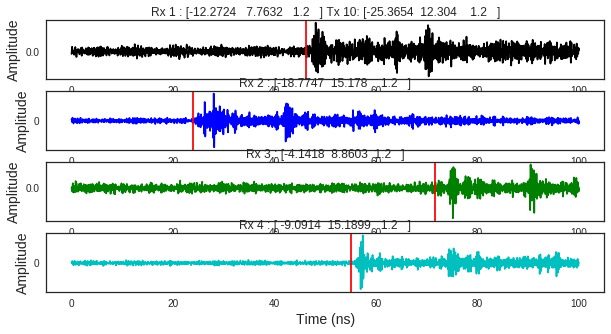

WHERE1 UWB Measurement campaign M1
~~~~~~~~~~~~~~~~~~~~~~~~~~~~~~~~~~

.. code:: python

    %matplotlib inline
    from pylayers.measures.mesuwb import *
    from pylayers.gis.layout import *
    from pylayers.simul.link import *
    from pylayers.signal.waveform import *

.. parsed-literal::

    WARNING:traits.has_traits:DEPRECATED: traits.has_traits.wrapped_class, 'the 'implements' class advisor has been deprecated. Use the 'provides' class decorator.

.. parsed-literal::

    <matplotlib.figure.Figure at 0x2ba6e71f5d10>

First of all, we load the Layout of the environment. If the Layout
associated graphs have already been built, one can load them with the
``dumpr()`` method.

.. code:: python

    L=Layout('WHERE1.ini')
    L.dumpr()

.. code:: python

    try:
        del td1
        del td2
        del td3
        del td4
        del te1
        del te2
        del te3
        del te4
        del tt1
        del tt2
        del tt3
        del tt4
    except:
        pass

The UWB measure from the WHERE1 project are handled in the class
``UWBMeasure``

.. code:: python

    K=UWBMeasure(10)

.. parsed-literal::

    DEPRECATION WARNING : geomutil.angular going deprecatd  because wrong
    DEPRECATION WARNING : geomutil.angular going deprecatd  because wrong
    DEPRECATION WARNING : geomutil.angular going deprecatd  because wrong
    DEPRECATION WARNING : geomutil.angular going deprecatd  because wrong

.. parsed-literal::

    /home/uguen/Documents/rch/devel/pylayers/pylayers/measures/mesuwb.py:993: FutureWarning: elementwise != comparison failed and returning scalar instead; this will raise an error or perform elementwise comparison in the future.
      if d != []:

The delays associated with the 4 links are obatained directly

.. code:: python

    K.de

.. parsed-literal::

    array([ 46.19349565,  23.96692223,  71.6705632 ,  55.09300165])

As well as more information if needed.

.. code:: python

    K.info()

.. parsed-literal::

    Date_Time : [u'31-Jul-2008 08:17:50']
    Tx_height : [u'120cm']
    Tx_position : [u'P010']
    Tx :  [-25.3654  12.304    1.2   ]
    ------Tx1 ------
    delays     (ns): 46.1934956511
    range  (meters): 13.8580486953
    visibility     : NLOS2
    angular (degree)  : 2.80776139034
    LQI Meth1 12.7383607831  (dB)
    LQI Meth2 -1.2959656826  (dB)
    ------Tx2 ------
    delays     (ns): 23.9669222261
    range  (meters): 7.19007666782
    visibility     : NLOS2
    angular (degree)  : 3.55280136793
    LQI Meth1 21.4526880977  (dB)
    LQI Meth2 5.56578610451  (dB)
    ------Tx3 ------
    delays     (ns): 71.6705632005
    range  (meters): 21.5011689601
    visibility     : NLOS2
    angular (degree)  : 2.98073648115
    LQI Meth1 11.5021659794  (dB)
    LQI Meth2 4.23241262908  (dB)
    ------Tx4 ------
    delays     (ns): 55.0930016539
    range  (meters): 16.5279004962
    visibility     : NLOS
    angular (degree)  : 3.31710006758
    LQI Meth1 28.2789637953  (dB)
    LQI Meth2 4.89658815244  (dB)

.. code:: python

    ### Simulation section
    fig=plt.figure(figsize=(10,5))
    f,a = K.show(delay=K.de)

.. code:: python

    #toa1 = K.toa_new()
    #toa2 = K.toa_th(1e-1,1e-1)

.. code:: python

    K.tau_Emax()

.. parsed-literal::

    array([[ 0.,  0.,  0., ...,  0.,  0.,  0.],
           [ 0.,  0.,  0., ...,  0.,  0.,  0.],
           [ 0.,  0.,  0., ...,  0.,  0.,  0.],
           [ 0.,  0.,  0., ...,  0.,  0.,  0.]])

.. code:: python

    np.vstack((K.rx))

.. parsed-literal::

    array([[  0.    ,   0.    ,   1.2   ],
           [-12.2724,   7.7632,   1.2   ],
           [-18.7747,  15.178 ,   1.2   ],
           [ -4.1418,   8.8603,   1.2   ],
           [ -9.0914,  15.1899,   1.2   ]])

The code below reads data from the M1-WHERE2 measurement campaign.

.. code:: python

    M=UWBMeasure(15)

.. parsed-literal::

    DEPRECATION WARNING : geomutil.angular going deprecatd  because wrong
    DEPRECATION WARNING : geomutil.angular going deprecatd  because wrong
    DEPRECATION WARNING : geomutil.angular going deprecatd  because wrong
    DEPRECATION WARNING : geomutil.angular going deprecatd  because wrong

.. code:: python

    for k in range(300):
        try:
            M  = UWBMeasure(k)
        except:
            break
        tx = M.tx
        D  = M.rx-tx[np.newaxis,:]
        D2 = D*D
        dist = np.sqrt(np.sum(D2,axis=1))[1:]
        Emax = M.Emax()
        Etot = M.Etot()[0]
        try:
            td1 = np.hstack((td1,dist[0]))
            td2 = np.hstack((td2,dist[1]))
            td3 = np.hstack((td3,dist[2]))
            td4 = np.hstack((td4,dist[3]))
    
            te1 = np.hstack((te1,Emax[0]))
            te2 = np.hstack((te2,Emax[1]))
            te3 = np.hstack((te3,Emax[2]))
            te4 = np.hstack((te4,Emax[3]))
    
            tt1 = np.hstack((tt1,Etot[0]))
            tt2 = np.hstack((tt2,Etot[1]))
            tt3 = np.hstack((tt3,Etot[2]))
            tt4 = np.hstack((tt4,Etot[3]))
            #tdist = np.hstack((tdist,dist))
            #te = np.hstack((te,Emax))
        except:
            td1=np.array(dist[0])
            td2=np.array(dist[1])
            td3=np.array(dist[2])
            td4=np.array(dist[3])
            te1 =np.array(Emax[0])
            te2 =np.array(Emax[1])
            te3 =np.array(Emax[2])
            te4 =np.array(Emax[3])
            tt1 =np.array(Etot[0])
            tt2 =np.array(Etot[1])
            tt3 =np.array(Etot[2])
            tt4 =np.array(Etot[3])

The IR-UWB applied waweform is available in the raw data structure and
can be extracted as follow. This exracttion is important in order to
proceeed to the ray tracing simulation with the same waveform as the one
used in the measurement campaign.

.. code:: python

    td1

::

    ---------------------------------------------------------------------------

    NameError                                 Traceback (most recent call last)

    <ipython-input-13-479d13f50eb4> in <module>()
    ----> 1 td1
    

    NameError: name 'td1' is not defined

.. code:: python

    from pylayers.signal.bsignal import *
    s=M.RAW_DATA.tx[0]
    t=M.RAW_DATA.timetx[0]*1e9
    plt.plot(t,s)
    plt.xlabel('time (ns)')
    se=TUsignal(t,s)

.. code:: python

    te = t[1]-t[0]
    cs = np.cumsum(s*s)
    E = cs[-1]*te
    EdB = 10*np.log10(E*30)
    print EdB
    print E*30
    use =1/E
    print use

.. parsed-literal::

    -10.2361907016
    0.0947067492189
    316.767286888

.. code:: python

    E2=se.Emax()
    print E2*30
    E2dB=10*np.log10(E2*30)
    print E2dB

::

    ---------------------------------------------------------------------------

    AttributeError                            Traceback (most recent call last)

    <ipython-input-16-b3aec4f6e3ab> in <module>()
    ----> 1 E2=se.Emax()
          2 print E2*30
          3 E2dB=10*np.log10(E2*30)
          4 print E2dB

    AttributeError: 'TUsignal' object has no attribute 'Emax'

.. code:: python

    se.plot(typ='v')

.. parsed-literal::

    (<matplotlib.figure.Figure at 0x2ba6e7d47b90>,
     array([[<matplotlib.axes._subplots.AxesSubplot object at 0x2ba6e7d47e50>]], dtype=object))

.. code:: python

    td1

::

    ---------------------------------------------------------------------------

    NameError                                 Traceback (most recent call last)

    <ipython-input-18-479d13f50eb4> in <module>()
    ----> 1 td1
    

    NameError: name 'td1' is not defined

.. code:: python

    fig = plt.figure(figsize=(16,6))
    ax = fig.add_subplot(111)
    ax.semilogx(td1,te1+EdB,'.r',label='Rx1')
    ax.semilogx(td2,te2+EdB,'.b',label='Rx2')
    ax.semilogx(td3,te3+EdB,'.g',label='Rx3')
    ax.semilogx(td4,te4+EdB,'.c',label='Rx4')
    d = np.linspace(1,30,100)
    
    LFS = -(32.4+20*np.log10(4)+20*np.log10(d))-4
    ax.semilogx(d,LFS)
    plt.legend()
    plt.grid()

::

    ---------------------------------------------------------------------------

    NameError                                 Traceback (most recent call last)

    <ipython-input-19-c8c2d113d203> in <module>()
          1 fig = plt.figure(figsize=(16,6))
          2 ax = fig.add_subplot(111)
    ----> 3 ax.semilogx(td1,te1+EdB,'.r',label='Rx1')
          4 ax.semilogx(td2,te2+EdB,'.b',label='Rx2')
          5 ax.semilogx(td3,te3+EdB,'.g',label='Rx3')

    NameError: name 'td1' is not defined

.. image:: Wheresimple_files/Wheresimple_25_1.png

.. code:: python

    fig = plt.figure(figsize=(16,6))
    ax = fig.add_subplot(111)
    ax.semilogx(td1,tt1+EdB,'.r',label='Rx1')
    ax.semilogx(td2,tt2+EdB,'.b',label='Rx2')
    ax.semilogx(td3,tt3+EdB,'.g',label='Rx3')
    ax.semilogx(td4,tt4+EdB,'.c',label='Rx4')
    d = np.linspace(1,30,100)
    
    LFS = -(32.4+20*np.log10(4)+20*np.log10(d))-4
    ax.semilogx(d,LFS)
    plt.legend()
    plt.grid()

::

    ---------------------------------------------------------------------------

    NameError                                 Traceback (most recent call last)

    <ipython-input-20-73bd51aacab9> in <module>()
          1 fig = plt.figure(figsize=(16,6))
          2 ax = fig.add_subplot(111)
    ----> 3 ax.semilogx(td1,tt1+EdB,'.r',label='Rx1')
          4 ax.semilogx(td2,tt2+EdB,'.b',label='Rx2')
          5 ax.semilogx(td3,tt3+EdB,'.g',label='Rx3')

    NameError: name 'td1' is not defined

.. image:: Wheresimple_files/Wheresimple_26_1.png

.. code:: python

    M.Etot()

.. parsed-literal::

    /home/uguen/Documents/rch/devel/pylayers/pylayers/antprop/channel.py:808: VisibleDeprecationWarning: boolean index did not match indexed array along dimension 0; dimension is 1 but corresponding boolean dimension is 40000
      etot = self.dx() * sum(self.y[u] * np.conj(self.y[u]))

::

    ---------------------------------------------------------------------------

    IndexError                                Traceback (most recent call last)

    <ipython-input-21-4c54b027f6b5> in <module>()
    ----> 1 M.Etot()
    

    /home/uguen/Documents/rch/devel/pylayers/pylayers/measures/mesuwb.pyc in Etot(self, toffns, tdns, dB)
       1998         de2 = self.de[2] + toffns
       1999         de3 = self.de[3] + toffns
    -> 2000         Etot1 = self.tdd.ch1.Etot(de0, de0 + tdns)
       2001         Etot2 = self.tdd.ch2.Etot(de1, de1 + tdns)
       2002         Etot3 = self.tdd.ch3.Etot(de2, de2 + tdns)

    /home/uguen/Documents/rch/devel/pylayers/pylayers/antprop/channel.pyc in Etot(self, tau0, taumax, dB)
        806         """
        807         u = (self.x > tau0) & (self.x < taumax)
    --> 808         etot = self.dx() * sum(self.y[u] * np.conj(self.y[u]))
        809         if dB:
        810             etot = 10 * np.log10(etot)

    IndexError: index 8646 is out of bounds for axis 0 with size 1

On choisit un index pour Tx et Rx

.. code:: python

    #measure id
    tx_id = 100 #in M.valid_index
    rx_id = 2 #1,2,3,4
    M=UWBMeasure(tx_id)
    TX = M.tx
    RX =M.rx[rx_id]

.. parsed-literal::

    DEPRECATION WARNING : geomutil.angular going deprecatd  because wrong
    DEPRECATION WARNING : geomutil.angular going deprecatd  because wrong
    DEPRECATION WARNING : geomutil.angular going deprecatd  because wrong
    DEPRECATION WARNING : geomutil.angular going deprecatd  because wrong

.. code:: python

    TX

.. parsed-literal::

    array([-22.3797,  13.3897,   1.2   ])

.. code:: python

    M.rx

.. parsed-literal::

    array([[  0.    ,   0.    ,   1.2   ],
           [-12.2724,   7.7632,   1.2   ],
           [-18.7747,  15.178 ,   1.2   ],
           [ -4.1418,   8.8603,   1.2   ],
           [ -9.0914,  15.1899,   1.2   ]])

.. code:: python

    L.showG('s',figsize=(8,4))
    plt.plot(TX[0],TX[1],'ob')
    plt.plot(RX[0],RX[1],'or')
    plt.title('TOF = '+ str(np.sqrt(np.sum((TX-RX)**2))/0.3))

.. parsed-literal::

    /home/uguen/anaconda/lib/python2.7/site-packages/matplotlib/collections.py:650: FutureWarning: elementwise comparison failed; returning scalar instead, but in the future will perform elementwise comparison
      if self._edgecolors_original != str('face'):

.. parsed-literal::

    <matplotlib.text.Text at 0x2ba6e826ba10>

.. parsed-literal::

    /home/uguen/anaconda/lib/python2.7/site-packages/matplotlib/collections.py:590: FutureWarning: elementwise comparison failed; returning scalar instead, but in the future will perform elementwise comparison
      if self._edgecolors == str('face'):

.. image:: Wheresimple_files/Wheresimple_32_3.png

.. code:: python

    TX

.. parsed-literal::

    array([-22.3797,  13.3897,   1.2   ])

.. code:: python

    RX

.. parsed-literal::

    array([-18.7747,  15.178 ,   1.2   ])

.. code:: python

    #Lk = DLink()
    Lk = DLink(L=L,a=TX,b=RX,cutoff=4,verbose=False)
    Lk.Aa=Antenna('defant.vsh3')
    Lk.Ab=Antenna('defant.vsh3')

::

    ---------------------------------------------------------------------------

    AssertionError                            Traceback (most recent call last)

    <ipython-input-28-6282203ae045> in <module>()
          1 #Lk = DLink()
    ----> 2 Lk = DLink(L=L,a=TX,b=RX,cutoff=4,verbose=False)
          3 Lk.Aa=Antenna('defant.vsh3')
          4 Lk.Ab=Antenna('defant.vsh3')

    /home/uguen/Documents/rch/devel/pylayers/pylayers/simul/link.pyc in __init__(self, **kwargs)
        344         Link.__init__(self)
        345 
    --> 346         defaults={ 'L':Layout(),
        347                    'a':np.array(()),
        348                    'b':np.array(()),

    /home/uguen/Documents/rch/devel/pylayers/pylayers/gis/layout.pyc in __init__(self, _filename, _filematini, _fileslabini, _filefur, force, check)
        410         # check layout integrity (default)
        411         if check:
    --> 412             self.check()
        413         #self.boundary()
        414 

    /home/uguen/Documents/rch/devel/pylayers/pylayers/gis/layout.pyc in check(self, level)
        719             deg0 = filter(lambda x: nx.degree(self.Gs,x)==0,upnt)
        720             deg1 = filter(lambda x: nx.degree(self.Gs,x)==1,upnt)
    --> 721             assert (len(deg0)==0), "It exists degree 0 points :  %r" % deg0
        722             assert (len(deg1)==0), "It exists degree 1 points : %r" % deg1
        723 

    AssertionError: It exists degree 0 points :  [-18, -17, -16, -15, -14]

.. code:: python

    Lk.eval(force=['ray','Ct','H'],alg=5)
    #f,a = Lk.show(rays=True,labels=False)

::

    ---------------------------------------------------------------------------

    NameError                                 Traceback (most recent call last)

    <ipython-input-29-213fa5db2653> in <module>()
    ----> 1 Lk.eval(force=['ray','Ct','H'],alg=5)
          2 #f,a = Lk.show(rays=True,labels=False)

    NameError: name 'Lk' is not defined

.. code:: python

    #%timeit Lk.eval(force=True,alg=7,cutoff=3)
    #f,a = Lk.show(rays=True,labels=False)

.. code:: python

    Lk.R

::

    ---------------------------------------------------------------------------

    NameError                                 Traceback (most recent call last)

    <ipython-input-31-dd2218c56595> in <module>()
    ----> 1 Lk.R
    

    NameError: name 'Lk' is not defined

.. code:: python

    #%timeit Lk.eval(force=True,alg=7,threshold=0.01)
    #f,a = Lk.show(rays=True,labels=False)

.. code:: python

    Lk.Si.keys()

::

    ---------------------------------------------------------------------------

    NameError                                 Traceback (most recent call last)

    <ipython-input-33-fbcd3fa4b286> in <module>()
    ----> 1 Lk.Si.keys()
    

    NameError: name 'Lk' is not defined

.. code:: python

    U=Lk.R[4]['sig2d'][0]

::

    ---------------------------------------------------------------------------

    NameError                                 Traceback (most recent call last)

    <ipython-input-34-7127f05a2d76> in <module>()
    ----> 1 U=Lk.R[4]['sig2d'][0]
    

    NameError: name 'Lk' is not defined

.. code:: python

    print U.shape

::

    ---------------------------------------------------------------------------

    NameError                                 Traceback (most recent call last)

    <ipython-input-35-c88df2aeda9a> in <module>()
    ----> 1 print U.shape
    

    NameError: name 'U' is not defined

.. code:: python

    s1 = U[:,:,0]
    print s1

::

    ---------------------------------------------------------------------------

    NameError                                 Traceback (most recent call last)

    <ipython-input-36-03b545538d6b> in <module>()
    ----> 1 s1 = U[:,:,0]
          2 print s1

    NameError: name 'U' is not defined

.. code:: python

    from pylayers.antprop.signature import Signature

.. code:: python

    S=Signature(s1)

::

    ---------------------------------------------------------------------------

    NameError                                 Traceback (most recent call last)

    <ipython-input-38-e7330839f958> in <module>()
    ----> 1 S=Signature(s1)
    

    NameError: name 's1' is not defined

.. code:: python

    S

::

    ---------------------------------------------------------------------------

    NameError                                 Traceback (most recent call last)

    <ipython-input-39-65db27307aa0> in <module>()
    ----> 1 S
    

    NameError: name 'S' is not defined

.. code:: python

    wav = Waveform(typ='W1compensate')

.. parsed-literal::

    DEPRECATION WARNING : geomutil.angular going deprecatd  because wrong
    DEPRECATION WARNING : geomutil.angular going deprecatd  because wrong
    DEPRECATION WARNING : geomutil.angular going deprecatd  because wrong
    DEPRECATION WARNING : geomutil.angular going deprecatd  because wrong

.. code:: python

    wav.show()

::

    ---------------------------------------------------------------------------

    IndexError                                Traceback (most recent call last)

    <ipython-input-41-8d4639290888> in <module>()
    ----> 1 wav.show()
    

    /home/uguen/Documents/rch/devel/pylayers/pylayers/signal/waveform.pyc in show(self, fig)
        361         #plt.title(title)
        362         ax1 = fig.add_subplot(2,1,1)
    --> 363         ax1.plot(self.st.x,self.st.y[0,:])
        364         plt.xlabel('time (ns)')
        365         plt.ylabel('level in linear scale')

    IndexError: too many indices for array

.. code:: python

    #ir = Lk.H.applywavB(wav.sfg)

.. code:: python

    Lk.H.isFriis

::

    ---------------------------------------------------------------------------

    NameError                                 Traceback (most recent call last)

    <ipython-input-43-7614e9090bba> in <module>()
    ----> 1 Lk.H.isFriis
    

    NameError: name 'Lk' is not defined

.. code:: python

    if Lk.H.isFriis:
        ir = Lk.H.applywavB(wav.sf)
    else:
        ir = Lk.H.applywavB(wav.sfg)

::

    ---------------------------------------------------------------------------

    NameError                                 Traceback (most recent call last)

    <ipython-input-44-4083ce0b2310> in <module>()
    ----> 1 if Lk.H.isFriis:
          2     ir = Lk.H.applywavB(wav.sf)
          3 else:
          4     ir = Lk.H.applywavB(wav.sfg)

    NameError: name 'Lk' is not defined

.. code:: python

    Lk.R.los

::

    ---------------------------------------------------------------------------

    NameError                                 Traceback (most recent call last)

    <ipython-input-45-c0cdcab44e2f> in <module>()
    ----> 1 Lk.R.los
    

    NameError: name 'Lk' is not defined

.. code:: python

    Lk.H.ak

::

    ---------------------------------------------------------------------------

    NameError                                 Traceback (most recent call last)

    <ipython-input-46-ab86c1ac1316> in <module>()
    ----> 1 Lk.H.ak
    

    NameError: name 'Lk' is not defined

.. code:: python

    Lk.H.taud

::

    ---------------------------------------------------------------------------

    NameError                                 Traceback (most recent call last)

    <ipython-input-47-a65c1ec8a0a6> in <module>()
    ----> 1 Lk.H.taud
    

    NameError: name 'Lk' is not defined

.. code:: python

    G=Lk.H.ift()

::

    ---------------------------------------------------------------------------

    NameError                                 Traceback (most recent call last)

    <ipython-input-48-0f2260ad659d> in <module>()
    ----> 1 G=Lk.H.ift()
    

    NameError: name 'Lk' is not defined

.. code:: python

    M.tdd.ch2.plot(typ='v')
    plt.xlim([10,130])

.. parsed-literal::

    (10, 130)

.. image:: Wheresimple_files/Wheresimple_56_1.png

.. code:: python

    M.tx

.. parsed-literal::

    array([-22.3797,  13.3897,   1.2   ])

.. code:: python

    M.rx

.. parsed-literal::

    array([[  0.    ,   0.    ,   1.2   ],
           [-12.2724,   7.7632,   1.2   ],
           [-18.7747,  15.178 ,   1.2   ],
           [ -4.1418,   8.8603,   1.2   ],
           [ -9.0914,  15.1899,   1.2   ]])

.. code:: python

    np.sqrt(np.sum((M.tx-M.rx[3,:])*(M.tx-M.rx[3,:]),axis=0))/0.3

.. parsed-literal::

    62.639751380717335

.. code:: python

    Lk.H.ak

::

    ---------------------------------------------------------------------------

    NameError                                 Traceback (most recent call last)

    <ipython-input-53-ab86c1ac1316> in <module>()
    ----> 1 Lk.H.ak
    

    NameError: name 'Lk' is not defined

.. code:: python

    Lk.wav=wav

::

    ---------------------------------------------------------------------------

    NameError                                 Traceback (most recent call last)

    <ipython-input-54-b1309bad8a92> in <module>()
    ----> 1 Lk.wav=wav
    

    NameError: name 'Lk' is not defined

.. code:: python

    ir.plot(typ='v')

::

    ---------------------------------------------------------------------------

    NameError                                 Traceback (most recent call last)

    <ipython-input-55-a7f16e271894> in <module>()
    ----> 1 ir.plot(typ='v')
    

    NameError: name 'ir' is not defined

.. code:: python

    ir

::

    ---------------------------------------------------------------------------

    NameError                                 Traceback (most recent call last)

    <ipython-input-56-2c92a57a4caa> in <module>()
    ----> 1 ir
    

    NameError: name 'ir' is not defined

.. code:: python

    fig = plt.figure(figsize=(10,7))
    ax1=fig.add_subplot(211)
    cmd='M.tdd.ch' + str(rx_id) + '.plot(typ=[\'l20\'],fig=fig,ax=ax1)'
    eval(cmd)
    ax2 = fig.add_subplot(212,sharex=ax1,sharey=ax1)
    #Lk.chanreal.plot(typ=['v'],fig=fig,ax=ax2)
    ir.plot(typ=['l20'],fig=fig,ax=ax2)
    plt.xlim(60,130)

::

    ---------------------------------------------------------------------------

    NameError                                 Traceback (most recent call last)

    <ipython-input-57-c4c4ac0b63ee> in <module>()
          5 ax2 = fig.add_subplot(212,sharex=ax1,sharey=ax1)
          6 #Lk.chanreal.plot(typ=['v'],fig=fig,ax=ax2)
    ----> 7 ir.plot(typ=['l20'],fig=fig,ax=ax2)
          8 plt.xlim(60,130)

    NameError: name 'ir' is not defined

.. image:: Wheresimple_files/Wheresimple_64_1.png

