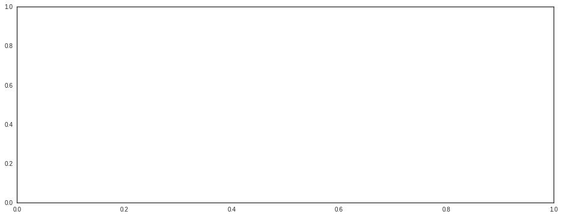
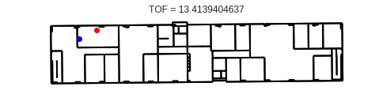
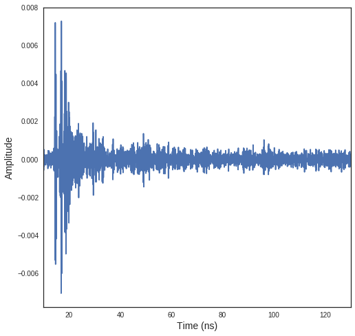
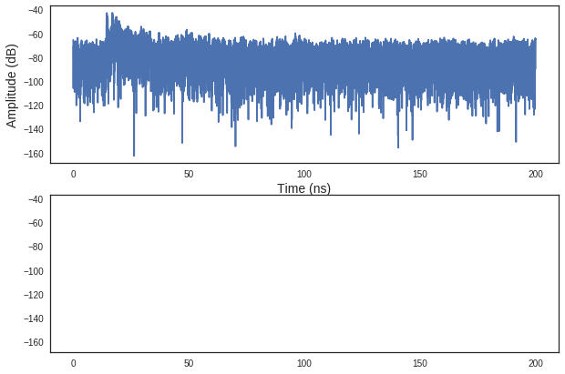

WHERE1 UWB Measurement campaign M1
~~~~~~~~~~~~~~~~~~~~~~~~~~~~~~~~~~

.. code:: python

    %matplotlib inline
    from pylayers.measures.mesuwb import *
    from pylayers.gis.layout import *
    from pylayers.simul.link import *
    from pylayers.signal.waveform import *

.. parsed-literal::

    WARNING:traits.has_traits:DEPRECATED: traits.has_traits.wrapped_class, 'the 'implements' class advisor has been deprecated. Use the 'provides' class decorator.

.. parsed-literal::

    <matplotlib.figure.Figure at 0x2b7861d26890>

First of all, we load the Layout of the environment. If the Layout
associated graphs have already been built, one can load them with the
``dumpr()`` method.

.. code:: python

    L=Layout('WHERE1.ini')
    L.dumpr()

.. code:: python

    try:
        del td1
        del td2
        del td3
        del td4
        del te1
        del te2
        del te3
        del te4
        del tt1
        del tt2
        del tt3
        del tt4
    except:
        pass

The UWB measure from the WHERE1 project are handled in the class
``UWBMeasure``

.. code:: python

    K=UWBMeasure(10)

The delays associated with the 4 links are obatained directly

.. code:: python

    K.de

.. parsed-literal::

    array([ 46.19349565,  23.96692223,  71.6705632 ,  55.09300165])

As well as more information if needed.

.. code:: python

    K.info()

.. parsed-literal::

    Date_Time : [u'31-Jul-2008 08:17:50']
    Tx_height : [u'120cm']
    Tx_position : [u'P010']
    Tx :  [-25.3654  12.304    1.2   ]
    ------Tx1 ------
    delays     (ns): 46.1934956511
    range  (meters): 13.8580486953
    visibility     : NLOS2
    angular (degree)  : 2.80776139034
    LQI Meth1 12.7383607831  (dB)
    LQI Meth2 -1.2959656826  (dB)
    ------Tx2 ------
    delays     (ns): 23.9669222261
    range  (meters): 7.19007666782
    visibility     : NLOS2
    angular (degree)  : 3.55280136793
    LQI Meth1 21.4526880977  (dB)
    LQI Meth2 5.56578610451  (dB)
    ------Tx3 ------
    delays     (ns): 71.6705632005
    range  (meters): 21.5011689601
    visibility     : NLOS2
    angular (degree)  : 2.98073648115
    LQI Meth1 11.5021659794  (dB)
    LQI Meth2 4.23241262908  (dB)
    ------Tx4 ------
    delays     (ns): 55.0930016539
    range  (meters): 16.5279004962
    visibility     : NLOS
    angular (degree)  : 3.31710006758
    LQI Meth1 28.2789637953  (dB)
    LQI Meth2 4.89658815244  (dB)

.. code:: python

    ### Simulation section
    fig=plt.figure(figsize=(10,5))
    f,a = K.show(delay=K.de)

.. image:: Wheresimple_files/Wheresimple_11_0.png

.. code:: python

    #toa1 = K.toa_new()
    #toa2 = K.toa_th(1e-1,1e-1)

.. code:: python

    K.tau_Emax()

.. parsed-literal::

    array([[ 0.,  0.,  0., ...,  0.,  0.,  0.],
           [ 0.,  0.,  0., ...,  0.,  0.,  0.],
           [ 0.,  0.,  0., ...,  0.,  0.,  0.],
           [ 0.,  0.,  0., ...,  0.,  0.,  0.]])

.. code:: python

    np.vstack((K.rx))

.. parsed-literal::

    array([[  0.    ,   0.    ,   1.2   ],
           [-12.2724,   7.7632,   1.2   ],
           [-18.7747,  15.178 ,   1.2   ],
           [ -4.1418,   8.8603,   1.2   ],
           [ -9.0914,  15.1899,   1.2   ]])

The code below reads data from the M1-WHERE2 measurement campaign.

.. code:: python

    M=UWBMeasure(15)

.. code:: python

    for k in range(300):
        try:
            M  = UWBMeasure(k)
        except:
            break
        tx = M.tx
        D  = M.rx-tx[np.newaxis,:]
        D2 = D*D
        dist = np.sqrt(np.sum(D2,axis=1))[1:]
        Emax = M.Emax()
        Etot = M.Etot()[0]
        try:
            td1 = np.hstack((td1,dist[0]))
            td2 = np.hstack((td2,dist[1]))
            td3 = np.hstack((td3,dist[2]))
            td4 = np.hstack((td4,dist[3]))
    
            te1 = np.hstack((te1,Emax[0]))
            te2 = np.hstack((te2,Emax[1]))
            te3 = np.hstack((te3,Emax[2]))
            te4 = np.hstack((te4,Emax[3]))
    
            tt1 = np.hstack((tt1,Etot[0]))
            tt2 = np.hstack((tt2,Etot[1]))
            tt3 = np.hstack((tt3,Etot[2]))
            tt4 = np.hstack((tt4,Etot[3]))
            #tdist = np.hstack((tdist,dist))
            #te = np.hstack((te,Emax))
        except:
            td1=np.array(dist[0])
            td2=np.array(dist[1])
            td3=np.array(dist[2])
            td4=np.array(dist[3])
            te1 =np.array(Emax[0])
            te2 =np.array(Emax[1])
            te3 =np.array(Emax[2])
            te4 =np.array(Emax[3])
            tt1 =np.array(Etot[0])
            tt2 =np.array(Etot[1])
            tt3 =np.array(Etot[2])
            tt4 =np.array(Etot[3])

The IR-UWB applied waweform is available in the raw data structure and
can be extracted as follow. This exracttion is important in order to
proceeed to the ray tracing simulation with the same waveform as the one
used in the measurement campaign.

.. code:: python

    td1

::

    ---------------------------------------------------------------------------

    NameError                                 Traceback (most recent call last)

    <ipython-input-13-479d13f50eb4> in <module>()
    ----> 1 td1
    

    NameError: name 'td1' is not defined

.. code:: python

    from pylayers.signal.bsignal import *
    s=M.RAW_DATA.tx[0]
    t=M.RAW_DATA.timetx[0]*1e9
    plt.plot(t,s)
    plt.xlabel('time (ns)')
    se=TUsignal(t,s)

.. image:: Wheresimple_files/Wheresimple_20_0.png

.. code:: python

    te = t[1]-t[0]
    cs = np.cumsum(s*s)
    E = cs[-1]*te
    EdB = 10*np.log10(E*30)
    print EdB
    print E*30
    use =1/E
    print use

.. parsed-literal::

    -10.2361907016
    0.0947067492189
    316.767286888

.. code:: python

    E2=se.Emax()
    print E2*30
    E2dB=10*np.log10(E2*30)
    print E2dB

::

    ---------------------------------------------------------------------------

    AttributeError                            Traceback (most recent call last)

    <ipython-input-16-b3aec4f6e3ab> in <module>()
    ----> 1 E2=se.Emax()
          2 print E2*30
          3 E2dB=10*np.log10(E2*30)
          4 print E2dB

    AttributeError: 'TUsignal' object has no attribute 'Emax'

.. code:: python

    se.plot(typ='v')

.. parsed-literal::

    (<matplotlib.figure.Figure at 0x2b7862896990>,
     array([[<matplotlib.axes._subplots.AxesSubplot object at 0x2b7862896e90>]], dtype=object))

.. image:: Wheresimple_files/Wheresimple_23_1.png

.. code:: python

    td1

::

    ---------------------------------------------------------------------------

    NameError                                 Traceback (most recent call last)

    <ipython-input-18-479d13f50eb4> in <module>()
    ----> 1 td1
    

    NameError: name 'td1' is not defined

.. code:: python

    fig = plt.figure(figsize=(16,6))
    ax = fig.add_subplot(111)
    ax.semilogx(td1,te1+EdB,'.r',label='Rx1')
    ax.semilogx(td2,te2+EdB,'.b',label='Rx2')
    ax.semilogx(td3,te3+EdB,'.g',label='Rx3')
    ax.semilogx(td4,te4+EdB,'.c',label='Rx4')
    d = np.linspace(1,30,100)
    
    LFS = -(32.4+20*np.log10(4)+20*np.log10(d))-4
    ax.semilogx(d,LFS)
    plt.legend()
    plt.grid()

::

    ---------------------------------------------------------------------------

    NameError                                 Traceback (most recent call last)

    <ipython-input-19-c8c2d113d203> in <module>()
          1 fig = plt.figure(figsize=(16,6))
          2 ax = fig.add_subplot(111)
    ----> 3 ax.semilogx(td1,te1+EdB,'.r',label='Rx1')
          4 ax.semilogx(td2,te2+EdB,'.b',label='Rx2')
          5 ax.semilogx(td3,te3+EdB,'.g',label='Rx3')

    NameError: name 'td1' is not defined

.. image:: Wheresimple_files/Wheresimple_25_1.png

.. code:: python

    fig = plt.figure(figsize=(16,6))
    ax = fig.add_subplot(111)
    ax.semilogx(td1,tt1+EdB,'.r',label='Rx1')
    ax.semilogx(td2,tt2+EdB,'.b',label='Rx2')
    ax.semilogx(td3,tt3+EdB,'.g',label='Rx3')
    ax.semilogx(td4,tt4+EdB,'.c',label='Rx4')
    d = np.linspace(1,30,100)
    
    LFS = -(32.4+20*np.log10(4)+20*np.log10(d))-4
    ax.semilogx(d,LFS)
    plt.legend()
    plt.grid()

::

    ---------------------------------------------------------------------------

    NameError                                 Traceback (most recent call last)

    <ipython-input-20-73bd51aacab9> in <module>()
          1 fig = plt.figure(figsize=(16,6))
          2 ax = fig.add_subplot(111)
    ----> 3 ax.semilogx(td1,tt1+EdB,'.r',label='Rx1')
          4 ax.semilogx(td2,tt2+EdB,'.b',label='Rx2')
          5 ax.semilogx(td3,tt3+EdB,'.g',label='Rx3')

    NameError: name 'td1' is not defined

.. code:: python

    M.Etot()

::

    ---------------------------------------------------------------------------

    IndexError                                Traceback (most recent call last)

    <ipython-input-21-4c54b027f6b5> in <module>()
    ----> 1 M.Etot()
    

    /home/uguen/Documents/rch/devel/pylayers/pylayers/measures/mesuwb.pyc in Etot(self, toffns, tdns, dB)
       1998         de2 = self.de[2] + toffns
       1999         de3 = self.de[3] + toffns
    -> 2000         Etot1 = self.tdd.ch1.Etot(de0, de0 + tdns)
       2001         Etot2 = self.tdd.ch2.Etot(de1, de1 + tdns)
       2002         Etot3 = self.tdd.ch3.Etot(de2, de2 + tdns)

    /home/uguen/Documents/rch/devel/pylayers/pylayers/antprop/channel.pyc in Etot(self, tau0, taumax, dB)
        758         """
        759         u = (self.x > tau0) & (self.x < taumax)
    --> 760         etot = self.dx() * sum(self.y[u] * np.conj(self.y[u]))
        761         if dB:
        762             etot = 10 * np.log10(etot)

    IndexError: index 8646 is out of bounds for axis 0 with size 1

On choisit un index pour Tx et Rx

.. code:: python

    #measure id
    tx_id = 100 #in M.valid_index
    rx_id = 2 #1,2,3,4
    M=UWBMeasure(tx_id)
    TX = M.tx
    RX =M.rx[rx_id]

.. code:: python

    TX

.. parsed-literal::

    array([-22.3797,  13.3897,   1.2   ])

.. code:: python

    M.rx

.. parsed-literal::

    array([[  0.    ,   0.    ,   1.2   ],
           [-12.2724,   7.7632,   1.2   ],
           [-18.7747,  15.178 ,   1.2   ],
           [ -4.1418,   8.8603,   1.2   ],
           [ -9.0914,  15.1899,   1.2   ]])

.. code:: python

    L.showG('s',figsize=(8,4))
    plt.plot(TX[0],TX[1],'ob')
    plt.plot(RX[0],RX[1],'or')
    plt.title('TOF = '+ str(np.sqrt(np.sum((TX-RX)**2))/0.3))

.. parsed-literal::

    <matplotlib.text.Text at 0x2b7862bf0d50>

.. code:: python

    TX

.. parsed-literal::

    array([-22.3797,  13.3897,   1.2   ])

.. code:: python

    RX

.. parsed-literal::

    array([-18.7747,  15.178 ,   1.2   ])

.. code:: python

    #Lk = DLink()
    Lk = DLink(L=L,a=TX,b=RX,cutoff=4,verbose=False)
    Lk.Aa=Antenna('defant.vsh3')
    Lk.Ab=Antenna('defant.vsh3')

.. code:: python

    Lk.eval(force=['ray','Ct','H'],alg=5)
    #f,a = Lk.show(rays=True,labels=False)

.. parsed-literal::

    checkh5
    Start Signatures
    algo 5
    Stop signature 17.0110569
    Start Rays
    Stop rays 42.1753499508

.. parsed-literal::

    (array([  3.72918019e-02,   1.66273688e-02,   7.93104213e-03,
              1.06747708e-02,   6.30979620e-03,   8.12747806e-03,
              2.68847295e-03,   4.18786082e-03,   1.35092907e-02,
              6.10078007e-03,   3.57696388e-03,   6.53754101e-03,
              9.02957962e-03,   2.96992407e-04,   3.37160935e-03,
              2.68709407e-03,   5.43030043e-03,   1.01000389e-03,
              6.02963124e-03,   3.56895811e-03,   3.83249474e-04,
              2.34381650e-03,   1.54881094e-03,   2.63676626e-03,
              2.03887835e-03,   4.70727171e-03,   4.70615448e-03,
              2.46350108e-03,   1.50693335e-03,   2.31066394e-03,
              4.06991801e-05,   3.35691219e-04,   6.86825484e-04,
              6.50497266e-05,   2.43384495e-03,   3.38500614e-04,
              1.55686598e-03,   1.55957204e-03,   3.17632934e-03,
              2.99542545e-03,   1.28239621e-04,   2.19020397e-03,
              2.62803590e-03,   2.32445486e-04,   3.11017468e-03,
              3.81591767e-04,   6.40166852e-04,   3.45489245e-03,
              3.20501974e-04,   2.93717842e-03,   2.93762673e-03,
              3.06438985e-04,   1.38195449e-04,   6.86167588e-05,
              3.15761751e-04,   1.13697713e-04,   1.51994537e-03,
              3.47233976e-04,   2.17643902e-03,   2.28722253e-03,
              2.99344291e-04,   9.45057721e-04,   8.35588219e-06,
              4.72223374e-04,   9.40091791e-04,   1.15784538e-04,
              4.90604332e-04,   3.17386821e-04,   1.29266238e-04,
              8.98217571e-04,   7.82882266e-04,   8.77257309e-05,
              5.74588486e-04,   1.06857209e-03,   4.42004517e-04,
              4.18916420e-04,   4.92264236e-05,   5.73211977e-05,
              2.94444313e-04,   1.33018255e-03,   2.03667185e-04,
              2.96869689e-04,   1.41952211e-03,   5.06698548e-04,
              1.49384397e-04,   7.63945851e-04,   1.87248972e-04,
              2.57202508e-04,   1.73803425e-04,   1.08845578e-04,
              6.54824039e-05,   2.70537398e-04,   1.75197391e-03,
              1.74934459e-03,   8.52897109e-05,   7.47502239e-05,
              1.08019364e-04,   2.98472292e-05,   2.61098206e-04,
              3.64925777e-04,   3.73786166e-04,   1.46173497e-04,
              1.14303316e-04,   6.44440856e-04,   4.54383965e-05,
              4.06213293e-04,   8.84807467e-04,   3.06788373e-04,
              2.92258503e-04,   1.59738072e-04,   8.58598181e-05,
              1.99648736e-04,   1.60451461e-04,   1.42443242e-03,
              1.42434696e-03,   3.14717189e-04,   6.26400621e-05,
              6.93771305e-07,   1.86299412e-05,   2.34101467e-05,
              4.59379968e-04,   2.70396238e-04,   5.54971588e-04,
              5.19840519e-04,   3.54258373e-04,   4.17395479e-04,
              4.61447616e-06,   2.54620627e-06,   9.95679058e-07,
              5.65733710e-06,   1.09225611e-04,   1.44985637e-04,
              8.80757322e-05,   5.15228667e-05,   2.48735485e-04,
              2.18999972e-04,   8.82486986e-05,   2.97830856e-04,
              9.67636842e-04,   3.01936252e-04,   5.63004546e-05,
              6.14655025e-05,   6.45801900e-05,   2.75281767e-05,
              6.50394363e-04,   7.36811231e-04,   1.73392684e-06,
              1.46236134e-04,   9.71408846e-05,   2.53203394e-05,
              1.25889795e-04,   5.62254933e-04,   2.74196301e-05,
              4.26144264e-05,   1.15789808e-04,   9.42601039e-06,
              2.76234322e-04,   2.71521065e-04,   5.47911271e-04,
              2.33720343e-05,   5.07542763e-05,   4.59476094e-05,
              3.19306132e-04,   6.63262858e-05,   7.08304944e-05,
              3.30407094e-05,   6.40227015e-05,   8.26954354e-04,
              9.86153789e-04,   3.02815550e-05,   1.32272543e-04,
              1.18639441e-04,   3.45163019e-04,   2.71304080e-04,
              6.84914530e-05,   6.79958667e-05,   6.08661254e-05,
              3.73801307e-05,   1.66655683e-04,   7.35183257e-05,
              1.56931925e-04,   1.36599109e-04,   3.62501848e-07,
              1.57446390e-05,   1.16395654e-04,   1.12244063e-05,
              8.67500029e-06,   1.53461788e-06,   4.72810574e-05,
              4.73635658e-05,   3.24622717e-06,   6.02986437e-05,
              1.19191076e-06,   1.70702519e-05,   1.56684323e-05,
              2.31203276e-05,   5.31602713e-05,   2.32933665e-05,
              5.15536123e-06,   5.39196026e-06,   4.66885263e-06,
              4.34441696e-04,   2.01862991e-04,   3.31931454e-04,
              7.11219946e-04,   5.96740966e-04,   2.98176159e-04,
              3.52353663e-05,   3.12691940e-04,   1.67858082e-04,
              3.40471415e-04,   2.59658807e-04,   5.04447257e-06,
              1.22529205e-04,   1.95414701e-04,   1.95412779e-04,
              2.72106545e-04,   2.67460156e-04,   2.47931159e-04,
              2.75139616e-04,   2.01628098e-04,   2.01626918e-04,
              2.23039588e-06,   2.63141696e-05,   3.71571005e-06,
              3.70809264e-05,   8.07645110e-06,   2.91891064e-06,
              4.41076700e-05,   1.15002739e-04,   5.00785828e-05,
              6.27702802e-05,   2.61447241e-05,   5.63997219e-05,
              2.39890358e-06,   5.48894592e-06,   1.47027270e-04,
              4.48295502e-04,   3.85140063e-06,   2.86062824e-04,
              2.44604423e-06,   2.81955036e-04,   1.08414280e-05,
              3.01258279e-05,   3.52800725e-05,   2.29937134e-05,
              5.09490298e-05,   1.94779247e-04,   6.33314350e-06,
              3.57057772e-05,   1.90184866e-05,   1.17516490e-05,
              1.18184587e-04,   1.93856006e-05,   2.24549867e-05,
              1.44439230e-04,   3.23930196e-05,   2.84697855e-05,
              9.06780676e-06,   6.83600704e-05,   1.45425114e-04,
              1.37794586e-04,   6.64638035e-05,   6.43529976e-05,
              9.53485449e-06,   1.61150831e-04,   4.99645703e-04,
              8.76037188e-07,   2.20102292e-06,   1.47563621e-05,
              1.48980613e-05,   8.14359734e-06,   8.30720595e-06,
              3.95343560e-05,   9.05932616e-05,   1.01521524e-04,
              2.33619261e-05,   1.11680233e-04,   1.22476485e-06,
              4.15717445e-06,   1.73957039e-06,   1.99021673e-06,
              4.47441778e-05,   3.72623952e-05,   1.53245931e-05,
              8.07305709e-06,   5.24436483e-06,   4.41925092e-06,
              3.84517203e-06,   4.73237391e-06,   7.50195490e-06,
              2.40458651e-05,   4.36335340e-06,   3.94243784e-06,
              1.92086315e-04,   1.46486237e-04,   2.38704588e-04,
              3.41290983e-04,   2.52703810e-05,   1.67777732e-05,
              3.92721250e-04,   3.92721000e-04,   1.61969434e-04,
              1.62006797e-04,   4.32135372e-06,   1.18967283e-04,
              3.60294102e-06,   2.74424994e-04,   2.30841357e-04,
              9.19649097e-05,   5.72212260e-05,   5.70170561e-05,
              8.90687782e-05,   8.91348424e-05,   7.83339416e-05,
              1.58798965e-04,   1.65648199e-04,   1.23216407e-04,
              2.75730086e-04,   3.29265292e-04,   5.95908518e-05,
              5.93506403e-05,   1.21587901e-04,   1.21303942e-04,
              2.40865822e-06,   3.78808533e-06,   2.23038952e-06,
              5.18050198e-06,   4.52168465e-05,   4.70449021e-05,
              6.53952203e-05,   1.06947690e-05,   2.84946726e-06,
              2.07414232e-06,   1.99773018e-06,   2.17443448e-06,
              3.45145625e-05,   1.05618566e-04,   1.37852967e-05,
              1.65054632e-05,   2.33854831e-04,   9.53725688e-05,
              9.96063798e-06,   3.66685881e-05,   8.18160668e-05,
              3.76657149e-05,   5.53597818e-05,   1.39883874e-05,
              2.30709109e-04,   1.43525134e-04,   1.03547348e-06,
              3.34564970e-06,   4.39490948e-06,   4.66509619e-06,
              1.23982382e-04,   2.76717154e-06,   2.63216495e-06,
              1.95220797e-04,   6.74100090e-05,   2.86774157e-05,
              1.18622063e-06,   2.84731244e-06,   4.05579668e-05,
              4.05271811e-05,   2.38033491e-05,   2.75976277e-06,
              8.96677868e-06,   8.99041709e-06,   2.74917860e-06,
              9.24704711e-07,   3.56934870e-06,   1.53703091e-04,
              4.43310254e-05,   5.08128675e-06,   2.36298848e-06,
              1.31037617e-04,   5.55157097e-05,   5.70125061e-06,
              1.36269238e-06,   2.53812479e-05,   9.82225895e-05,
              6.00770754e-05,   1.27915391e-04,   1.28554280e-04,
              1.06594124e-04,   1.27699405e-04,   2.11974224e-04,
              1.77333014e-04,   8.38357923e-05,   1.96166561e-04,
              1.40258013e-04,   1.40512693e-04,   1.40458860e-04,
              1.40737995e-04,   3.19888877e-04,   7.62959592e-05,
              1.14172037e-04,   2.75156657e-05,   5.69653234e-05,
              5.90920800e-05,   1.09856289e-04,   9.42977471e-05,
              2.12842161e-05,   1.19304991e-05,   8.08238975e-05,
              9.36043228e-05]),
     array([  13.41394046,   15.32668193,   17.28244898,   21.30894336,
              43.00088848,   17.28893227,   18.8059076 ,   19.04423909,
              19.46553824,   21.04003428,   22.56162839,   22.76117455,
              24.45549155,   25.38181522,   26.93572493,   37.75571867,
              43.73872895,   44.35880019,   44.64388435,   45.07722557,
              46.0793409 ,   69.09122106,   20.4367845 ,   22.30834285,
              23.93798395,   25.19736453,   25.19736453,   25.55439444,
              26.43261324,   26.43261324,   26.61271395,   27.8027092 ,
              27.93716783,   28.07555064,   28.09863479,   28.74527684,
              29.2244943 ,   29.2244943 ,   29.48784965,   29.91796403,
              38.47723012,   38.59396705,   39.61684354,   45.07441796,
              45.78161493,   45.95327142,   46.37435446,   46.64714638,
              46.76863968,   47.42442841,   47.42442841,   47.61623313,
              48.02257943,   48.09599831,   48.62359187,   48.93487963,
              50.57306244,   55.6288624 ,   69.5528348 ,   70.12557899,
              71.04787819,   96.12220937,   25.97668091,   27.45290806,
              27.45290806,   28.9307905 ,   29.06003004,   29.83774356,
              29.9414269 ,   30.15007588,   30.15007588,   30.28185329,
              30.40535062,   30.96909059,   31.14949343,   32.23483476,
              32.31464906,   32.31464906,   33.54896835,   33.54896835,
              39.30009209,   40.30505226,   42.72580359,   42.72580359,
              47.05933224,   47.15857717,   47.90178234,   48.65905008,
              48.65905008,   48.6843726 ,   48.75679495,   49.27731412,
              49.3148686 ,   49.3148686 ,   49.49917307,   49.57040502,
              49.58449802,   49.96093654,   50.08246886,   50.23251594,
              50.23251594,   50.30031643,   50.38474416,   50.63640199,
              50.76881905,   51.20190079,   51.97725122,   56.20115953,
              56.90843814,   57.24937054,   58.80300516,   63.79284658,
              71.49686003,   71.92771947,   71.92771947,   72.00464915,
              72.05415321,   72.93378444,   76.78735385,   77.58031207,
              80.97413944,   96.4545444 ,   96.86835982,   98.21329079,
             105.07108987,  122.32589205,   27.18065399,   27.83625084,
              28.32003175,   28.61447101,   30.99175769,   32.25661242,
              34.24895092,   34.24895092,   34.35819183,   34.35819183,
              35.01843715,   35.01843715,   35.98728347,   35.98728347,
              37.3535964 ,   43.36470037,   43.36470037,   46.06104502,
              47.83232589,   48.66139538,   48.93487963,   50.50327466,
              50.50327466,   50.59738313,   50.93252235,   51.26446339,
              51.38185652,   51.39526231,   51.7119119 ,   51.73351317,
              52.02084327,   52.02084327,   52.03888168,   52.08862691,
              52.08862691,   52.16773895,   52.41125108,   52.57617033,
              52.57617033,   52.86418868,   52.86418868,   54.38413964,
              54.38413964,   57.73078387,   57.80562626,   58.49350756,
              58.55656726,   59.11489095,   59.11489095,   59.34469998,
              60.01494327,   60.33853914,   62.39338624,   63.94479941,
              64.29251336,   64.91168828,   71.43639743,   72.20676519,
              72.44770183,   72.99773626,   73.35674899,   73.37122674,
              73.80922026,   73.80922026,   73.91438908,   74.08520055,
              74.91320462,   77.20296439,   77.71935223,   77.99169713,
              78.30049254,   78.5028969 ,   79.0721355 ,   79.0721355 ,
              79.88975898,   81.36836767,   81.7028972 ,   81.85848311,
              98.18084913,   98.18084913,   98.53857361,   98.91912432,
              98.94367331,  104.01500734,  105.37520547,  105.75412014,
             106.2239839 ,  106.3693353 ,  107.16277357,  107.16435484,
             117.74745617,  122.58720923,  122.81008214,  122.91307443,
             152.82612519,  152.82636823,   28.96302576,   29.42828909,
              30.31265183,   30.75750638,   32.78395875,   32.78395875,
              36.00679165,   36.00679165,   38.20066968,   39.2338013 ,
              46.75061356,   47.59852801,   49.58449802,   50.38474416,
              51.2243243 ,   51.2243243 ,   52.3484134 ,   53.01829156,
              53.10702764,   53.76745521,   53.81538051,   53.81538051,
              54.13059978,   54.13059978,   54.44304553,   54.44304553,
              54.5662257 ,   54.5662257 ,   58.28244509,   58.9647641 ,
              59.10052089,   59.77350223,   60.64231548,   60.64231548,
              60.86656969,   61.52023493,   62.11113762,   62.11113762,
              62.90417034,   63.53687627,   64.44328802,   65.06102805,
              66.85452322,   66.85452322,   67.4518169 ,   71.88295262,
              72.43727547,   72.64858525,   73.19711018,   73.79168396,
              74.33177397,   74.51588381,   74.73064632,   74.73064632,
              75.05076242,   75.13664376,   75.33915467,   75.62629776,
              75.62629776,   75.86822936,   78.70811351,   79.21469013,
              79.34921368,   79.34921368,   79.47579891,   79.47579891,
              79.97751317,   79.97751317,   80.11681984,   80.11681984,
              80.28931181,   80.78597397,   82.09362589,   82.57943697,
              83.40750121,   83.40750121,   99.24209367,   99.64433329,
             100.22899026,  100.22899026,  104.32220162,  104.70492706,
             106.52480817,  106.66974965,  106.89964806,  106.95762678,
             106.95762678,  107.044082  ,  107.46096984,  107.46254673,
             107.83255556,  107.83412702,  118.01891134,  118.3573548 ,
             123.07037123,  123.39496049,  123.95008619,  123.95008619,
             153.03537023,  153.03561294,  153.29652488,  153.29676718,
              34.27618504,   34.27618504,   34.67022063,   34.67022063,
              42.37087637,   42.37087637,   50.21573327,   50.21573327,
              52.86418868,   52.86418868,   55.4649113 ,   55.4649113 ,
              56.09758676,   56.09758676,   61.09699997,   61.09699997,
              61.87787625,   61.87787625,   63.56680978,   63.56680978,
              65.52049028,   65.52049028,   66.99953262,   66.99953262,
              67.92457289,   68.51093053,   74.18327896,   74.18327896,
              74.92540917,   74.92540917,   75.56133426,   76.03428583,
              76.03428583,   76.08886407,   76.7373243 ,   76.7373243 ,
              77.53701198,   77.53701198,   80.81439929,   80.81439929,
              80.95243505,   81.56226218,   81.56226218,   81.56226218,
              81.56226218,   82.35516736,   82.35516736,   84.11517943,
              84.11517943,  100.92072709,  100.92072709,  105.9203557 ,
             105.9203557 ,  108.09040085,  108.09040085,  108.23324578,
             108.23324578,  108.41707667,  109.01311865,  109.01311865,
             109.01467309,  109.01467309,  119.43392916,  119.43392916,
             124.42795616,  124.42795616,  154.12924622,  154.12924622,
             154.12948721,  154.12948721,   70.35444267,   70.35444267,
              77.75291143,   77.75291143,   81.34676847,   81.83701327,
             108.71183245,  109.0791571 ,   83.38643019,   83.38643019,
             110.24637188,  110.24637188]))

.. code:: python

    #%timeit Lk.eval(force=True,alg=7,cutoff=3)
    #f,a = Lk.show(rays=True,labels=False)

.. code:: python

    Lk.R

.. parsed-literal::

    Rays3D
    ----------
    0 / 1 : [0]
    1 / 4 : [1 2 3 4]
    2 / 17 : [ 5  6  7  8  9 10 11 12 13 14 15 16 17 18 19 20 21]
    3 / 40 : [22 23 24 25 26 27 28 29 30 31 32 33 34 35 36 37 38 39 40 41 42 43 44 45 46
     47 48 49 50 51 52 53 54 55 56 57 58 59 60 61]
    4 / 64 : [ 62  63  64  65  66  67  68  69  70  71  72  73  74  75  76  77  78  79
      80  81  82  83  84  85  86  87  88  89  90  91  92  93  94  95  96  97
      98  99 100 101 102 103 104 105 106 107 108 109 110 111 112 113 114 115
     116 117 118 119 120 121 122 123 124 125]
    5 / 96 : [126 127 128 129 130 131 132 133 134 135 136 137 138 139 140 141 142 143
     144 145 146 147 148 149 150 151 152 153 154 155 156 157 158 159 160 161
     162 163 164 165 166 167 168 169 170 171 172 173 174 175 176 177 178 179
     180 181 182 183 184 185 186 187 188 189 190 191 192 193 194 195 196 197
     198 199 200 201 202 203 204 205 206 207 208 209 210 211 212 213 214 215
     216 217 218 219 220 221]
    6 / 102 : [222 223 224 225 226 227 228 229 230 231 232 233 234 235 236 237 238 239
     240 241 242 243 244 245 246 247 248 249 250 251 252 253 254 255 256 257
     258 259 260 261 262 263 264 265 266 267 268 269 270 271 272 273 274 275
     276 277 278 279 280 281 282 283 284 285 286 287 288 289 290 291 292 293
     294 295 296 297 298 299 300 301 302 303 304 305 306 307 308 309 310 311
     312 313 314 315 316 317 318 319 320 321 322 323]
    7 / 70 : [324 325 326 327 328 329 330 331 332 333 334 335 336 337 338 339 340 341
     342 343 344 345 346 347 348 349 350 351 352 353 354 355 356 357 358 359
     360 361 362 363 364 365 366 367 368 369 370 371 372 373 374 375 376 377
     378 379 380 381 382 383 384 385 386 387 388 389 390 391 392 393]
    8 / 8 : [394 395 396 397 398 399 400 401]
    9 / 4 : [402 403 404 405]
    -----
    ni : 2096
    nl : 4598

.. code:: python

    #%timeit Lk.eval(force=True,alg=7,threshold=0.01)
    #f,a = Lk.show(rays=True,labels=False)

.. code:: python

    Lk.Si.keys()

.. parsed-literal::

    [1, 2, 3, 4, 5, 6, 7, 8, 9, 10, 11]

.. code:: python

    U=Lk.R[4]['sig2d'][0]

.. code:: python

    print U.shape

.. parsed-literal::

    (2, 2, 9)

.. code:: python

    s1 = U[:,:,0]
    print s1

.. parsed-literal::

    [[ 30 335]
     [  2   2]]

.. code:: python

    from pylayers.antprop.signature import Signature

.. code:: python

    S=Signature(s1)

.. code:: python

    S

.. parsed-literal::

    [ 30 335]
    [2 2]

.. code:: python

    wav = Waveform(typ='W1compensate')

.. code:: python

    wav.show()

::

    ---------------------------------------------------------------------------

    IndexError                                Traceback (most recent call last)

    <ipython-input-41-8d4639290888> in <module>()
    ----> 1 wav.show()
    

    /home/uguen/Documents/rch/devel/pylayers/pylayers/signal/waveform.pyc in show(self, fig)
        361         #plt.title(title)
        362         ax1 = fig.add_subplot(2,1,1)
    --> 363         ax1.plot(self.st.x,self.st.y[0,:])
        364         plt.xlabel('time (ns)')
        365         plt.ylabel('level in linear scale')

    IndexError: too many indices for array

.. image:: Wheresimple_files/Wheresimple_48_1.png

.. code:: python

    #ir = Lk.H.applywavB(wav.sfg)

.. code:: python

    Lk.H.isFriis

.. parsed-literal::

    True

.. code:: python

    if Lk.H.isFriis:
        ir = Lk.H.applywavB(wav.sf)
    else:
        ir = Lk.H.applywavB(wav.sfg)

.. code:: python

    Lk.R.los

.. parsed-literal::

    True

.. code:: python

    Lk.H.ak

.. parsed-literal::

    array([  3.72918019e-02,   1.66273688e-02,   7.93104213e-03,
             1.06747708e-02,   6.30979620e-03,   8.12747806e-03,
             2.68847295e-03,   4.18786082e-03,   1.35092907e-02,
             6.10078007e-03,   3.57696388e-03,   6.53754101e-03,
             9.02957962e-03,   2.96992407e-04,   3.37160935e-03,
             2.68709407e-03,   5.43030043e-03,   1.01000389e-03,
             6.02963124e-03,   3.56895811e-03,   3.83249474e-04,
             2.34381650e-03,   1.54881094e-03,   2.63676626e-03,
             2.03887835e-03,   4.70727171e-03,   4.70615448e-03,
             2.46350108e-03,   1.50693335e-03,   2.31066394e-03,
             4.06991801e-05,   3.35691219e-04,   6.86825484e-04,
             6.50497266e-05,   2.43384495e-03,   3.38500614e-04,
             1.55686598e-03,   1.55957204e-03,   3.17632934e-03,
             2.99542545e-03,   1.28239621e-04,   2.19020397e-03,
             2.62803590e-03,   2.32445486e-04,   3.11017468e-03,
             3.81591767e-04,   6.40166852e-04,   3.45489245e-03,
             3.20501974e-04,   2.93717842e-03,   2.93762673e-03,
             3.06438985e-04,   1.38195449e-04,   6.86167588e-05,
             3.15761751e-04,   1.13697713e-04,   1.51994537e-03,
             3.47233976e-04,   2.17643902e-03,   2.28722253e-03,
             2.99344291e-04,   9.45057721e-04,   8.35588219e-06,
             4.72223374e-04,   9.40091791e-04,   1.15784538e-04,
             4.90604332e-04,   3.17386821e-04,   1.29266238e-04,
             8.98217571e-04,   7.82882266e-04,   8.77257309e-05,
             5.74588486e-04,   1.06857209e-03,   4.42004517e-04,
             4.18916420e-04,   4.92264236e-05,   5.73211977e-05,
             2.94444313e-04,   1.33018255e-03,   2.03667185e-04,
             2.96869689e-04,   1.41952211e-03,   5.06698548e-04,
             1.49384397e-04,   7.63945851e-04,   1.87248972e-04,
             2.57202508e-04,   1.73803425e-04,   1.08845578e-04,
             6.54824039e-05,   2.70537398e-04,   1.75197391e-03,
             1.74934459e-03,   8.52897109e-05,   7.47502239e-05,
             1.08019364e-04,   2.98472292e-05,   2.61098206e-04,
             3.64925777e-04,   3.73786166e-04,   1.46173497e-04,
             1.14303316e-04,   6.44440856e-04,   4.54383965e-05,
             4.06213293e-04,   8.84807467e-04,   3.06788373e-04,
             2.92258503e-04,   1.59738072e-04,   8.58598181e-05,
             1.99648736e-04,   1.60451461e-04,   1.42443242e-03,
             1.42434696e-03,   3.14717189e-04,   6.26400621e-05,
             6.93771305e-07,   1.86299412e-05,   2.34101467e-05,
             4.59379968e-04,   2.70396238e-04,   5.54971588e-04,
             5.19840519e-04,   3.54258373e-04,   4.17395479e-04,
             4.61447616e-06,   2.54620627e-06,   9.95679058e-07,
             5.65733710e-06,   1.09225611e-04,   1.44985637e-04,
             8.80757322e-05,   5.15228667e-05,   2.48735485e-04,
             2.18999972e-04,   8.82486986e-05,   2.97830856e-04,
             9.67636842e-04,   3.01936252e-04,   5.63004546e-05,
             6.14655025e-05,   6.45801900e-05,   2.75281767e-05,
             6.50394363e-04,   7.36811231e-04,   1.73392684e-06,
             1.46236134e-04,   9.71408846e-05,   2.53203394e-05,
             1.25889795e-04,   5.62254933e-04,   2.74196301e-05,
             4.26144264e-05,   1.15789808e-04,   9.42601039e-06,
             2.76234322e-04,   2.71521065e-04,   5.47911271e-04,
             2.33720343e-05,   5.07542763e-05,   4.59476094e-05,
             3.19306132e-04,   6.63262858e-05,   7.08304944e-05,
             3.30407094e-05,   6.40227015e-05,   8.26954354e-04,
             9.86153789e-04,   3.02815550e-05,   1.32272543e-04,
             1.18639441e-04,   3.45163019e-04,   2.71304080e-04,
             6.84914530e-05,   6.79958667e-05,   6.08661254e-05,
             3.73801307e-05,   1.66655683e-04,   7.35183257e-05,
             1.56931925e-04,   1.36599109e-04,   3.62501848e-07,
             1.57446390e-05,   1.16395654e-04,   1.12244063e-05,
             8.67500029e-06,   1.53461788e-06,   4.72810574e-05,
             4.73635658e-05,   3.24622717e-06,   6.02986437e-05,
             1.19191076e-06,   1.70702519e-05,   1.56684323e-05,
             2.31203276e-05,   5.31602713e-05,   2.32933665e-05,
             5.15536123e-06,   5.39196026e-06,   4.66885263e-06,
             4.34441696e-04,   2.01862991e-04,   3.31931454e-04,
             7.11219946e-04,   5.96740966e-04,   2.98176159e-04,
             3.52353663e-05,   3.12691940e-04,   1.67858082e-04,
             3.40471415e-04,   2.59658807e-04,   5.04447257e-06,
             1.22529205e-04,   1.95414701e-04,   1.95412779e-04,
             2.72106545e-04,   2.67460156e-04,   2.47931159e-04,
             2.75139616e-04,   2.01628098e-04,   2.01626918e-04,
             2.23039588e-06,   2.63141696e-05,   3.71571005e-06,
             3.70809264e-05,   8.07645110e-06,   2.91891064e-06,
             4.41076700e-05,   1.15002739e-04,   5.00785828e-05,
             6.27702802e-05,   2.61447241e-05,   5.63997219e-05,
             2.39890358e-06,   5.48894592e-06,   1.47027270e-04,
             4.48295502e-04,   3.85140063e-06,   2.86062824e-04,
             2.44604423e-06,   2.81955036e-04,   1.08414280e-05,
             3.01258279e-05,   3.52800725e-05,   2.29937134e-05,
             5.09490298e-05,   1.94779247e-04,   6.33314350e-06,
             3.57057772e-05,   1.90184866e-05,   1.17516490e-05,
             1.18184587e-04,   1.93856006e-05,   2.24549867e-05,
             1.44439230e-04,   3.23930196e-05,   2.84697855e-05,
             9.06780676e-06,   6.83600704e-05,   1.45425114e-04,
             1.37794586e-04,   6.64638035e-05,   6.43529976e-05,
             9.53485449e-06,   1.61150831e-04,   4.99645703e-04,
             8.76037188e-07,   2.20102292e-06,   1.47563621e-05,
             1.48980613e-05,   8.14359734e-06,   8.30720595e-06,
             3.95343560e-05,   9.05932616e-05,   1.01521524e-04,
             2.33619261e-05,   1.11680233e-04,   1.22476485e-06,
             4.15717445e-06,   1.73957039e-06,   1.99021673e-06,
             4.47441778e-05,   3.72623952e-05,   1.53245931e-05,
             8.07305709e-06,   5.24436483e-06,   4.41925092e-06,
             3.84517203e-06,   4.73237391e-06,   7.50195490e-06,
             2.40458651e-05,   4.36335340e-06,   3.94243784e-06,
             1.92086315e-04,   1.46486237e-04,   2.38704588e-04,
             3.41290983e-04,   2.52703810e-05,   1.67777732e-05,
             3.92721250e-04,   3.92721000e-04,   1.61969434e-04,
             1.62006797e-04,   4.32135372e-06,   1.18967283e-04,
             3.60294102e-06,   2.74424994e-04,   2.30841357e-04,
             9.19649097e-05,   5.72212260e-05,   5.70170561e-05,
             8.90687782e-05,   8.91348424e-05,   7.83339416e-05,
             1.58798965e-04,   1.65648199e-04,   1.23216407e-04,
             2.75730086e-04,   3.29265292e-04,   5.95908518e-05,
             5.93506403e-05,   1.21587901e-04,   1.21303942e-04,
             2.40865822e-06,   3.78808533e-06,   2.23038952e-06,
             5.18050198e-06,   4.52168465e-05,   4.70449021e-05,
             6.53952203e-05,   1.06947690e-05,   2.84946726e-06,
             2.07414232e-06,   1.99773018e-06,   2.17443448e-06,
             3.45145625e-05,   1.05618566e-04,   1.37852967e-05,
             1.65054632e-05,   2.33854831e-04,   9.53725688e-05,
             9.96063798e-06,   3.66685881e-05,   8.18160668e-05,
             3.76657149e-05,   5.53597818e-05,   1.39883874e-05,
             2.30709109e-04,   1.43525134e-04,   1.03547348e-06,
             3.34564970e-06,   4.39490948e-06,   4.66509619e-06,
             1.23982382e-04,   2.76717154e-06,   2.63216495e-06,
             1.95220797e-04,   6.74100090e-05,   2.86774157e-05,
             1.18622063e-06,   2.84731244e-06,   4.05579668e-05,
             4.05271811e-05,   2.38033491e-05,   2.75976277e-06,
             8.96677868e-06,   8.99041709e-06,   2.74917860e-06,
             9.24704711e-07,   3.56934870e-06,   1.53703091e-04,
             4.43310254e-05,   5.08128675e-06,   2.36298848e-06,
             1.31037617e-04,   5.55157097e-05,   5.70125061e-06,
             1.36269238e-06,   2.53812479e-05,   9.82225895e-05,
             6.00770754e-05,   1.27915391e-04,   1.28554280e-04,
             1.06594124e-04,   1.27699405e-04,   2.11974224e-04,
             1.77333014e-04,   8.38357923e-05,   1.96166561e-04,
             1.40258013e-04,   1.40512693e-04,   1.40458860e-04,
             1.40737995e-04,   3.19888877e-04,   7.62959592e-05,
             1.14172037e-04,   2.75156657e-05,   5.69653234e-05,
             5.90920800e-05,   1.09856289e-04,   9.42977471e-05,
             2.12842161e-05,   1.19304991e-05,   8.08238975e-05,
             9.36043228e-05])

.. code:: python

    Lk.H.taud

.. parsed-literal::

    array([  13.41394046,   15.32668193,   17.28244898,   21.30894336,
             43.00088848,   17.28893227,   18.8059076 ,   19.04423909,
             19.46553824,   21.04003428,   22.56162839,   22.76117455,
             24.45549155,   25.38181522,   26.93572493,   37.75571867,
             43.73872895,   44.35880019,   44.64388435,   45.07722557,
             46.0793409 ,   69.09122106,   20.4367845 ,   22.30834285,
             23.93798395,   25.19736453,   25.19736453,   25.55439444,
             26.43261324,   26.43261324,   26.61271395,   27.8027092 ,
             27.93716783,   28.07555064,   28.09863479,   28.74527684,
             29.2244943 ,   29.2244943 ,   29.48784965,   29.91796403,
             38.47723012,   38.59396705,   39.61684354,   45.07441796,
             45.78161493,   45.95327142,   46.37435446,   46.64714638,
             46.76863968,   47.42442841,   47.42442841,   47.61623313,
             48.02257943,   48.09599831,   48.62359187,   48.93487963,
             50.57306244,   55.6288624 ,   69.5528348 ,   70.12557899,
             71.04787819,   96.12220937,   25.97668091,   27.45290806,
             27.45290806,   28.9307905 ,   29.06003004,   29.83774356,
             29.9414269 ,   30.15007588,   30.15007588,   30.28185329,
             30.40535062,   30.96909059,   31.14949343,   32.23483476,
             32.31464906,   32.31464906,   33.54896835,   33.54896835,
             39.30009209,   40.30505226,   42.72580359,   42.72580359,
             47.05933224,   47.15857717,   47.90178234,   48.65905008,
             48.65905008,   48.6843726 ,   48.75679495,   49.27731412,
             49.3148686 ,   49.3148686 ,   49.49917307,   49.57040502,
             49.58449802,   49.96093654,   50.08246886,   50.23251594,
             50.23251594,   50.30031643,   50.38474416,   50.63640199,
             50.76881905,   51.20190079,   51.97725122,   56.20115953,
             56.90843814,   57.24937054,   58.80300516,   63.79284658,
             71.49686003,   71.92771947,   71.92771947,   72.00464915,
             72.05415321,   72.93378444,   76.78735385,   77.58031207,
             80.97413944,   96.4545444 ,   96.86835982,   98.21329079,
            105.07108987,  122.32589205,   27.18065399,   27.83625084,
             28.32003175,   28.61447101,   30.99175769,   32.25661242,
             34.24895092,   34.24895092,   34.35819183,   34.35819183,
             35.01843715,   35.01843715,   35.98728347,   35.98728347,
             37.3535964 ,   43.36470037,   43.36470037,   46.06104502,
             47.83232589,   48.66139538,   48.93487963,   50.50327466,
             50.50327466,   50.59738313,   50.93252235,   51.26446339,
             51.38185652,   51.39526231,   51.7119119 ,   51.73351317,
             52.02084327,   52.02084327,   52.03888168,   52.08862691,
             52.08862691,   52.16773895,   52.41125108,   52.57617033,
             52.57617033,   52.86418868,   52.86418868,   54.38413964,
             54.38413964,   57.73078387,   57.80562626,   58.49350756,
             58.55656726,   59.11489095,   59.11489095,   59.34469998,
             60.01494327,   60.33853914,   62.39338624,   63.94479941,
             64.29251336,   64.91168828,   71.43639743,   72.20676519,
             72.44770183,   72.99773626,   73.35674899,   73.37122674,
             73.80922026,   73.80922026,   73.91438908,   74.08520055,
             74.91320462,   77.20296439,   77.71935223,   77.99169713,
             78.30049254,   78.5028969 ,   79.0721355 ,   79.0721355 ,
             79.88975898,   81.36836767,   81.7028972 ,   81.85848311,
             98.18084913,   98.18084913,   98.53857361,   98.91912432,
             98.94367331,  104.01500734,  105.37520547,  105.75412014,
            106.2239839 ,  106.3693353 ,  107.16277357,  107.16435484,
            117.74745617,  122.58720923,  122.81008214,  122.91307443,
            152.82612519,  152.82636823,   28.96302576,   29.42828909,
             30.31265183,   30.75750638,   32.78395875,   32.78395875,
             36.00679165,   36.00679165,   38.20066968,   39.2338013 ,
             46.75061356,   47.59852801,   49.58449802,   50.38474416,
             51.2243243 ,   51.2243243 ,   52.3484134 ,   53.01829156,
             53.10702764,   53.76745521,   53.81538051,   53.81538051,
             54.13059978,   54.13059978,   54.44304553,   54.44304553,
             54.5662257 ,   54.5662257 ,   58.28244509,   58.9647641 ,
             59.10052089,   59.77350223,   60.64231548,   60.64231548,
             60.86656969,   61.52023493,   62.11113762,   62.11113762,
             62.90417034,   63.53687627,   64.44328802,   65.06102805,
             66.85452322,   66.85452322,   67.4518169 ,   71.88295262,
             72.43727547,   72.64858525,   73.19711018,   73.79168396,
             74.33177397,   74.51588381,   74.73064632,   74.73064632,
             75.05076242,   75.13664376,   75.33915467,   75.62629776,
             75.62629776,   75.86822936,   78.70811351,   79.21469013,
             79.34921368,   79.34921368,   79.47579891,   79.47579891,
             79.97751317,   79.97751317,   80.11681984,   80.11681984,
             80.28931181,   80.78597397,   82.09362589,   82.57943697,
             83.40750121,   83.40750121,   99.24209367,   99.64433329,
            100.22899026,  100.22899026,  104.32220162,  104.70492706,
            106.52480817,  106.66974965,  106.89964806,  106.95762678,
            106.95762678,  107.044082  ,  107.46096984,  107.46254673,
            107.83255556,  107.83412702,  118.01891134,  118.3573548 ,
            123.07037123,  123.39496049,  123.95008619,  123.95008619,
            153.03537023,  153.03561294,  153.29652488,  153.29676718,
             34.27618504,   34.27618504,   34.67022063,   34.67022063,
             42.37087637,   42.37087637,   50.21573327,   50.21573327,
             52.86418868,   52.86418868,   55.4649113 ,   55.4649113 ,
             56.09758676,   56.09758676,   61.09699997,   61.09699997,
             61.87787625,   61.87787625,   63.56680978,   63.56680978,
             65.52049028,   65.52049028,   66.99953262,   66.99953262,
             67.92457289,   68.51093053,   74.18327896,   74.18327896,
             74.92540917,   74.92540917,   75.56133426,   76.03428583,
             76.03428583,   76.08886407,   76.7373243 ,   76.7373243 ,
             77.53701198,   77.53701198,   80.81439929,   80.81439929,
             80.95243505,   81.56226218,   81.56226218,   81.56226218,
             81.56226218,   82.35516736,   82.35516736,   84.11517943,
             84.11517943,  100.92072709,  100.92072709,  105.9203557 ,
            105.9203557 ,  108.09040085,  108.09040085,  108.23324578,
            108.23324578,  108.41707667,  109.01311865,  109.01311865,
            109.01467309,  109.01467309,  119.43392916,  119.43392916,
            124.42795616,  124.42795616,  154.12924622,  154.12924622,
            154.12948721,  154.12948721,   70.35444267,   70.35444267,
             77.75291143,   77.75291143,   81.34676847,   81.83701327,
            108.71183245,  109.0791571 ,   83.38643019,   83.38643019,
            110.24637188,  110.24637188])

.. code:: python

    G=Lk.H.ift()

.. code:: python

    M.tdd.ch2.plot(typ='v')
    plt.xlim([10,130])

.. parsed-literal::

    (10, 130)

.. code:: python

    M.tx

.. parsed-literal::

    array([-22.3797,  13.3897,   1.2   ])

.. code:: python

    M.rx

.. parsed-literal::

    array([[  0.    ,   0.    ,   1.2   ],
           [-12.2724,   7.7632,   1.2   ],
           [-18.7747,  15.178 ,   1.2   ],
           [ -4.1418,   8.8603,   1.2   ],
           [ -9.0914,  15.1899,   1.2   ]])

.. code:: python

    np.sqrt(np.sum((M.tx-M.rx[3,:])*(M.tx-M.rx[3,:]),axis=0))/0.3

.. parsed-literal::

    62.639751380717335

.. code:: python

    Lk.H.ak

.. parsed-literal::

    array([  3.72918019e-02,   1.66273688e-02,   7.93104213e-03,
             1.06747708e-02,   6.30979620e-03,   8.12747806e-03,
             2.68847295e-03,   4.18786082e-03,   1.35092907e-02,
             6.10078007e-03,   3.57696388e-03,   6.53754101e-03,
             9.02957962e-03,   2.96992407e-04,   3.37160935e-03,
             2.68709407e-03,   5.43030043e-03,   1.01000389e-03,
             6.02963124e-03,   3.56895811e-03,   3.83249474e-04,
             2.34381650e-03,   1.54881094e-03,   2.63676626e-03,
             2.03887835e-03,   4.70727171e-03,   4.70615448e-03,
             2.46350108e-03,   1.50693335e-03,   2.31066394e-03,
             4.06991801e-05,   3.35691219e-04,   6.86825484e-04,
             6.50497266e-05,   2.43384495e-03,   3.38500614e-04,
             1.55686598e-03,   1.55957204e-03,   3.17632934e-03,
             2.99542545e-03,   1.28239621e-04,   2.19020397e-03,
             2.62803590e-03,   2.32445486e-04,   3.11017468e-03,
             3.81591767e-04,   6.40166852e-04,   3.45489245e-03,
             3.20501974e-04,   2.93717842e-03,   2.93762673e-03,
             3.06438985e-04,   1.38195449e-04,   6.86167588e-05,
             3.15761751e-04,   1.13697713e-04,   1.51994537e-03,
             3.47233976e-04,   2.17643902e-03,   2.28722253e-03,
             2.99344291e-04,   9.45057721e-04,   8.35588219e-06,
             4.72223374e-04,   9.40091791e-04,   1.15784538e-04,
             4.90604332e-04,   3.17386821e-04,   1.29266238e-04,
             8.98217571e-04,   7.82882266e-04,   8.77257309e-05,
             5.74588486e-04,   1.06857209e-03,   4.42004517e-04,
             4.18916420e-04,   4.92264236e-05,   5.73211977e-05,
             2.94444313e-04,   1.33018255e-03,   2.03667185e-04,
             2.96869689e-04,   1.41952211e-03,   5.06698548e-04,
             1.49384397e-04,   7.63945851e-04,   1.87248972e-04,
             2.57202508e-04,   1.73803425e-04,   1.08845578e-04,
             6.54824039e-05,   2.70537398e-04,   1.75197391e-03,
             1.74934459e-03,   8.52897109e-05,   7.47502239e-05,
             1.08019364e-04,   2.98472292e-05,   2.61098206e-04,
             3.64925777e-04,   3.73786166e-04,   1.46173497e-04,
             1.14303316e-04,   6.44440856e-04,   4.54383965e-05,
             4.06213293e-04,   8.84807467e-04,   3.06788373e-04,
             2.92258503e-04,   1.59738072e-04,   8.58598181e-05,
             1.99648736e-04,   1.60451461e-04,   1.42443242e-03,
             1.42434696e-03,   3.14717189e-04,   6.26400621e-05,
             6.93771305e-07,   1.86299412e-05,   2.34101467e-05,
             4.59379968e-04,   2.70396238e-04,   5.54971588e-04,
             5.19840519e-04,   3.54258373e-04,   4.17395479e-04,
             4.61447616e-06,   2.54620627e-06,   9.95679058e-07,
             5.65733710e-06,   1.09225611e-04,   1.44985637e-04,
             8.80757322e-05,   5.15228667e-05,   2.48735485e-04,
             2.18999972e-04,   8.82486986e-05,   2.97830856e-04,
             9.67636842e-04,   3.01936252e-04,   5.63004546e-05,
             6.14655025e-05,   6.45801900e-05,   2.75281767e-05,
             6.50394363e-04,   7.36811231e-04,   1.73392684e-06,
             1.46236134e-04,   9.71408846e-05,   2.53203394e-05,
             1.25889795e-04,   5.62254933e-04,   2.74196301e-05,
             4.26144264e-05,   1.15789808e-04,   9.42601039e-06,
             2.76234322e-04,   2.71521065e-04,   5.47911271e-04,
             2.33720343e-05,   5.07542763e-05,   4.59476094e-05,
             3.19306132e-04,   6.63262858e-05,   7.08304944e-05,
             3.30407094e-05,   6.40227015e-05,   8.26954354e-04,
             9.86153789e-04,   3.02815550e-05,   1.32272543e-04,
             1.18639441e-04,   3.45163019e-04,   2.71304080e-04,
             6.84914530e-05,   6.79958667e-05,   6.08661254e-05,
             3.73801307e-05,   1.66655683e-04,   7.35183257e-05,
             1.56931925e-04,   1.36599109e-04,   3.62501848e-07,
             1.57446390e-05,   1.16395654e-04,   1.12244063e-05,
             8.67500029e-06,   1.53461788e-06,   4.72810574e-05,
             4.73635658e-05,   3.24622717e-06,   6.02986437e-05,
             1.19191076e-06,   1.70702519e-05,   1.56684323e-05,
             2.31203276e-05,   5.31602713e-05,   2.32933665e-05,
             5.15536123e-06,   5.39196026e-06,   4.66885263e-06,
             4.34441696e-04,   2.01862991e-04,   3.31931454e-04,
             7.11219946e-04,   5.96740966e-04,   2.98176159e-04,
             3.52353663e-05,   3.12691940e-04,   1.67858082e-04,
             3.40471415e-04,   2.59658807e-04,   5.04447257e-06,
             1.22529205e-04,   1.95414701e-04,   1.95412779e-04,
             2.72106545e-04,   2.67460156e-04,   2.47931159e-04,
             2.75139616e-04,   2.01628098e-04,   2.01626918e-04,
             2.23039588e-06,   2.63141696e-05,   3.71571005e-06,
             3.70809264e-05,   8.07645110e-06,   2.91891064e-06,
             4.41076700e-05,   1.15002739e-04,   5.00785828e-05,
             6.27702802e-05,   2.61447241e-05,   5.63997219e-05,
             2.39890358e-06,   5.48894592e-06,   1.47027270e-04,
             4.48295502e-04,   3.85140063e-06,   2.86062824e-04,
             2.44604423e-06,   2.81955036e-04,   1.08414280e-05,
             3.01258279e-05,   3.52800725e-05,   2.29937134e-05,
             5.09490298e-05,   1.94779247e-04,   6.33314350e-06,
             3.57057772e-05,   1.90184866e-05,   1.17516490e-05,
             1.18184587e-04,   1.93856006e-05,   2.24549867e-05,
             1.44439230e-04,   3.23930196e-05,   2.84697855e-05,
             9.06780676e-06,   6.83600704e-05,   1.45425114e-04,
             1.37794586e-04,   6.64638035e-05,   6.43529976e-05,
             9.53485449e-06,   1.61150831e-04,   4.99645703e-04,
             8.76037188e-07,   2.20102292e-06,   1.47563621e-05,
             1.48980613e-05,   8.14359734e-06,   8.30720595e-06,
             3.95343560e-05,   9.05932616e-05,   1.01521524e-04,
             2.33619261e-05,   1.11680233e-04,   1.22476485e-06,
             4.15717445e-06,   1.73957039e-06,   1.99021673e-06,
             4.47441778e-05,   3.72623952e-05,   1.53245931e-05,
             8.07305709e-06,   5.24436483e-06,   4.41925092e-06,
             3.84517203e-06,   4.73237391e-06,   7.50195490e-06,
             2.40458651e-05,   4.36335340e-06,   3.94243784e-06,
             1.92086315e-04,   1.46486237e-04,   2.38704588e-04,
             3.41290983e-04,   2.52703810e-05,   1.67777732e-05,
             3.92721250e-04,   3.92721000e-04,   1.61969434e-04,
             1.62006797e-04,   4.32135372e-06,   1.18967283e-04,
             3.60294102e-06,   2.74424994e-04,   2.30841357e-04,
             9.19649097e-05,   5.72212260e-05,   5.70170561e-05,
             8.90687782e-05,   8.91348424e-05,   7.83339416e-05,
             1.58798965e-04,   1.65648199e-04,   1.23216407e-04,
             2.75730086e-04,   3.29265292e-04,   5.95908518e-05,
             5.93506403e-05,   1.21587901e-04,   1.21303942e-04,
             2.40865822e-06,   3.78808533e-06,   2.23038952e-06,
             5.18050198e-06,   4.52168465e-05,   4.70449021e-05,
             6.53952203e-05,   1.06947690e-05,   2.84946726e-06,
             2.07414232e-06,   1.99773018e-06,   2.17443448e-06,
             3.45145625e-05,   1.05618566e-04,   1.37852967e-05,
             1.65054632e-05,   2.33854831e-04,   9.53725688e-05,
             9.96063798e-06,   3.66685881e-05,   8.18160668e-05,
             3.76657149e-05,   5.53597818e-05,   1.39883874e-05,
             2.30709109e-04,   1.43525134e-04,   1.03547348e-06,
             3.34564970e-06,   4.39490948e-06,   4.66509619e-06,
             1.23982382e-04,   2.76717154e-06,   2.63216495e-06,
             1.95220797e-04,   6.74100090e-05,   2.86774157e-05,
             1.18622063e-06,   2.84731244e-06,   4.05579668e-05,
             4.05271811e-05,   2.38033491e-05,   2.75976277e-06,
             8.96677868e-06,   8.99041709e-06,   2.74917860e-06,
             9.24704711e-07,   3.56934870e-06,   1.53703091e-04,
             4.43310254e-05,   5.08128675e-06,   2.36298848e-06,
             1.31037617e-04,   5.55157097e-05,   5.70125061e-06,
             1.36269238e-06,   2.53812479e-05,   9.82225895e-05,
             6.00770754e-05,   1.27915391e-04,   1.28554280e-04,
             1.06594124e-04,   1.27699405e-04,   2.11974224e-04,
             1.77333014e-04,   8.38357923e-05,   1.96166561e-04,
             1.40258013e-04,   1.40512693e-04,   1.40458860e-04,
             1.40737995e-04,   3.19888877e-04,   7.62959592e-05,
             1.14172037e-04,   2.75156657e-05,   5.69653234e-05,
             5.90920800e-05,   1.09856289e-04,   9.42977471e-05,
             2.12842161e-05,   1.19304991e-05,   8.08238975e-05,
             9.36043228e-05])

.. code:: python

    Lk.wav=wav

.. code:: python

    ir.plot(typ='v')

.. parsed-literal::

    (<matplotlib.figure.Figure at 0x2b786247e110>,
     array([[<matplotlib.axes._subplots.AxesSubplot object at 0x2b786249a690>]], dtype=object))

.. code:: python

    ir

.. parsed-literal::

    TUsignal :  (11517,)  (1, 11517) 

.. code:: python

    fig = plt.figure(figsize=(10,7))
    ax1=fig.add_subplot(211)
    cmd='M.tdd.ch' + str(rx_id) + '.plot(typ=[\'l20\'],fig=fig,ax=ax1)'
    eval(cmd)
    ax2 = fig.add_subplot(212,sharex=ax1,sharey=ax1)
    #Lk.chanreal.plot(typ=['v'],fig=fig,ax=ax2)
    ir.plot(typ=['l20'],fig=fig,ax=ax2)
    plt.xlim(60,130)

.. parsed-literal::

    (60, 130)

