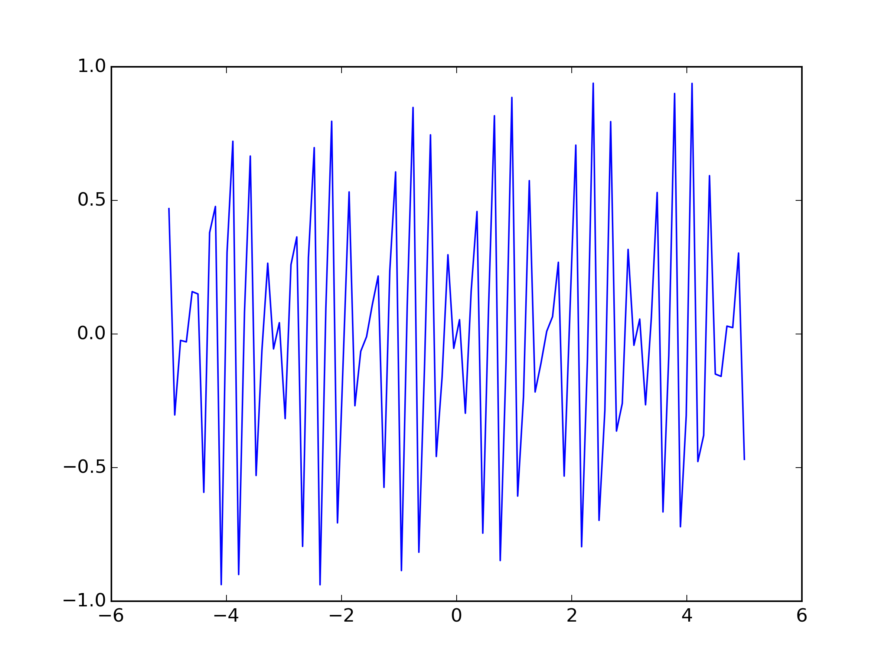

This is a test
==============

.. code:: python

    import matplotlib.pyplot as plt
    import numpy as np
    from IPython.display import Image,HTML,YouTubeVideo,SVG

.. code:: python

    x = np.linspace(-5,5,100)

.. code:: python

    y = np.sin(2*x)*np.cos(20*x)

.. code:: python

    plt.plot(x,y)
    plt.savefig('fig1.png',dpi=300)

.. math:: E=m c^{2}

   Ma figure

.. code:: python

    Image('fig1.png')

.. image:: essai_files/essai_7_0.png

