The class Cone
==============

.. code:: python

    from pylayers.util.cone import *
    from pylayers.util.geomutil import *
    from pylayers.util.plotutil import *
    %matplotlib inline

The
```Cone`` <http://pylayers.github.io/pylayers/modules/pylayers.util.cone.html>`__
class implements several methods for handling planar cones.

A planar cone is defined as being composed of : + an apex
:math:`\vec{p}` + two vectors :math:`\vec{v}_a` and :math:`\vec{v}_b`
not necessarily normalized.

Let create a cone.

.. code:: python

    va = np.array([2,1])
    vb = np.array([1,3])
    C = Cone(va,vb,apex=np.array([2,-3]))

From those parameters the Cone ``__init__`` constructs 2 unitary vectors
:math:`\hat{u}` and :math:`\hat{v}` such that :

-  :math:`\hat{u} \times \hat{v} = c\hat{z} \;\; \textrm{with} \;\; c >0`

This can be interpreted as applying an anticlockwise rotation from
:math:`\hat{u}` to :math:`\hat{v}`.

.. code:: python

    print "Unitary vector u",C.u
    print "Unitary vector v",C.v
    print "dot(u,v)",C.dot
    print "cross(u,v)",C.cross


.. parsed-literal::

    Unitary vector u [ 0.89442719  0.4472136 ]
    Unitary vector v [ 0.31622777  0.9486833 ]
    dot(u,v) 0.707106781187
    cross(u,v) 0.707106781187


Is a point belonging to a cone ? : belong\_point()
--------------------------------------------------

.. code:: python

    p = 4*np.random.randn(2,6000)
    b = C.belong_point(p)

.. code:: python

    nb = np.array(map(lambda x: not x,b))
    pr = p[:,b]
    pb = p[:,nb]

.. code:: python

    fig,ax = C.show()
    ax.plot(pr[0,:],pr[1,:],'.r')
    ax.plot(pb[0,:],pb[1,:],'.b')
    plt.axis('equal')
    plt.title('belong_cone method')
    plt.xlabel('x')
    plt.ylabel('y')
    #plt.axis('off')


.. parsed-literal::

    <matplotlib.text.Text at 0x2b8da2271f50>


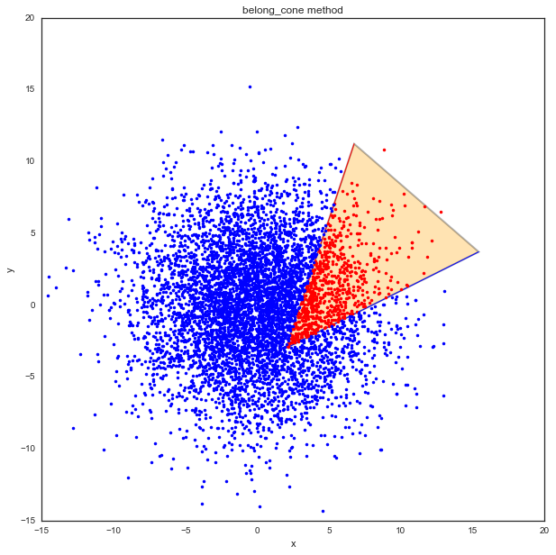


Creating a Cone from 2 segments ``from2segs()``
-----------------------------------------------

.. code:: python

    seg0 = np.array([[2,3],[0,0]])
    seg1 = np.array([[0,1],[4,4]])

.. code:: python

    Cs=Cone()

.. code:: python

    Cs.from2segs(seg0,seg1)

.. code:: python

    Cs.apex


.. parsed-literal::

    array([ 1.5,  2. ])


.. code:: python

    Cs.seg1-seg1


.. parsed-literal::

    array([[0, 0],
           [0, 0]])


.. code:: python

    Cs.show()


.. parsed-literal::

    (<matplotlib.figure.Figure at 0x2b8d9fdfed90>,
     <matplotlib.axes._subplots.AxesSubplot at 0x2b8d721e64d0>)


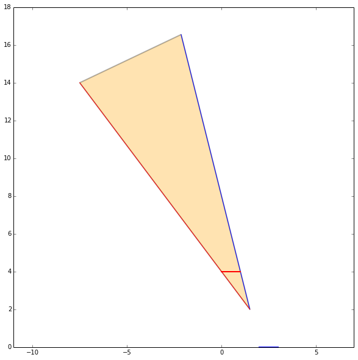


.. code:: python

    b=Cs.belong_point(p)

.. code:: python

    pta = 10*sp.randn(2,1000)
    phe = 10*sp.randn(2,1000)

.. code:: python

    nb = np.array(map(lambda x: not x,b))
    pr = p[:,b]
    pb = p[:,nb]

.. code:: python

    fig,ax = Cs.show()
    #displot(pta[:,bs],phe[:,bs],color='k')
    ax.plot(pr[0,:],pr[1,:],'.r')
    ax.plot(pb[0,:],pb[1,:],'.b')
    plt.axis('equal')
    #plt.axis('off')


.. parsed-literal::

    (-15.0, 15.0, -15.0, 20.0)


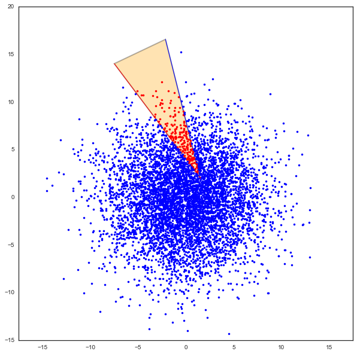


.. code:: python

    Cs.seg1


.. parsed-literal::

    array([[0, 1],
           [4, 4]])


.. code:: python

    bi=Cs.belong_point2(p)

.. code:: python

    %timeit b=Cs.belong_point(p)


.. parsed-literal::

    The slowest run took 6.43 times longer than the fastest. This could mean that an intermediate result is being cached.
    10000 loops, best of 3: 106 µs per loop


.. code:: python

    #nb = np.array(map(lambda x: not x,bo))
    pr = p[:,bi]
    #pb = p[:,bo2]
    fig,ax = Cs.show()
    ax.plot(pr[0,:],pr[1,:],'.r')
    #ax.plot(pb[0,:],pb[1,:],'.b')
    plt.axis('equal')
    #plt.axis('off')


.. parsed-literal::

    (-8.0, 10.0, -15.0, 20.0)


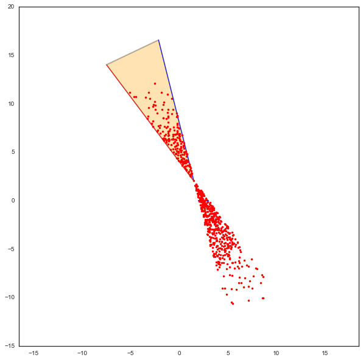


The adressed problem consists in determining whether a segment lies in
the cone or not. The condition is satisfied if not all segments
termination are outside the cone on the same side of the cone. This is
implemented in the method ``Cone.outside``

.. code:: python

    b1,b2=Cs.outside_point(p)

.. code:: python

    pr = p[:,b1]
    pb = p[:,b2]
    fig,ax = Cs.show()
    ax.plot(pr[0,:],pr[1,:],'.r')
    ax.plot(pb[0,:],pb[1,:],'.b')
    plt.axis('equal')
    #plt.axis('off')


.. parsed-literal::

    (-15.0, 15.0, -15.0, 20.0)


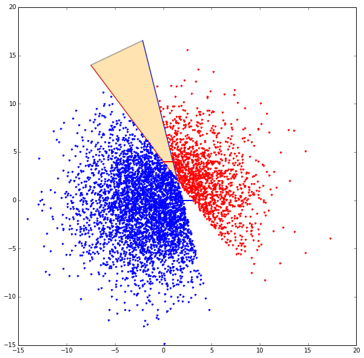


Un cone est un objet qui va servir construire les objets ``Beams``. Un
``Beam`` est un ``Cone`` qui englobe les segments d'une ``Signature``.
Une signature et un point donne un ``Beam``. A un ``Beam`` est associ un
``Cone`` dont l'apex est une ancre virtuelle.

.. code:: python

    pta = 10*sp.randn(2,400)
    phe = 10*sp.randn(2,400)

.. code:: python

    displot(pta,phe)


.. parsed-literal::

    (<matplotlib.figure.Figure at 0x2b8da250c750>,
     <matplotlib.axes._subplots.AxesSubplot at 0x2b8da2416790>)


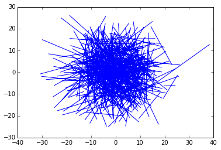


.. code:: python

    Cs.seg0


.. parsed-literal::

    array([[2, 3],
           [0, 0]])


.. code:: python

    typ, proba = Cs.belong_seg(pta,phe)

.. code:: python

    fig,ax = Cs.show()
    bs1 = np.where(typ==1)[0]
    bs2 = np.where(typ==2)[0]
    bs3 = np.where(typ==3)[0]
    bs4 = np.where(typ==4)[0]
    bs5 = np.where(typ==5)[0]
    bs6 = np.where(typ==6)[0]
    displot(pta[:,bs1],phe[:,bs1],color='g')
    displot(pta[:,bs2],phe[:,bs2],color='b')
    displot(pta[:,bs3],phe[:,bs3],color='b')
    displot(pta[:,bs4],phe[:,bs4],color='r')
    displot(pta[:,bs5],phe[:,bs5],color='r')
    #displot(pta[:,bs6],phe[:,bs6],color='m')
    #displot(pta[:,bs],phe[:,bs],color='blue')


.. parsed-literal::

    (<matplotlib.figure.Figure at 0x2b8da31815d0>,
     <matplotlib.axes._subplots.AxesSubplot at 0x2b8da313b050>)


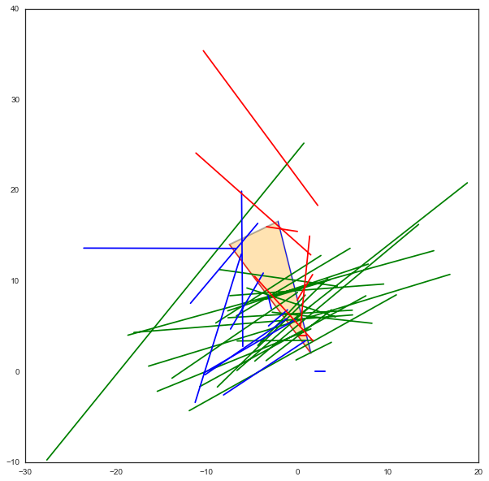


There is different way to create a ``Cone`` either from 2 segments
``from2segs`` or from one point and one segment ``fromptseg``. This
second method is used when the field is going from a diffraction point
to a segment.

Conditional Graph
-----------------

:math:`\mathcal{G}_i` is a ``conditional graph`` meaning that the edge
indicates which is the list of authorized next edge for the output. A
ray being a sequence :math:`{\nu_k}` of nodes of :math:`\mathcal{G}_i`.
The cone angular sector represents the whole set and each intercepting
segment, is a part or this whole set. This can be interpreted as a
probability. This means that the research of rays could be done
stochastically in a very efficient manner. This is not fully implemented
yet.

.. code:: python

    Cb = Cone()

.. code:: python

    Cb.u


.. parsed-literal::

    array([ 1.,  0.])


.. code:: python

    seg = np.array([[1,2],[2,2]])
    pt = np.array([0,0])

.. code:: python

    Cb.fromptseg(pt,seg)

.. code:: python

    typ,proba = Cb.belong_seg(pta,phe)
    bs = np.where(typ>0)[0]

.. code:: python

    Cb.seg1


.. parsed-literal::

    array([[1, 2],
           [2, 2]])


.. code:: python

    Cb.show()
    displot(pta[:,bs],phe[:,bs],color='k')


.. parsed-literal::

    (<matplotlib.figure.Figure at 0x2b8da2420d10>,
     <matplotlib.axes._subplots.AxesSubplot at 0x2b8da313b210>)


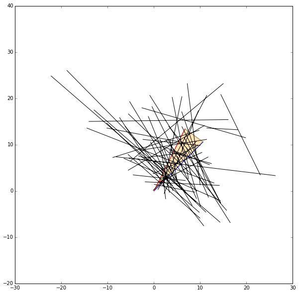


Benchmark normalizing a vector
~~~~~~~~~~~~~~~~~~~~~~~~~~~~~~

.. code:: python

    a = np.array([5,6])

.. code:: python

    %timeit a/np.sqrt(np.dot(a,a))


.. parsed-literal::

    The slowest run took 8.16 times longer than the fastest. This could mean that an intermediate result is being cached.
    100000 loops, best of 3: 4.88 µs per loop


.. code:: python

    %timeit a/sp.linalg.norm(a)


.. parsed-literal::

    The slowest run took 6.72 times longer than the fastest. This could mean that an intermediate result is being cached.
    100000 loops, best of 3: 9.65 µs per loop


.. code:: python

    %timeit a/np.sqrt(np.sum(a*a,axis=0))


.. parsed-literal::

    The slowest run took 4.93 times longer than the fastest. This could mean that an intermediate result is being cached.
    100000 loops, best of 3: 9.54 µs per loop


Debug
-----

This a case which where segments ``seg0`` and ``seg1`` are orthogonal

.. code:: python

    seg0 = array([[-25.768, -25.822],
           [  4.28 ,   9.925]])


::


    ---------------------------------------------------------------------------

    NameError                                 Traceback (most recent call last)

    <ipython-input-39-1063b62b8faf> in <module>()
    ----> 1 seg0 = array([[-25.768, -25.822],
          2        [  4.28 ,   9.925]])


    NameError: name 'array' is not defined


.. code:: python

    seg1 = array([[-26.848, -26.805],
           [  5.415,   4.515]])


::


    ---------------------------------------------------------------------------

    NameError                                 Traceback (most recent call last)

    <ipython-input-40-95e9502a4505> in <module>()
    ----> 1 seg1 = array([[-26.848, -26.805],
          2        [  5.415,   4.515]])


    NameError: name 'array' is not defined


.. code:: python

    cn = Cone()

.. code:: python

    cn.from2segs(seg0,seg1)

.. code:: python

    pta =array([[-27.836, -27.833, -27.833, -27.817, -26.848, -27.774, -26.952,
            -28.062],
           [ 10.926,  10.686,  10.686,   8.956,   5.415,   4.506,  10.934,    8.954]])


::


    ---------------------------------------------------------------------------

    NameError                                 Traceback (most recent call last)

    <ipython-input-43-b197e999ada8> in <module>()
    ----> 1 pta =array([[-27.836, -27.833, -27.833, -27.817, -26.848, -27.774, -26.952,
          2         -28.062],
          3        [ 10.926,  10.686,  10.686,   8.956,   5.415,   4.506,  10.934,    8.954]])


    NameError: name 'array' is not defined


.. code:: python

    phe = array([[-27.835, -27.835, -28.078, -27.774, -26.882, -26.805, -27.836,
            -28.078],
           [ 10.891,  10.891,  10.683,   4.506,   8.965,   4.515,  10.926,
             10.683]])


::


    ---------------------------------------------------------------------------

    NameError                                 Traceback (most recent call last)

    <ipython-input-44-b4e3a2a92cdb> in <module>()
    ----> 1 phe = array([[-27.835, -27.835, -28.078, -27.774, -26.882, -26.805, -27.836,
          2         -28.078],
          3        [ 10.891,  10.891,  10.683,   4.506,   8.965,   4.515,  10.926,
          4          10.683]])


    NameError: name 'array' is not defined


.. code:: python

    typ,proba = cn.belong_seg(pta,phe)
    bn = np.where(typ==0)[0]

.. code:: python

    proba


.. parsed-literal::

    array([ 0.        ,  0.        ,  1.        ,  0.        ,  0.        ,
            0.        ,  0.        ,  0.        ,  0.        ,  0.        ,
            0.        ,  0.        ,  0.        ,  0.        ,  0.        ,
            0.        ,  0.        ,  0.        ,  0.        ,  0.        ,
            0.        ,  0.        ,  0.        ,  0.        ,  0.        ,
            0.        ,  0.        ,  0.        ,  0.10498244,  0.        ,
            0.        ,  0.        ,  0.        ,  0.        ,  0.        ,
            0.        ,  0.        ,  0.        ,  0.        ,  1.        ,
            0.        ,  0.        ,  0.        ,  0.        ,  0.        ,
            0.        ,  0.        ,  0.        ,  0.        ,  0.        ,
            0.        ,  0.        ,  0.        ,  0.        ,  0.        ,
            0.        ,  0.        ,  1.        ,  0.        ,  0.        ,
            1.        ,  0.30597098,  0.        ,  0.        ,  0.        ,
            0.        ,  0.        ,  0.        ,  0.        ,  0.        ,
            0.        ,  0.        ,  0.        ,  1.        ,  0.        ,
            0.        ,  0.59967647,  0.        ,  0.        ,  0.        ,
            0.        ,  0.        ,  0.        ,  0.        ,  0.        ,
            0.        ,  0.        ,  0.        ,  0.        ,  0.        ,
            0.        ,  0.        ,  0.        ,  0.        ,  0.        ,
            0.        ,  0.        ,  0.        ,  0.        ,  0.97801319,
            0.        ,  0.        ,  0.        ,  0.        ,  0.        ,
            0.07398923,  0.        ,  0.        ,  0.        ,  0.        ,
            0.        ,  0.        ,  0.        ,  0.        ,  0.        ,
            0.        ,  1.        ,  0.        ,  0.        ,  0.        ,
            0.        ,  0.        ,  0.63906749,  0.        ,  0.        ,
            0.        ,  0.        ,  0.        ,  0.        ,  0.01383698,
            0.        ,  0.        ,  0.        ,  0.        ,  0.        ,
            0.        ,  0.        ,  0.        ,  0.        ,  0.        ,
            0.        ,  0.        ,  0.        ,  0.        ,  0.        ,
            0.        ,  0.        ,  0.        ,  0.        ,  0.        ,
            0.        ,  0.        ,  0.        ,  0.        ,  0.        ,
            1.        ,  0.        ,  0.        ,  0.        ,  0.        ,
            0.        ,  0.        ,  1.        ,  0.        ,  0.        ,
            0.        ,  0.        ,  0.        ,  0.        ,  0.        ,
            0.        ,  1.        ,  1.        ,  1.        ,  0.05744027,
            0.        ,  0.        ,  0.        ,  0.76873907,  0.1480276 ,
            0.        ,  0.59913756,  0.        ,  0.        ,  0.        ,
            0.        ,  0.        ,  0.        ,  0.        ,  0.        ,
            0.        ,  0.        ,  0.        ,  0.        ,  0.        ,
            0.        ,  0.        ,  0.        ,  0.        ,  0.70409614,
            0.        ,  0.        ,  0.        ,  0.        ,  0.        ,
            0.53280277,  0.        ,  0.        ,  0.        ,  1.        ,
            0.        ,  0.        ,  0.        ,  0.        ,  0.        ,
            0.        ,  1.        ,  0.        ,  0.        ,  1.        ,
            0.        ,  0.        ,  0.        ,  0.        ,  0.        ,
            1.        ,  0.        ,  0.        ,  0.        ,  0.        ,
            0.        ,  0.        ,  1.        ,  0.        ,  1.        ,
            0.        ,  0.        ,  0.        ,  0.        ,  0.        ,
            0.        ,  0.        ,  0.75685669,  0.        ,  0.        ,
            0.        ,  0.02961765,  0.        ,  0.        ,  0.        ,
            0.        ,  0.        ,  0.        ,  0.        ,  1.        ,
            0.        ,  0.        ,  0.        ,  0.        ,  0.        ,
            0.        ,  0.        ,  0.        ,  0.        ,  0.        ,
            0.3281306 ,  0.        ,  0.        ,  0.        ,  0.        ,
            0.        ,  0.        ,  0.        ,  0.        ,  0.        ,
            0.        ,  1.        ,  1.        ,  0.        ,  0.        ,
            0.        ,  0.        ,  0.        ,  0.        ,  0.        ,
            0.        ,  0.        ,  0.        ,  1.        ,  0.        ,
            0.        ,  0.        ,  0.        ,  0.        ,  0.        ,
            0.        ,  0.        ,  0.        ,  0.        ,  0.        ,
            0.        ,  0.        ,  0.        ,  0.        ,  0.        ,
            0.        ,  0.        ,  0.        ,  0.        ,  0.        ,
            0.        ,  0.        ,  0.        ,  0.        ,  0.        ,
            0.        ,  0.        ,  0.        ,  0.        ,  0.        ,
            0.        ,  0.        ,  0.        ,  0.        ,  0.        ,
            0.        ,  0.        ,  0.        ,  0.        ,  0.        ,
            0.        ,  0.        ,  0.        ,  0.        ,  0.        ,
            0.        ,  0.        ,  0.        ,  0.        ,  0.        ,
            0.        ,  0.2693165 ,  0.        ,  0.        ,  0.        ,
            0.        ,  0.        ,  0.        ,  1.        ,  0.        ,
            0.        ,  0.        ,  0.        ,  0.        ,  0.        ,
            0.        ,  0.36991486,  0.        ,  0.        ,  0.        ,
            0.        ,  0.        ,  0.        ,  1.        ,  0.        ,
            0.        ,  0.        ,  0.        ,  0.        ,  0.        ,
            0.        ,  0.        ,  0.        ,  0.        ,  0.        ,
            0.        ,  0.        ,  0.        ,  0.        ,  0.        ,
            0.        ,  0.        ,  1.        ,  0.        ,  0.        ,
            0.        ,  0.        ,  0.        ,  1.        ,  0.        ,
            0.        ,  0.        ,  0.        ,  0.        ,  0.        ,
            0.        ,  0.        ,  0.        ,  0.        ,  0.        ])


.. code:: python

    cn.show()
    displot(pta[:,bn],phe[:,bn])


.. parsed-literal::

    (<matplotlib.figure.Figure at 0x2b8da3357450>,
     <matplotlib.axes._subplots.AxesSubplot at 0x2b8da3489850>)


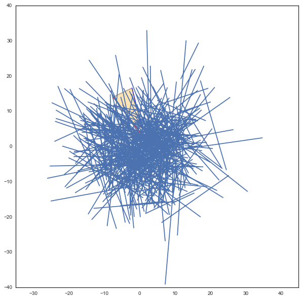


.. code:: python

    pta1=pta[:,5].reshape(2,1)
    phe1=phe[:,5].reshape(2,1)

.. code:: python

    cn.show()
    displot(pta1,phe1)


.. parsed-literal::

    (<matplotlib.figure.Figure at 0x2b8da3587d10>,
     <matplotlib.axes._subplots.AxesSubplot at 0x2b8da3591bd0>)


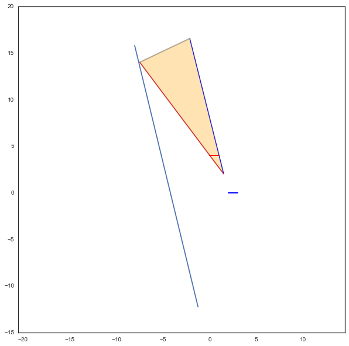


.. code:: python

    b = cn.belong_seg(pta1,phe1)

geomutil.mirror
---------------

.. code:: python

    p = np.random.randn(2,10000)
    pa  = np.array([-1,1]).reshape(2,1)
    pb  = np.array([-1,3]).reshape(2,1)
    M = geu.mirror(p,pa,pb)

.. code:: python

    M


.. parsed-literal::

    array([[-1.95213575, -2.92663038, -1.41836739, ..., -1.86016358,
            -1.68726104, -4.11654995],
           [-0.34091807, -0.31914793, -1.18926891, ...,  0.86315627,
             0.83181209, -0.46015444]])


.. code:: python

    figsize(20,20)
    displot(pa,pb)
    plot(p[0,:],p[1,:],'or',alpha=0.2)
    plot(M[0,:],M[1,:],'ob',alpha=0.2)


::


    ---------------------------------------------------------------------------

    NameError                                 Traceback (most recent call last)

    <ipython-input-53-0829430ac458> in <module>()
    ----> 1 figsize(20,20)
          2 displot(pa,pb)
          3 plot(p[0,:],p[1,:],'or',alpha=0.2)
          4 plot(M[0,:],M[1,:],'ob',alpha=0.2)


    NameError: name 'figsize' is not defined


.. code:: python

    pa=np.array([0,0]).reshape(2,1)
    pb=np.array([1,0]).reshape(2,1)
    pc=np.array([1,0]).reshape(2,1)

.. code:: python

    geu.isaligned(pa,pb,pc)


.. parsed-literal::

    array([ True], dtype=bool)


Geometric probability
---------------------

The idea is to add an information of the fraction of the angular sector
which is subtended by the intercepted segment.

.. code:: python

    a = np.array([2,1])
    b = np.array([1,3])
    C = Cone(a,b,apex=np.array([2,-3]))

.. code:: python

    import scipy as sp
    pta = np.array([2,-1]).reshape(2,1)
    phe = np.array([5.99,-1]).reshape(2,1)
    pta = 10*sp.randn(2,1000)
    phe = 10*sp.randn(2,1000)
    typ,proba = C.belong_seg(pta,phe)
    u0 = np.where(typ==0)[0]
    u1 = np.where(typ==1)[0]
    u2 = np.where(typ==2)[0]
    u3 = np.where(typ==3)[0]
    u4 = np.where(typ==4)[0]
    u5 = np.where(typ==5)[0]
    u6 = np.where(typ==6)[0]
    us = np.where( ((proba<0.1) & (proba>0)) )  [0]

.. code:: python

    C.show()
    #col=['r','g','b','m']
    try:
        displot(pta[:,us],phe[:,us],color='k')
    except:
        pass


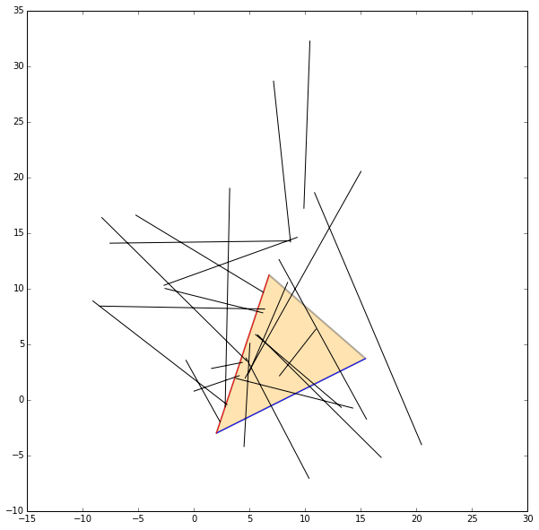


.. code:: python

    C.show()
    #col=['r','g','b','m']
    try:
        displot(pta[:,u1],phe[:,u1],color='r')
    except:
        pass
    print proba[u1]


.. parsed-literal::

    [ 1.  1.  1.  1.  1.  1.  1.  1.  1.  1.  1.  1.  1.  1.  1.  1.  1.  1.
      1.  1.  1.  1.  1.  1.  1.  1.  1.  1.  1.  1.  1.  1.  1.  1.  1.  1.
      1.  1.  1.  1.  1.  1.  1.  1.  1.  1.  1.  1.  1.  1.  1.  1.  1.  1.
      1.  1.  1.  1.  1.  1.  1.  1.  1.  1.  1.  1.  1.  1.  1.  1.  1.  1.
      1.  1.  1.  1.  1.  1.  1.  1.  1.  1.  1.  1.]


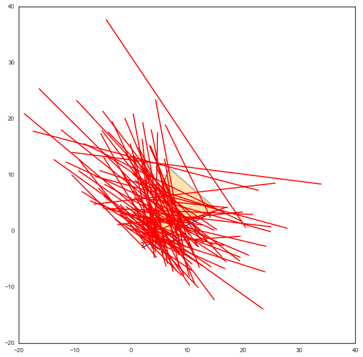


.. code:: python

    C.show()
    
    try:
        displot(pta[:,u2],phe[:,u2],color='g')
    except:
        pass
    print(proba[u2])


.. parsed-literal::

    [ 0.09765695  0.7471172   0.37631341  0.09134127  0.8107929   0.02740472
      0.01155886  0.43371337  0.57482972  0.81665712  0.09720132  0.96918426
      0.32940117  0.19930752  0.22127924  0.33946677  0.72901486  0.28132239
      0.24382297  0.09193293  0.83508063  0.55212659  0.0847907   0.25187003
      0.60830125  0.88909621  0.11755991  0.96715141  0.06429485]


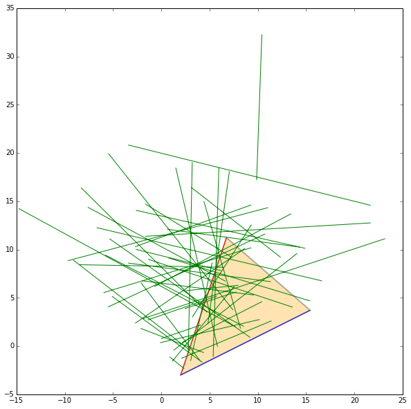


.. code:: python

    C.show()
    try:
        displot(pta[:,u3],phe[:,u3],color='b')
    except:
        pass
    print(proba[u3])


.. parsed-literal::

    [ 0.24390893  0.91534494  0.38011268  0.93977795  0.49295148  0.6531122
      0.77907516  0.09083322  0.81165485  0.03616402  0.29557555  0.86111473
      0.8210745   0.13908704  0.19076096  0.06951564  0.64362376  0.28828787
      0.66350535  0.57403557  0.79200419  0.68915284  0.97868987  0.36929148
      0.30572578  0.5364374   0.44502893  0.55027637  0.06697602  0.01464838
      0.63885564  0.2872956   0.75582834  0.58048507]


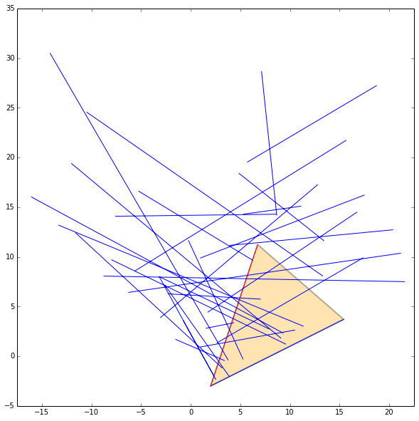


.. code:: python

    C.show()
    try:
        displot(pta[:,u4],phe[:,u4],color='m')
    except:
        pass
    print(proba[u4])


.. parsed-literal::

    [  7.56335012e-01   6.41774363e-01   7.40926394e-01   3.33228564e-02
       7.92943111e-03   2.72642928e-04   7.36840265e-01   9.33150163e-01
       9.83228643e-01   6.67982410e-01   6.65751859e-01   3.26300612e-01]


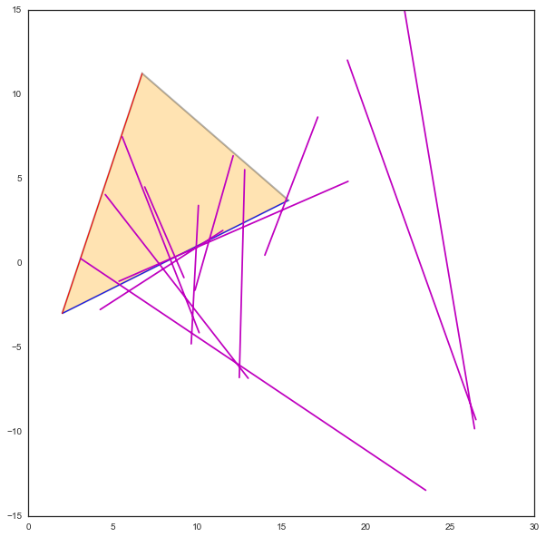


.. code:: python

    C.show()
    try:
        displot(pta[:,u5],phe[:,u5],color='k')
    except:
        pass


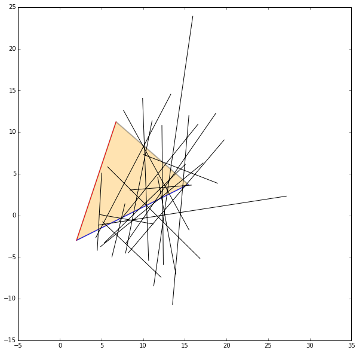


.. code:: python

    C.show()
    try:
        displot(pta[:,u6],phe[:,u6],color='k')
    except:
        pass


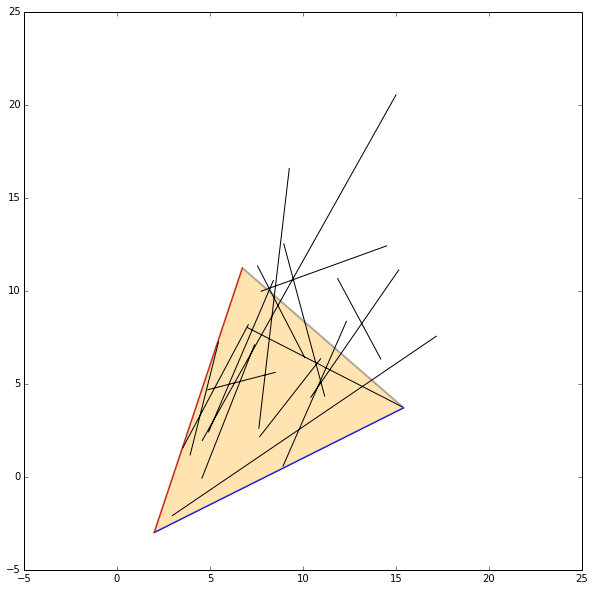

