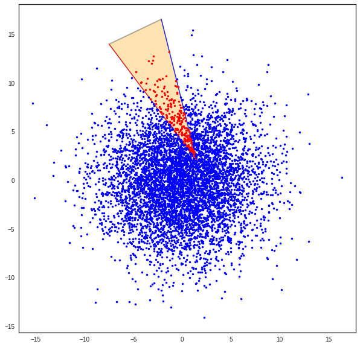
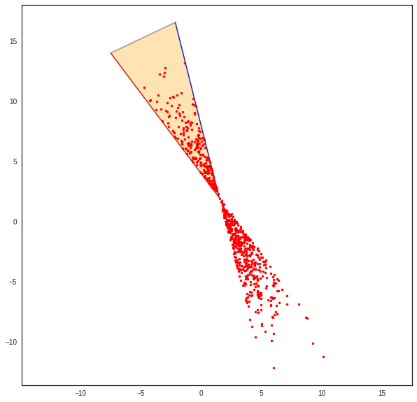
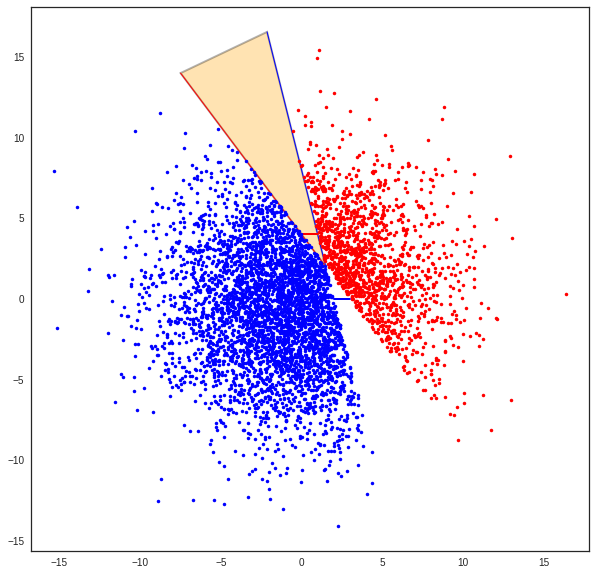

The class Cone
==============

.. code:: python

    >>> from pylayers.util.cone import *
    >>> from pylayers.util.geomutil import *
    >>> from pylayers.util.plotutil import *
    >>> %matplotlib inline

The
```Cone`` <http://pylayers.github.io/pylayers/modules/pylayers.util.cone.html>`__
class implements several methods for handling planar cones.

A planar cone is defined as being composed of : + an apex
:math:`\vec{p}` + two vectors :math:`\vec{v}_a` and :math:`\vec{v}_b`
not necessarily normalized.

Let create a cone.

.. code:: python

    >>> va = np.array([2,1])
    >>> vb = np.array([1,3])
    >>> C = Cone(va,vb,apex=np.array([2,-3]))

From those parameters the Cone ``__init__`` constructs 2 unitary vectors
:math:`\hat{u}` and :math:`\hat{v}` such that :

-  :math:`\hat{u} \times \hat{v} = c\hat{z} \;\; \textrm{with} \;\; c >0`

This can be interpreted as applying an anticlockwise rotation from
:math:`\hat{u}` to :math:`\hat{v}`.

.. code:: python

    >>> print "Unitary vector u",C.u
    >>> print "Unitary vector v",C.v
    >>> print "dot(u,v)",C.dot
    >>> print "cross(u,v)",C.cross


.. parsed-literal::

    Unitary vector u [ 0.89442719  0.4472136 ]
    Unitary vector v [ 0.31622777  0.9486833 ]
    dot(u,v) 0.707106781187
    cross(u,v) 0.707106781187


Is a point belonging to a cone ? : belong\_point()
--------------------------------------------------

.. code:: python

    >>> p = 4*np.random.randn(2,6000)
    >>> b = C.belong_point(p)

.. code:: python

    >>> nb = np.array(map(lambda x: not x,b))
    >>> pr = p[:,b]
    >>> pb = p[:,nb]

.. code:: python

    >>> fig,ax = C.show()
    >>> ax.plot(pr[0,:],pr[1,:],'.r')
    >>> ax.plot(pb[0,:],pb[1,:],'.b')
    >>> plt.axis('equal')
    >>> plt.title('belong_cone method')
    >>> plt.xlabel('x')
    >>> plt.ylabel('y')
    >>> #plt.axis('off')


.. parsed-literal::

    <matplotlib.text.Text at 0x7f9c2a396790>


.. image:: Cone_files/Cone_9_1.png


Creating a Cone from 2 segments ``from2segs()``
-----------------------------------------------

.. code:: python

    >>> seg0 = np.array([[2,3],[0,0]])
    >>> seg1 = np.array([[0,1],[4,4]])

.. code:: python

    >>> Cs=Cone()

.. code:: python

    >>> Cs.from2segs(seg0,seg1)

.. code:: python

    >>> Cs.apex


.. parsed-literal::

    array([ 1.5,  2. ])


.. code:: python

    >>> Cs.seg1-seg1


.. parsed-literal::

    array([[0, 0],
           [0, 0]])


.. code:: python

    >>> Cs.show()


.. parsed-literal::

    (<matplotlib.figure.Figure at 0x7f9c29ece150>,
     <matplotlib.axes._subplots.AxesSubplot at 0x7f9c2a2ad350>)


.. image:: Cone_files/Cone_16_1.png


.. code:: python

    >>> b=Cs.belong_point(p)

.. code:: python

    >>> pta = 10*sp.randn(2,1000)
    >>> phe = 10*sp.randn(2,1000)

.. code:: python

    >>> nb = np.array(map(lambda x: not x,b))
    >>> pr = p[:,b]
    >>> pb = p[:,nb]

.. code:: python

    >>> fig,ax = Cs.show()
    >>> #displot(pta[:,bs],phe[:,bs],color='k')
    ... ax.plot(pr[0,:],pr[1,:],'.r')
    >>> ax.plot(pb[0,:],pb[1,:],'.b')
    >>> plt.axis('equal')
    >>> #plt.axis('off')


.. parsed-literal::

    (-16.910598251516173,
     17.99623744471733,
     -15.60365452654651,
     18.083365694024096)





.. code:: python

    >>> Cs.seg1


.. parsed-literal::

    array([[0, 1],
           [4, 4]])


.. code:: python

    >>> bi=Cs.belong_point2(p)

.. code:: python

    >>> %timeit b=Cs.belong_point(p)


.. parsed-literal::

    The slowest run took 5.18 times longer than the fastest. This could mean that an intermediate result is being cached.
    10000 loops, best of 3: 107 µs per loop


.. code:: python

    >>> #nb = np.array(map(lambda x: not x,bo))
    ... pr = p[:,bi]
    >>> #pb = p[:,bo2]
    ... fig,ax = Cs.show()
    >>> ax.plot(pr[0,:],pr[1,:],'.r')
    >>> #ax.plot(pb[0,:],pb[1,:],'.b')
    ... plt.axis('equal')
    >>> #plt.axis('off')


.. parsed-literal::

    (-8.383229151638302,
     11.047812184404364,
     -13.578383241089245,
     17.986924204240417)





The adressed problem consists in determining whether a segment lies in
the cone or not. The condition is satisfied if not all segments
termination are outside the cone on the same side of the cone. This is
implemented in the method ``Cone.outside``

.. code:: python

    >>> b1,b2=Cs.outside_point(p)

.. code:: python

    >>> pr = p[:,b1]
    >>> pb = p[:,b2]
    >>> fig,ax = Cs.show()
    >>> ax.plot(pr[0,:],pr[1,:],'.r')
    >>> ax.plot(pb[0,:],pb[1,:],'.b')
    >>> plt.axis('equal')
    >>> #plt.axis('off')


.. parsed-literal::

    (-16.910598251516173,
     17.99623744471733,
     -15.60365452654651,
     18.083365694024096)





Un cone est un objet qui va servir construire les objets ``Beams``. Un
``Beam`` est un ``Cone`` qui englobe les segments d'une ``Signature``.
Une signature et un point donne un ``Beam``. A un ``Beam`` est associ un
``Cone`` dont l'apex est une ancre virtuelle.

.. code:: python

    >>> pta = 10*sp.randn(2,400)
    >>> phe = 10*sp.randn(2,400)

.. code:: python

    >>> displot(pta,phe)


.. parsed-literal::

    (<matplotlib.figure.Figure at 0x7f9c2a134290>,
     <matplotlib.axes._subplots.AxesSubplot at 0x7f9c2a1f0210>)


.. code:: python

    >>> Cs.seg0


.. parsed-literal::

    array([[2, 3],
           [0, 0]])


.. code:: python

    >>> typ, proba = Cs.belong_seg(pta,phe)

.. code:: python

    >>> fig,ax = Cs.show()
    >>> bs1 = np.where(typ==1)[0]
    >>> bs2 = np.where(typ==2)[0]
    >>> bs3 = np.where(typ==3)[0]
    >>> bs4 = np.where(typ==4)[0]
    >>> bs5 = np.where(typ==5)[0]
    >>> bs6 = np.where(typ==6)[0]
    >>> displot(pta[:,bs1],phe[:,bs1],color='g')
    >>> displot(pta[:,bs2],phe[:,bs2],color='b')
    >>> displot(pta[:,bs3],phe[:,bs3],color='b')
    >>> displot(pta[:,bs4],phe[:,bs4],color='r')
    >>> displot(pta[:,bs5],phe[:,bs5],color='r')
    >>> #displot(pta[:,bs6],phe[:,bs6],color='m')
    ... #displot(pta[:,bs],phe[:,bs],color='blue')


.. parsed-literal::

    (<matplotlib.figure.Figure at 0x7f9c2a10c550>,
     <matplotlib.axes._subplots.AxesSubplot at 0x7f9c2a04cbd0>)


.. image:: Cone_files/Cone_33_1.png


There is different way to create a ``Cone`` either from 2 segments
``from2segs`` or from one point and one segment ``fromptseg``. This
second method is used when the field is going from a diffraction point
to a segment.

Conditional Graph
-----------------

:math:`\mathcal{G}_i` is a ``conditional graph`` meaning that the edge
indicates which is the list of authorized next edge for the output. A
ray being a sequence :math:`{\nu_k}` of nodes of :math:`\mathcal{G}_i`.
The cone angular sector represents the whole set and each intercepting
segment, is a part or this whole set. This can be interpreted as a
probability. This means that the research of rays could be done
stochastically in a very efficient manner. This is not fully implemented
yet.

.. code:: python

    >>> Cb = Cone()

.. code:: python

    >>> Cb.u


.. parsed-literal::

    array([ 1.,  0.])


.. code:: python

    >>> seg = np.array([[1,2],[2,2]])
    >>> pt = np.array([0,0])

.. code:: python

    >>> Cb.fromptseg(pt,seg)

.. code:: python

    >>> typ,proba = Cb.belong_seg(pta,phe)
    >>> bs = np.where(typ>0)[0]

.. code:: python

    >>> Cb.seg1


.. parsed-literal::

    array([[1, 2],
           [2, 2]])


.. code:: python

    >>> Cb.show()
    >>> displot(pta[:,bs],phe[:,bs],color='k')


.. parsed-literal::

    (<matplotlib.figure.Figure at 0x7f9c2a116b10>,
     <matplotlib.axes._subplots.AxesSubplot at 0x7f9c29fd2150>)


.. image:: Cone_files/Cone_41_1.png


Benchmark normalizing a vector
~~~~~~~~~~~~~~~~~~~~~~~~~~~~~~

.. code:: python

    >>> a = np.array([5,6])

.. code:: python

    >>> %timeit a/np.sqrt(np.dot(a,a))


.. parsed-literal::

    The slowest run took 16.64 times longer than the fastest. This could mean that an intermediate result is being cached.
    100000 loops, best of 3: 5.17 µs per loop


.. code:: python

    >>> %timeit a/sp.linalg.norm(a)


.. parsed-literal::

    The slowest run took 5.60 times longer than the fastest. This could mean that an intermediate result is being cached.
    100000 loops, best of 3: 10.9 µs per loop


.. code:: python

    >>> %timeit a/np.sqrt(np.sum(a*a,axis=0))


.. parsed-literal::

    The slowest run took 4.79 times longer than the fastest. This could mean that an intermediate result is being cached.
    100000 loops, best of 3: 10.1 µs per loop


Debug
-----

This a case which where segments ``seg0`` and ``seg1`` are orthogonal

.. code:: python

    >>> seg0 = array([[-25.768, -25.822],
    ...        [  4.28 ,   9.925]])


::


    

    NameErrorTraceback (most recent call last)

    <ipython-input-39-1063b62b8faf> in <module>()
    ----> 1 seg0 = array([[-25.768, -25.822],
          2        [  4.28 ,   9.925]])


    NameError: name 'array' is not defined


.. code:: python

    >>> seg1 = array([[-26.848, -26.805],
    ...        [  5.415,   4.515]])


::


    

    NameErrorTraceback (most recent call last)

    <ipython-input-40-95e9502a4505> in <module>()
    ----> 1 seg1 = array([[-26.848, -26.805],
          2        [  5.415,   4.515]])


    NameError: name 'array' is not defined


.. code:: python

    >>> cn = Cone()

.. code:: python

    >>> cn.from2segs(seg0,seg1)

.. code:: python

    >>> pta =array([[-27.836, -27.833, -27.833, -27.817, -26.848, -27.774, -26.952,
    ...         -28.062],
    ...        [ 10.926,  10.686,  10.686,   8.956,   5.415,   4.506,  10.934,    8.954]])


::


    

    NameErrorTraceback (most recent call last)

    <ipython-input-43-b197e999ada8> in <module>()
    ----> 1 pta =array([[-27.836, -27.833, -27.833, -27.817, -26.848, -27.774, -26.952,
          2         -28.062],
          3        [ 10.926,  10.686,  10.686,   8.956,   5.415,   4.506,  10.934,    8.954]])


    NameError: name 'array' is not defined


.. code:: python

    >>> phe = array([[-27.835, -27.835, -28.078, -27.774, -26.882, -26.805, -27.836,
    ...         -28.078],
    ...        [ 10.891,  10.891,  10.683,   4.506,   8.965,   4.515,  10.926,
    ...          10.683]])


::


    

    NameErrorTraceback (most recent call last)

    <ipython-input-44-b4e3a2a92cdb> in <module>()
    ----> 1 phe = array([[-27.835, -27.835, -28.078, -27.774, -26.882, -26.805, -27.836,
          2         -28.078],
          3        [ 10.891,  10.891,  10.683,   4.506,   8.965,   4.515,  10.926,
          4          10.683]])


    NameError: name 'array' is not defined


.. code:: python

    >>> typ,proba = cn.belong_seg(pta,phe)
    >>> bn = np.where(typ==0)[0]

.. code:: python

    >>> proba


.. parsed-literal::

    array([ 0.        ,  0.40743308,  1.        ,  0.        ,  0.        ,
            0.        ,  0.        ,  1.        ,  0.        ,  0.        ,
            0.        ,  0.        ,  0.        ,  0.        ,  0.        ,
            0.        ,  0.        ,  0.        ,  0.        ,  0.        ,
            0.        ,  0.        ,  0.        ,  0.        ,  0.        ,
            0.        ,  0.        ,  0.        ,  0.        ,  0.        ,
            0.        ,  0.        ,  0.        ,  0.        ,  0.        ,
            0.        ,  0.        ,  0.        ,  0.        ,  0.        ,
            0.        ,  0.        ,  0.        ,  0.        ,  0.        ,
            0.        ,  0.        ,  0.        ,  0.        ,  0.        ,
            0.        ,  1.        ,  0.        ,  0.        ,  0.27882553,
            0.        ,  0.        ,  0.        ,  0.        ,  0.        ,
            0.        ,  0.        ,  0.        ,  0.        ,  0.        ,
            0.        ,  0.70258493,  0.        ,  0.        ,  0.        ,
            0.        ,  0.        ,  0.        ,  0.        ,  0.        ,
            0.        ,  0.        ,  0.        ,  0.        ,  0.        ,
            0.        ,  0.        ,  0.        ,  0.        ,  0.        ,
            0.        ,  0.        ,  0.        ,  0.        ,  0.        ,
            0.        ,  0.        ,  0.        ,  0.        ,  0.        ,
            0.        ,  1.        ,  1.        ,  0.        ,  0.        ,
            0.        ,  0.        ,  0.        ,  0.        ,  0.        ,
            0.        ,  0.        ,  0.        ,  1.        ,  0.        ,
            0.        ,  0.        ,  0.        ,  0.        ,  0.        ,
            0.        ,  0.        ,  0.        ,  1.        ,  0.        ,
            0.        ,  0.        ,  0.        ,  0.        ,  0.        ,
            1.        ,  1.        ,  1.        ,  0.        ,  0.        ,
            0.        ,  0.        ,  0.        ,  0.        ,  0.        ,
            0.        ,  0.        ,  0.        ,  0.        ,  0.        ,
            0.        ,  0.        ,  0.        ,  0.4118138 ,  0.        ,
            0.        ,  0.        ,  0.        ,  0.        ,  0.        ,
            0.        ,  0.        ,  0.        ,  0.        ,  0.        ,
            0.        ,  0.        ,  0.        ,  0.        ,  0.        ,
            1.        ,  0.        ,  0.        ,  0.        ,  0.        ,
            0.        ,  0.        ,  0.        ,  0.        ,  0.        ,
            0.        ,  0.        ,  0.        ,  0.        ,  0.        ,
            0.        ,  0.        ,  0.        ,  0.        ,  0.        ,
            0.60091961,  1.        ,  0.        ,  0.        ,  0.        ,
            0.        ,  0.        ,  0.        ,  0.        ,  0.        ,
            0.        ,  1.        ,  0.72712004,  0.        ,  1.        ,
            0.        ,  0.        ,  0.        ,  0.        ,  0.        ,
            0.        ,  0.        ,  0.        ,  1.        ,  0.        ,
            0.        ,  0.        ,  0.        ,  0.        ,  0.        ,
            1.        ,  0.        ,  0.        ,  0.        ,  0.        ,
            0.        ,  0.        ,  0.58889221,  0.        ,  0.        ,
            0.        ,  0.        ,  0.        ,  0.        ,  0.        ,
            0.        ,  0.37204381,  0.        ,  0.        ,  0.        ,
            0.        ,  0.        ,  0.        ,  0.        ,  0.        ,
            1.        ,  0.        ,  0.        ,  0.        ,  0.        ,
            1.        ,  0.        ,  0.        ,  0.        ,  0.        ,
            0.        ,  0.        ,  0.        ,  0.        ,  0.43184077,
            0.        ,  0.        ,  0.        ,  1.        ,  0.        ,
            0.        ,  1.        ,  0.        ,  0.        ,  0.        ,
            0.19774672,  0.        ,  0.        ,  0.        ,  0.        ,
            0.        ,  0.        ,  0.        ,  0.2268908 ,  0.        ,
            0.61074076,  0.        ,  0.        ,  0.        ,  0.        ,
            0.        ,  0.        ,  0.        ,  0.        ,  1.        ,
            0.        ,  0.        ,  0.        ,  0.        ,  0.        ,
            0.        ,  0.        ,  0.        ,  0.        ,  0.        ,
            0.        ,  0.        ,  0.        ,  0.        ,  1.        ,
            0.        ,  0.        ,  0.        ,  0.        ,  0.        ,
            0.        ,  0.        ,  0.        ,  0.        ,  0.        ,
            0.        ,  1.        ,  0.        ,  0.24722323,  0.        ,
            0.        ,  0.        ,  0.        ,  0.        ,  0.        ,
            0.        ,  1.        ,  0.        ,  0.        ,  0.        ,
            0.        ,  0.        ,  0.89380205,  0.        ,  1.        ,
            0.        ,  0.        ,  0.        ,  1.        ,  0.        ,
            0.        ,  0.        ,  0.        ,  0.        ,  0.        ,
            0.        ,  1.        ,  0.99196169,  0.        ,  0.        ,
            1.        ,  0.        ,  0.        ,  0.        ,  0.        ,
            0.        ,  0.        ,  0.        ,  1.        ,  0.        ,
            0.        ,  0.        ,  0.        ,  0.        ,  0.        ,
            0.        ,  1.        ,  0.        ,  0.        ,  0.        ,
            0.        ,  1.        ,  0.        ,  0.37718956,  0.        ,
            0.        ,  0.        ,  0.        ,  0.        ,  0.        ,
            0.        ,  0.        ,  0.        ,  0.        ,  0.        ,
            0.        ,  0.        ,  0.        ,  0.        ,  0.        ,
            0.        ,  0.        ,  0.        ,  1.        ,  0.        ,
            0.        ,  0.        ,  0.        ,  0.        ,  0.61405648,
            0.        ,  0.        ,  0.        ,  0.        ,  0.        ,
            0.        ,  0.        ,  0.        ,  0.        ,  0.        ])


.. code:: python

    >>> cn.show()
    >>> displot(pta[:,bn],phe[:,bn])


.. parsed-literal::

    (<matplotlib.figure.Figure at 0x7f9c2a137550>,
     <matplotlib.axes._subplots.AxesSubplot at 0x7f9c2a1561d0>)


.. image:: Cone_files/Cone_56_1.png


.. code:: python

    >>> pta1=pta[:,5].reshape(2,1)
    >>> phe1=phe[:,5].reshape(2,1)

.. code:: python

    >>> cn.show()
    >>> displot(pta1,phe1)


.. parsed-literal::

    (<matplotlib.figure.Figure at 0x7f9c2833b190>,
     <matplotlib.axes._subplots.AxesSubplot at 0x7f9c283be890>)


.. image:: Cone_files/Cone_58_1.png


.. code:: python

    >>> b = cn.belong_seg(pta1,phe1)

geomutil.mirror
---------------

.. code:: python

    >>> p = np.random.randn(2,10000)
    >>> pa  = np.array([-1,1]).reshape(2,1)
    >>> pb  = np.array([-1,3]).reshape(2,1)
    >>> M = geu.mirror(p,pa,pb)

.. code:: python

    >>> M


.. parsed-literal::

    array([[-1.80056506, -0.45566959, -2.57142226, ..., -2.0853822 ,
            -2.38869618, -2.88978071],
           [-1.3130668 , -0.8099664 , -0.45534988, ..., -0.01105269,
            -0.64514099, -0.53957856]])


.. code:: python

    >>> figsize(20,20)
    >>> displot(pa,pb)
    >>> plot(p[0,:],p[1,:],'or',alpha=0.2)
    >>> plot(M[0,:],M[1,:],'ob',alpha=0.2)


::


    

    NameErrorTraceback (most recent call last)

    <ipython-input-53-0829430ac458> in <module>()
    ----> 1 figsize(20,20)
          2 displot(pa,pb)
          3 plot(p[0,:],p[1,:],'or',alpha=0.2)
          4 plot(M[0,:],M[1,:],'ob',alpha=0.2)


    NameError: name 'figsize' is not defined


.. code:: python

    >>> pa=np.array([0,0]).reshape(2,1)
    >>> pb=np.array([1,0]).reshape(2,1)
    >>> pc=np.array([1,0]).reshape(2,1)

.. code:: python

    >>> geu.isaligned(pa,pb,pc)


.. parsed-literal::

    array([ True], dtype=bool)


Geometric probability
---------------------

The idea is to add an information of the fraction of the angular sector
which is subtended by the intercepted segment.

.. code:: python

    >>> a = np.array([2,1])
    >>> b = np.array([1,3])
    >>> C = Cone(a,b,apex=np.array([2,-3]))

.. code:: python

    >>> import scipy as sp
    >>> pta = np.array([2,-1]).reshape(2,1)
    >>> phe = np.array([5.99,-1]).reshape(2,1)
    >>> pta = 10*sp.randn(2,1000)
    >>> phe = 10*sp.randn(2,1000)
    >>> typ,proba = C.belong_seg(pta,phe)
    >>> u0 = np.where(typ==0)[0]
    >>> u1 = np.where(typ==1)[0]
    >>> u2 = np.where(typ==2)[0]
    >>> u3 = np.where(typ==3)[0]
    >>> u4 = np.where(typ==4)[0]
    >>> u5 = np.where(typ==5)[0]
    >>> u6 = np.where(typ==6)[0]
    >>> us = np.where( ((proba<0.1) & (proba>0)) )  [0]

.. code:: python

    >>> C.show()
    >>> #col=['r','g','b','m']
    ... try:
    ...     displot(pta[:,us],phe[:,us],color='k')
    >>> except:
    ...     pass


.. image:: Cone_files/Cone_69_0.png


.. code:: python

    >>> C.show()
    >>> #col=['r','g','b','m']
    ... try:
    ...     displot(pta[:,u1],phe[:,u1],color='r')
    >>> except:
    ...     pass
    >>> print proba[u1]


.. parsed-literal::

    [ 1.  1.  1.  1.  1.  1.  1.  1.  1.  1.  1.  1.  1.  1.  1.  1.  1.  1.
      1.  1.  1.  1.  1.  1.  1.  1.  1.  1.  1.  1.  1.  1.  1.  1.  1.  1.
      1.  1.  1.  1.  1.  1.  1.  1.  1.  1.  1.  1.  1.  1.  1.  1.  1.  1.
      1.  1.  1.  1.  1.  1.  1.  1.  1.  1.  1.  1.  1.  1.  1.  1.  1.  1.
      1.  1.  1.  1.  1.  1.  1.  1.  1.  1.  1.  1.]


.. image:: Cone_files/Cone_70_1.png


.. code:: python

    >>> C.show()
    >>> 
    >>> try:
    ...     displot(pta[:,u2],phe[:,u2],color='g')
    >>> except:
    ...     pass
    >>> print(proba[u2])


.. parsed-literal::

    [ 0.43736156  0.06870599  0.46854134  0.26991912  0.96209565  0.79693702
      0.36749495  0.18412835  0.97480557  0.46713302  0.61805484  0.13551922
      0.3975633   0.47553598  0.92331495  0.5629051   0.75990021  0.44981204
      0.15474131  0.05718427  0.3077045   0.07986304  0.0765847   0.72161955
      0.12242633  0.53618313  0.91036233  0.93245053  0.61131975  0.15680479
      0.0842943   0.37081325  0.00483835  0.33803883  0.20684903  0.79545636
      0.7712438   0.15038099  0.73535369  0.18306744  0.27086345  0.36148261
      0.58175241]


.. image:: Cone_files/Cone_71_1.png


.. code:: python

    >>> C.show()
    >>> try:
    ...     displot(pta[:,u3],phe[:,u3],color='b')
    >>> except:
    ...     pass
    >>> print(proba[u3])


.. parsed-literal::

    [ 0.53321774  0.2850624   0.79714699  0.66820213  0.46329356  0.02231597
      0.6381687   0.94873691  0.06028365  0.42577666  0.40170715  0.87097009
      0.28018797  0.60192762  0.77218623  0.46068757  0.24231895  0.12012527
      0.2958268   0.02564258  0.20903551  0.5848245   0.54536372  0.6756437
      0.14882913  0.95825158  0.55487465  0.91997086  0.58973664  0.97724919
      0.42385107  0.04634142  0.63801452  0.22673842  0.32913638  0.04037261
      0.95984203  0.84635994  0.31051312  0.64204187  0.22578098  0.74498622]


.. image:: Cone_files/Cone_72_1.png


.. code:: python

    >>> C.show()
    >>> try:
    ...     displot(pta[:,u4],phe[:,u4],color='m')
    >>> except:
    ...     pass
    >>> print(proba[u4])


.. parsed-literal::

    [ 0.28172671  0.25177525  0.75563027  0.57569771  0.98287884  0.19041544
      0.32268279  0.80352579  0.37777776  0.51817355  0.39252555  0.25674542
      0.16015134  0.30708583  0.28058335]


.. image:: Cone_files/Cone_73_1.png


.. code:: python

    >>> C.show()
    >>> try:
    ...     displot(pta[:,u5],phe[:,u5],color='k')
    >>> except:
    ...     pass


.. image:: Cone_files/Cone_74_0.png


.. code:: python

    >>> C.show()
    >>> try:
    ...     displot(pta[:,u6],phe[:,u6],color='k')
    >>> except:
    ...     pass


.. image:: Cone_files/Cone_75_0.png

