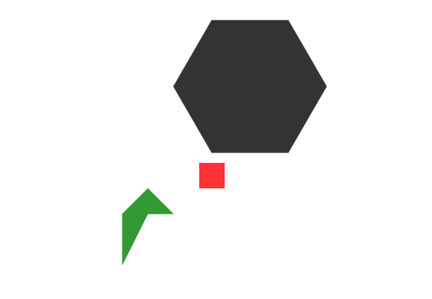
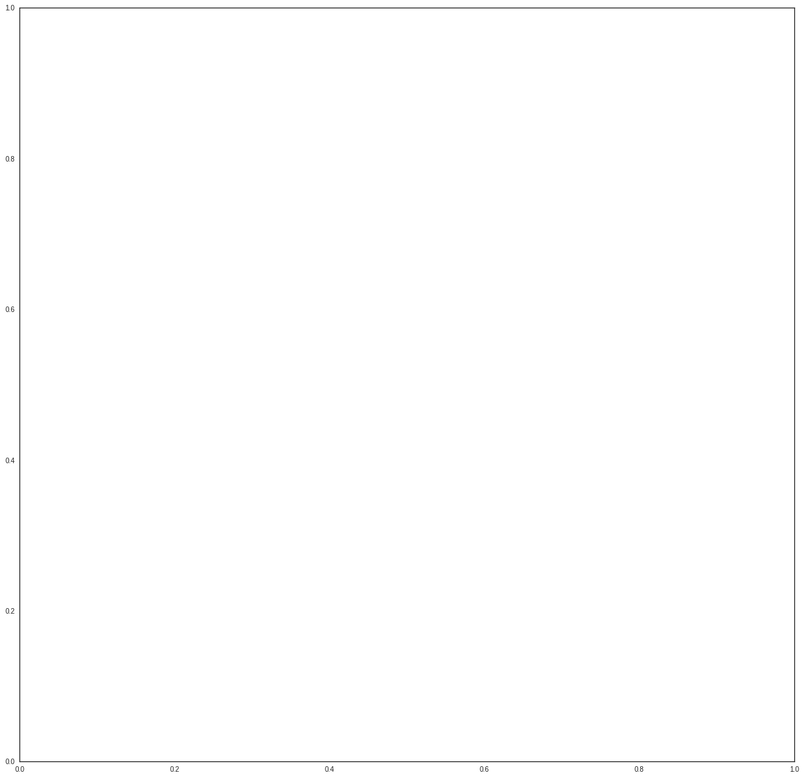
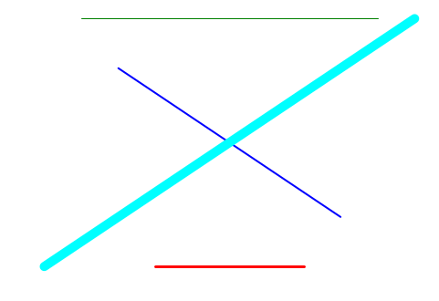
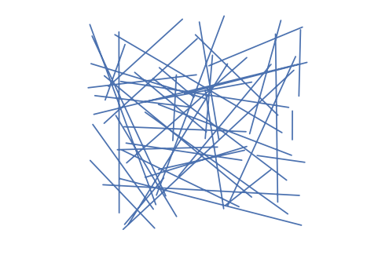
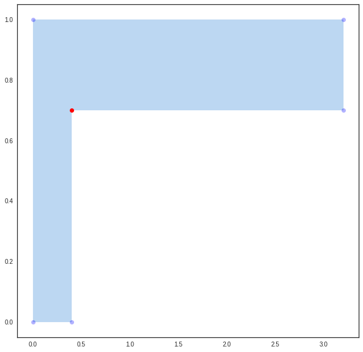
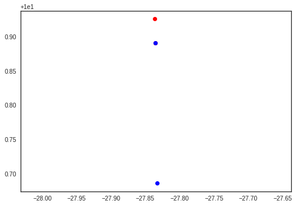

.. code:: python

    %pylab inline

.. parsed-literal::

    Populating the interactive namespace from numpy and matplotlib

.. code:: python

    from pylayers.util.geomutil import *
    from pylayers.util.plotutil import *
    import matplotlib.pyplot as plt
    import shapely.geometry as shg

``Geomutil`` is a module which gathers different geometrical functions
used in other module of pylayers.

Class Polygon
=============

This class implements the visibility graph, of a Polygon.

The Polygon class is a subclass of the shapely polygon class. It allows
to initialize a Polygon with different object
(list,np.array,sh.MultiPoint)

.. code:: python

    points = shg.MultiPoint([(0, 0), (1, 1), (2, 0), (1, 0),(0,-2)])
    poly1 = Polygon(points)
    poly2 = Polygon(p=[[3,4,4,3],[1,1,2,2]])
    N = 7
    phi = np.linspace(0,2*np.pi,N)
    x = 3*np.cos(phi)+5
    y = 3*np.sin(phi)+5
    nppoints  = np.vstack((x,y))
    poly3  = Polygon(nppoints)

ploting polygons
----------------

.. code:: python

    fig = plt.figure()
    ax = fig.gca()
    plt.axis('off')
    plt.axis('equal')
    fig,ax=poly1.plot(color='green',fig=fig,ax=ax)
    fig,ax=poly2.plot(color='red',fig=fig,ax=ax)
    fig,ax=poly3.plot(color='#000000',fig=fig,ax=ax)

``buildGv()``
-------------

Dertermine visibility relationships in a Polygon. Returns a graph

This function is used for determining visibility relationships in indoor
environement.

.. code:: python

    fig = plt.figure(figsize=(8,8))
    points  = shg.MultiPoint([(0, 0), (0, 1), (2.5,1), (2.5, 2), \
                                              (2.8,2), (2.8, 1.1), (3.2, 1.1), \
                                              (3.2, 0.7), (0.4, 0.7), (0.4, 0)])
    polyg   = Polygon(points)
    Gv      = polyg.buildGv(show=True)
    plt.axis('off')

::

    ---------------------------------------------------------------------------

    TypeError                                 Traceback (most recent call last)

    <ipython-input-5-f276c4ba72a7> in <module>()
          2 points  = shg.MultiPoint([(0, 0), (0, 1), (2.5,1), (2.5, 2),                                           (2.8,2), (2.8, 1.1), (3.2, 1.1),                                           (3.2, 0.7), (0.4, 0.7), (0.4, 0)])
          3 polyg   = Polygon(points)
    ----> 4 Gv      = polyg.buildGv(show=True)
          5 plt.axis('off')

    /home/uguen/Documents/rch/devel/pylayers/pylayers/util/geomutil.pyc in buildGv(self, **kwargs)
       1274         #
       1275         if kwargs['show']:
    -> 1276             points1 = shg.MultiPoint(lring)
       1277             for k, pt in enumerate(points1):
       1278                 if k in uconvex:

    /home/uguen/anaconda/lib/python2.7/site-packages/shapely/geometry/multipoint.pyc in __init__(self, points)
         54         super(MultiPoint, self).__init__()
         55 
    ---> 56         if points is None or len(points) == 0:
         57             # allow creation of empty multipoints, to support unpickling
         58             pass

    TypeError: object of type 'LinearRing' has no len()

.. parsed-literal::

    <matplotlib.figure.Figure at 0x2b26da7698d0>

Geomview classes
================

GeomVect class
--------------

This class is used to interact with geomview 3D viewer.

geomBase
~~~~~~~~

Display a base

.. code:: python

    v1 = np.array([1,0,0])
    v2 = np.array([0,1,0])
    v3 = np.array([0,0,1])
    M  = np.vstack((v1,v2,v3))
    gv = GeomVect('test')
    gv.geomBase(M)
    #gv.show3()

points
~~~~~~

display a set of points

.. code:: python

    gv1 = GeomVect('test1')
    gv1.points(np.random.rand(3,10))
    #gv1.show3()

ndarray method converts a Polygon object to an ndarray

.. code:: python

    geo = Geomoff('test2')
    pt  = poly3.ndarray().T
    pt1 = np.hstack((pt,np.zeros((7,1))))

This class is used in module vrml2geom

.. code:: python

    polys = [[0,1,2,3,4,5,6]]
    geo.polygons(pt1,polys)
    #geo.show3()

.. code:: python

    poly = [0,1,2,3,4,5,6]
    geo.polygon(pt1,poly)
    #geo.show3()

.. code:: python

    np.zeros((7,1))

.. parsed-literal::

    array([[ 0.],
           [ 0.],
           [ 0.],
           [ 0.],
           [ 0.],
           [ 0.],
           [ 0.]])

.. code:: python

    extrem=np.array([-2,2,-2,2,-2,2])

plotting a box
~~~~~~~~~~~~~~

.. code:: python

    geo=Geomoff('test3')
    geo.box()

.. code:: python

    #geo.show3()

Utility functions
-----------------

angledir
~~~~~~~~

angledir converts a 3D vector into the 2 spherical angle :math:`\theta`,
:math:`\phi` expressed in radians

.. code:: python

    s = np.array([[2,0,0],[0,2,0],[0,0,1],[1,1,1]])
    angledir(s)*180/np.pi

.. parsed-literal::

    array([[ 90.        ,   0.        ],
           [ 90.        ,  90.        ],
           [  0.        ,   0.        ],
           [ 54.73561032,  45.        ]])

linet
~~~~~

.. code:: python

    fig = plt.figure()
    plt.axis('off')
    ax = fig.gca()
    p1 = np.array([0,0])
    p2 = np.array([1,0])
    p3 = np.array([0,1])
    p4 = np.array([1,1])
    ax = linet(ax,p1,p2,al=0.7,color='red',linewidth=3)
    ax = linet(ax,p2,p3,al=0.8,color='blue',linewidth=2)
    ax = linet(ax,p3,p4,al=0.9,color='green',linewidth=1)
    ax = linet(ax,p4,p1,al=1,color='cyan',linewidth=10)

dptseg(p,pt,ph)
~~~~~~~~~~~~~~~

this function calculates distances between a set of points and a segment

.. code:: python

    pt = np.array([0,0])
    ph = np.array([10,0])
    p  = np.array([[-1,1 ,3,4,11],[8,1,2,3,3]])
    d1,d2,h = dptseg(p,pt,ph)

.. code:: python

    print d1,d2,h

.. parsed-literal::

    [[ -1.   1.   3.   4.  11.]] [[ 11.   9.   7.   6.  -1.]] [ 8.  1.  2.  3.  3.]

displot
~~~~~~~

.. code:: python

    plt.axis('off')
    plt.axis('equal')
    N   = 50
    pt  = sp.rand(2,N)
    ph  = sp.rand(2,N)
    f,a = displot(pt,ph)

ptonseg(pta,phe,pt)
~~~~~~~~~~~~~~~~~~~

used in select.py

.. code:: python

    pta = np.array([0,0])
    phe = np.array([10,0])
    pt = np.array([9,8])
    p = ptonseg(pta,phe,pt)
    print p

.. parsed-literal::

    [ 9.  0.]

ptconvex
~~~~~~~~

.. code:: python

    points  = shg.MultiPoint([(0, 0), (0, 1), (3.2, 1), (3.2, 0.7), (0.4, 0.7), (0.4, 0)])
    N = len(points)
    polyg   = Polygon(points)
    tcc,n   = polyg.ptconvex()

.. code:: python

    plt.axis('off')
    plt.axis('equal')
    k = 0
    polyg.plot()
    for p in points:
        if tcc[k] == 1 :
            plt.plot(p.x, p.y, 'o', color='red',alpha=1)
        else:
            plt.plot(p.x, p.y, 'o', color='blue',alpha=0.3)
        k = k+1

intersect
~~~~~~~~~

intersect(A,B,C,D) wether or not the N segments (AB) intersects N
segments (CD). The intersection is tested only for the segment of same
index in the ndarray.

.. code:: python

    from pylayers.util.geomutil import *
    from pylayers.util.plotutil import *
    import scipy as sp
    N1 = 6
    N2 = 5
    A = sp.rand(2,N1)
    B = sp.rand(2,N1)
    C = sp.rand(2,N1)
    D = sp.rand(2,N1)
    b1 = intersect(A,B,C,D)

.. code:: python

    b1

.. parsed-literal::

    array([False, False, False, False, False, False], dtype=bool)

.. code:: python

    pt1 = A[:,b1]
    ph1 = B[:,b1]
    pt2 = C[:,b1]
    ph2 = D[:,b1]
    pt3 = A[:,(1-b1).astype(bool)]
    ph3 = B[:,(1-b1).astype(bool)]
    pt4 = C[:,(1-b1).astype(bool)]
    ph4 = D[:,(1-b1).astype(bool)]
    f1,a1 = displot(pt1,ph1,'r')
    f2,a2 = displot(pt2,ph2,'b')
    f3,a3 = displot(pt3,ph3,'c')
    f4,a4 = displot(pt4,ph4,'y')
    ti = plt.title('test intersect')

::

    ---------------------------------------------------------------------------

    ValueError                                Traceback (most recent call last)

    <ipython-input-25-468d44e91345> in <module>()
          7 pt4 = C[:,(1-b1).astype(bool)]
          8 ph4 = D[:,(1-b1).astype(bool)]
    ----> 9 f1,a1 = displot(pt1,ph1,'r')
         10 f2,a2 = displot(pt2,ph2,'b')
         11 f3,a3 = displot(pt3,ph3,'c')

    /home/uguen/Documents/rch/devel/pylayers/pylayers/util/plotutil.pyc in displot(pt, ph, arrow, **kwargs)
        571 
        572     m1   = np.array([0, 0, 1])
    --> 573     mask = np.kron(np.ones((2, Nseg)), m1)
        574     # 2 x 3*2*Np
        575     pzz = pz[1:, :].T

    /home/uguen/anaconda/lib/python2.7/site-packages/numpy/lib/shape_base.pyc in kron(a, b)
        782     axis = nd-1
        783     for _ in range(nd):
    --> 784         result = concatenate(result, axis=axis)
        785     wrapper = get_array_prepare(a, b)
        786     if wrapper is not None:

    ValueError: need at least one array to concatenate

.. image:: Geomutil_files/Geomutil_54_1.png

.. code:: python

    b1

.. parsed-literal::

    array([False, False, False, False, False, False], dtype=bool)

.. code:: python

    (1-b1).astype('bool')

.. parsed-literal::

    array([ True,  True,  True,  True,  True,  True], dtype=bool)

.. code:: python

    b1.all()

.. parsed-literal::

    False

.. code:: python

    b1.any()

.. parsed-literal::

    False

Useful functions
----------------

.. code:: python

    pts = np.array([-27.835,  10.891])
    phs = np.array([-27.836,  10.926])
    
    ptk = np.array([-27.833,  10.686])
    phk = np.array([-27.835,  10.891])

.. code:: python

    isaligned(pts,phs,ptk)

.. parsed-literal::

    True

.. code:: python

    isaligned(pts,phs,phk)

.. parsed-literal::

    True

.. code:: python

    plt.plot(pts[0],pts[1],'or')
    plt.plot(phs[0],phs[1],'or')
    plt.plot(ptk[0],ptk[1],'ob')
    plt.plot(phk[0],phk[1],'ob')
    plt.axis('equal')

.. parsed-literal::

    (-27.836000000000002, -27.832500000000003, 10.65, 10.950000000000001)

